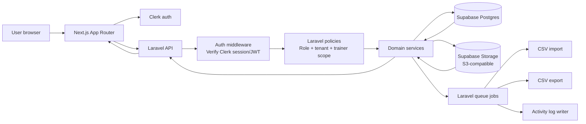
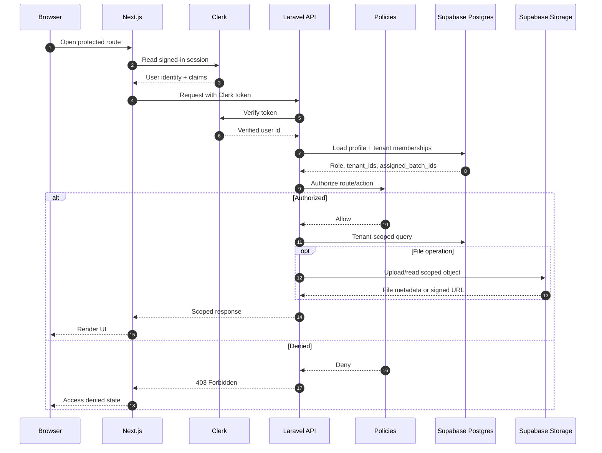
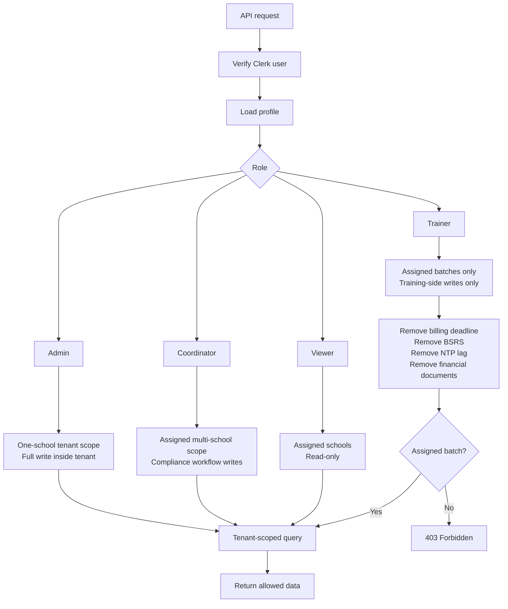
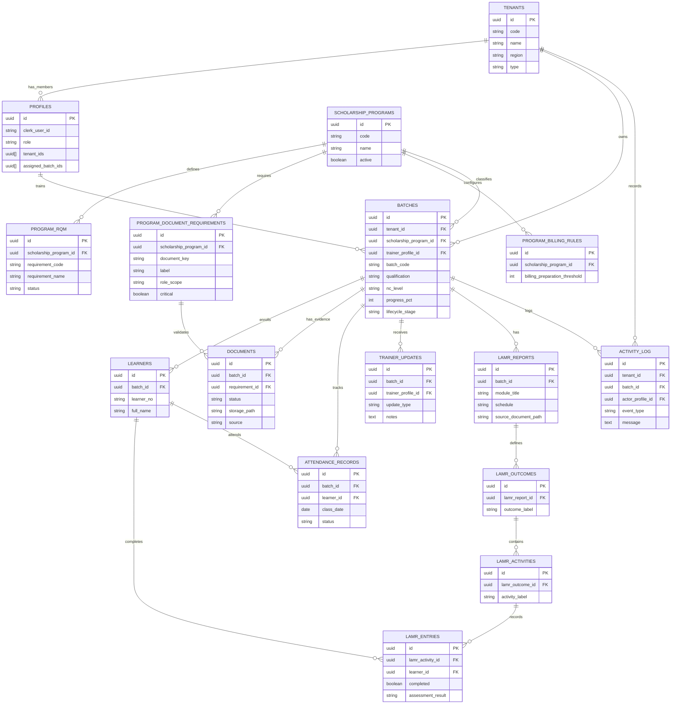
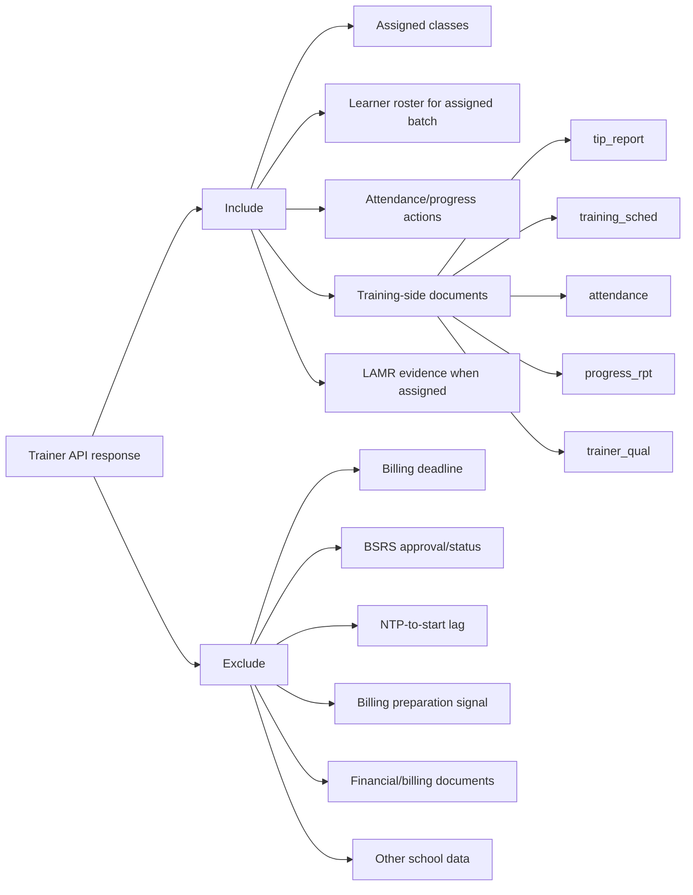

# TVI-CAMS API Mermaid Diagrams

These diagrams describe the planned production API architecture for TVI-CAMS.

Stack direction:

- Frontend: Next.js App Router
- Backend: Laravel API
- Auth: Clerk
- Database/storage: Supabase Postgres and Supabase Storage
- Rule: Laravel enforces tenant, role, and trainer scope before returning data.

## System Architecture

## Frontend Routes To API Endpoints

```mermaid
flowchart TD
  subgraph Next["Next.js routes"]
    Dashboard["/dashboard"]
    Cards["/batch-cards"]
    Table["/table-view"]
    Docs["/documents"]
    Analytics["/analytics"]
    Activity["/activity-log"]
    TrainerDashboard["/trainer"]
    TrainerClasses["/trainer/classes"]
    TrainerAttendance["/trainer/classes/[batchId]/attendance"]
    TrainerDocuments["/trainer/classes/[batchId]/documents"]
  end

  subgraph API["Laravel API"]
    GetDashboard["GET /api/dashboard"]
    GetBatchSummary["GET /api/batches?summary=true"]
    GetBatches["GET /api/batches"]
    GetBatch["GET /api/batches/{batch}"]
    GetTable["GET /api/batches?view=table"]
    GetDocMatrix["GET /api/documents/matrix"]
    PostDoc["POST /api/batches/{batch}/documents"]
    GetAnalytics["GET /api/analytics/summary"]
    GetActivity["GET /api/activity-log"]
    GetTrainerDashboard["GET /api/trainer/dashboard"]
    GetTrainerClasses["GET /api/trainer/classes"]
    GetAttendance["GET /api/trainer/classes/{batch}/attendance"]
    PostAttendance["POST /api/trainer/classes/{batch}/attendance"]
    GetTrainerDocs["GET /api/trainer/classes/{batch}/documents"]
    PostTrainerDocs["POST /api/trainer/classes/{batch}/documents"]
  end

  Dashboard --> GetDashboard
  Dashboard --> GetBatchSummary
  Cards --> GetBatches
  Cards --> GetBatch
  Table --> GetTable
  Docs --> GetDocMatrix
  Docs --> PostDoc
  Analytics --> GetAnalytics
  Activity --> GetActivity
  TrainerDashboard --> GetTrainerDashboard
  TrainerClasses --> GetTrainerClasses
  TrainerAttendance --> GetAttendance
  TrainerAttendance --> PostAttendance
  TrainerDocuments --> GetTrainerDocs
  TrainerDocuments --> PostTrainerDocs
```

## Request Authorization Pipeline

## Role-Based API Access

## Core Data Model

## Trainer Data Boundary

