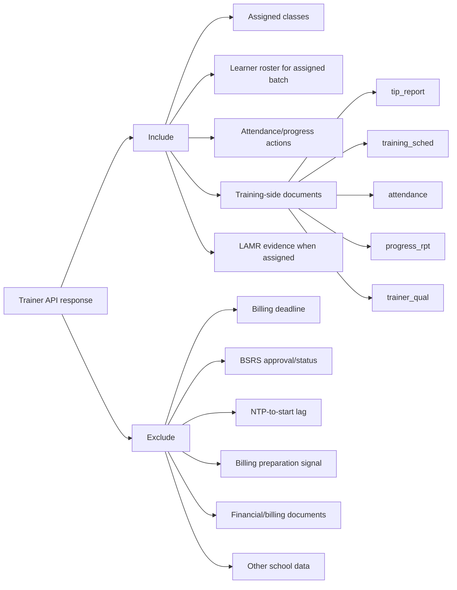

# TVI-CAMS API Mermaid Diagrams

**These diagrams describe a FUTURE, PLANNED architecture (TES-58, Backlog —
not started).** Today there is no backend API layer: Next.js Server Components
call `lib/data/*.ts`, which talks to Supabase directly (see CLAUDE.md
"Architecture" and `diagrams/System Architecture LR.mmd` / `diagrams/Request
Auth Sequence Diagram.mmd` for the current state). Do not build against this
document as if it exists yet.

Stack direction (once TES-58 ships):

- Frontend: Next.js App Router
- Backend: Express.js API on Node/TypeScript (PLANNED; recommendation updated
  from Laravel, 2026-07-06 — see TRD §1.3)
- Auth: Clerk
- Database/storage: Supabase Postgres and Supabase Storage
- Rule: the Express.js API enforces tenant, role, and trainer scope before returning data.

## System Architecture (future — TES-58)

Maintained at `diagrams/flowchart LR.mmd`, explicitly labeled PLANNED there.
For what actually runs today, see `diagrams/System Architecture LR.mmd`.

## Frontend Routes To API Endpoints (planned catalog — TES-32/TES-58)

Mirrors `diagrams/API Diagram.mmd`; keep both in sync.

```mermaid
flowchart TD
  subgraph Next["Next.js routes"]
    Dashboard["/dashboard"]
    Cards["/batch-cards"]
    Table["/table-view"]
    Docs["/documents"]
    Analytics["/analytics"]
    Activity["/activity-log"]
    TrainerDashboard["/trainer"]
    TrainerClasses["/trainer/classes"]
    TrainerAttendance["/trainer/classes/[batchId]/attendance"]
    TrainerDocuments["/trainer/classes/[batchId]/documents"]
  end

  subgraph API["PLANNED Next.js Route Handlers (TES-32)<br/>later migrates behind Express.js per TES-58"]
    GetDashboard["GET /api/dashboard"]
    GetBatchSummary["GET /api/batches?summary=true"]
    GetBatches["GET /api/batches"]
    GetBatch["GET /api/batches/{batch}"]
    GetTable["GET /api/batches?view=table"]
    GetDocMatrix["GET /api/documents/matrix"]
    PostDoc["POST /api/batches/{batch}/documents"]
    GetAnalytics["GET /api/analytics/summary"]
    GetActivity["GET /api/activity-log"]
    GetTrainerDashboard["GET /api/trainer/dashboard"]
    GetTrainerClasses["GET /api/trainer/classes"]
    GetAttendance["GET /api/trainer/classes/{batch}/attendance"]
    PostAttendance["POST /api/trainer/classes/{batch}/attendance"]
    GetTrainerDocs["GET /api/trainer/classes/{batch}/documents"]
    PostTrainerDocs["POST /api/trainer/classes/{batch}/documents"]
  end

  Dashboard --> GetDashboard
  Dashboard --> GetBatchSummary
  Cards --> GetBatches
  Cards --> GetBatch
  Table --> GetTable
  Docs --> GetDocMatrix
  Docs --> PostDoc
  Analytics --> GetAnalytics
  Activity --> GetActivity
  TrainerDashboard --> GetTrainerDashboard
  TrainerClasses --> GetTrainerClasses
  TrainerAttendance --> GetAttendance
  TrainerAttendance --> PostAttendance
  TrainerDocuments --> GetTrainerDocs
  TrainerDocuments --> PostTrainerDocs
```

## Request Authorization Pipeline (future — TES-58)

Once the Express.js API exists, this pipeline would insert an Express hop
between Next.js and Supabase. For what actually runs today (no backend API;
Next.js talks to Supabase directly via `createSupabaseServerClient()`, RLS is
final authority), see `diagrams/Request Auth Sequence Diagram.mmd`.

## Role-Based API Access

See `diagrams/role based user access.mmd` for the maintained version (kept in
sync with MASTER_PRD_SRS.md §8 Permission Matrix, FR-02, and TRD §3.5). It
additionally shows: the unauthenticated redirect, the `TES-34` least-privilege
fallback to Viewer, explicit deny checks per role (not just Trainer), and the
Supabase RLS layer as final authority — none of which this copy has, so treat
that file as canonical rather than duplicating it here.

## Core Data Model

**Historical note (TES-38):** this section used to show `PROGRAM_RQM`,
`ATTENDANCE_RECORDS`, and `TRAINER_UPDATES` as if they existed in the
migration — the exact conflict TES-38 was filed to resolve. ADR-001 (2026-06-30)
has since settled it: RQM is **not** a separate table (it's `rqm_code` /
`ntp_number` / etc. columns directly on `batches` — "one RQM code = one
batch"), `attendance_records` is a real planned table, and
`TRAINER_UPDATES` was never adopted.

Current schema (matches the migration exactly): `diagrams/erDiagram.mmd` /
`diagrams/data model schema.mmd`.

Planned additions per ADR-001, not yet migrated: `diagrams/ADR-001 Planned
Schema.mmd`.

Do not re-duplicate the ERD in this file — the two `diagrams/*.mmd` copies
above are already the source of this exact drift (one got fixed, the other
and this doc didn't), so a third copy here would just reopen it.

## Trainer Data Boundary

