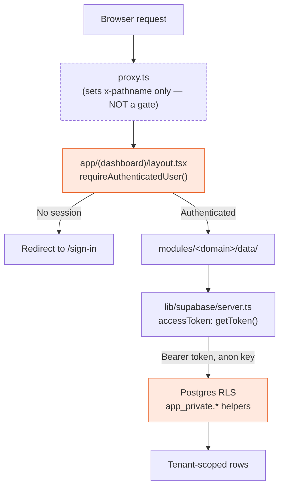
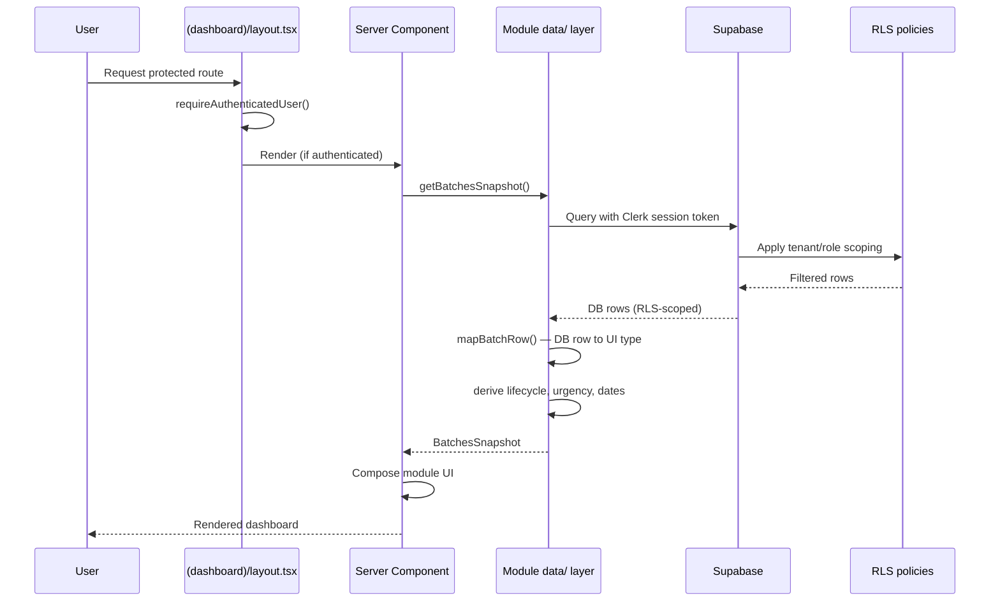
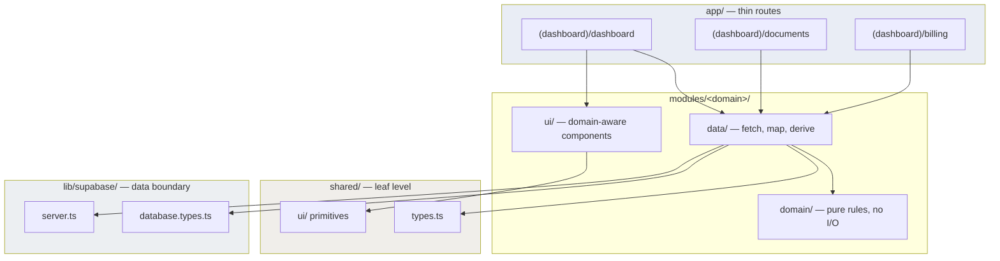
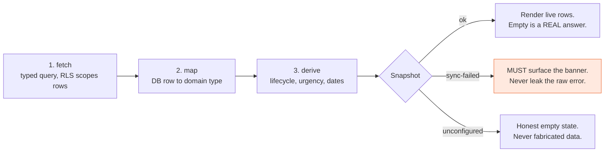
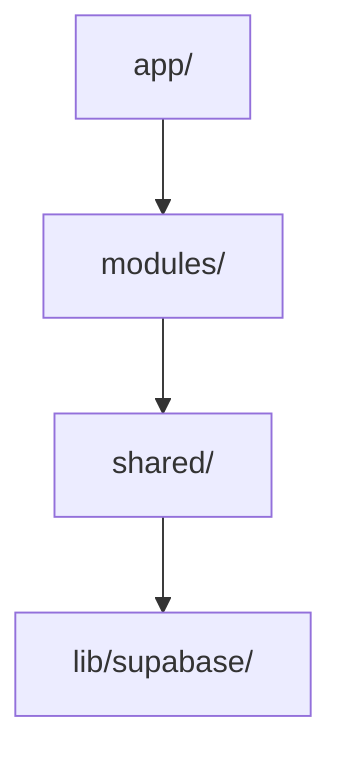

# TVI-CAMS Architecture Diagrams

Architecture documentation for TVI-CAMS: components, data flow, and where the
security boundary actually sits.

> **Scope discipline.** Every diagram here describes the system **as built today**.
> Anything planned-but-absent is called out inline as `PLANNED`, never drawn as if it
> exists. This rule exists because [`DIAGRAM_ARCHITECTURE_SYNC_2026-07-04.md`](DIAGRAM_ARCHITECTURE_SYNC_2026-07-04.md)
> found several diagrams modelling a fictional system as current — a Laravel API that was
> never built, and three tables that do not exist in the migration.
>
> Last verified against source: **2026-09-01**.

## Designed versions

Three diagrams are also maintained as standalone HTML (inline SVG, no dependencies).
Open them directly in a browser:

| Diagram | File | Shows |
|---|---|---|
| Authorization chain | [`diagrams/auth-chain.html`](diagrams/auth-chain.html) | Where auth is enforced, and where authorization is decided |
| Module layering | [`diagrams/module-layering.html`](diagrams/module-layering.html) | The four levels and the one legal import direction |
| Data contract | [`diagrams/data-contract.html`](diagrams/data-contract.html) | fetch → map → derive, and the three snapshot states |

Historical diagnostic diagrams also live in [`diagrams/`](diagrams/):
`auth-chain-break.html`, `four-causes-of-empty.html`, `phase-dependencies.html`.
These document past or in-flight problems, not the target design.

## System Overview

TVI-CAMS is a Next.js 16 App Router application (React 19, TypeScript strict,
Tailwind v4) — an internal multi-tenant compliance tool for TVI schools running TESDA
scholarship batches. It uses:

- **Clerk** for identity, via native third-party auth (no JWT template)
- **Supabase** (Postgres + Storage) for data, called directly from Server Components
- Domain modules (`modules/<domain>/{data,domain,ui}`)
- Row-Level Security as the security boundary

There is **no separate backend**. Express.js is a documented future direction only.

## High-Level Architecture

```mermaid
architecture-beta
    group client(dashboard)[Client Browser]
    group nextjs(cloud)[Next JS App]
    group auth(cloud)[Authentication]
    group data(database)[Data Layer]

    service user(internet)[User] in client
    service app(server)[App Router] in nextjs
    service clerk(cloud)[Clerk] in auth
    service supabase(database)[Supabase] in data

    user:R --> L:app
    app:T --> B:clerk
    app:B --> T:supabase
    clerk:R --> L:supabase
```

## Authorization Chain

> Designed version: [`diagrams/auth-chain.html`](diagrams/auth-chain.html)

**The middleware is not a gate.** `proxy.ts` runs `clerkMiddleware` but its handler only
stamps an `x-pathname` header and calls `NextResponse.next()` — it blocks nothing and
redirects nobody. Authentication is enforced by `requireAuthenticatedUser()` in
`app/(dashboard)/layout.tsx`. This is safe today only because every data route lives
under the `(dashboard)` group; a data route added outside it would be unprotected.

Three properties of this chain are load-bearing:

1. **No JWT template.** Clerk deprecated Supabase JWT templates on 1 Apr 2025. The schema
   never needed one — `app_private.current_clerk_user_id()` reads only `auth.jwt() ->> 'sub'`,
   and resolves role and tenant from `profiles` / `profile_tenant_memberships` in the
   database. The plain session token carries `sub`.
2. **`accessToken` callback, not a static header.** The callback is re-invoked when the
   token expires; a fixed `Authorization` header goes stale.
3. **A missing token throws.** It must never build an `anon` client — RLS would answer
   with zero rows and no error, which is indistinguishable from "this user has no batches".

## Data Flow Sequence

## Module Structure & Layering

> Designed version: [`diagrams/module-layering.html`](diagrams/module-layering.html)

Fourteen modules exist: `activity`, `analytics`, `attendance`, `auth`, `batches`,
`billing`, `documents`, `import-export`, `lamr`, `notifications`, `reports`, `settings`,
`shell`, `tenancy`. **Seven have a `data/` layer today** — activity, auth, batches,
billing, documents, import-export, tenancy. The rest hold UI, domain rules, or a README
stating their planned contents.

## Data Contract (fetch → map → derive)

> Designed version: [`diagrams/data-contract.html`](diagrams/data-contract.html)

`modules/batches/data/batches.ts` is the reference implementation every entity contract
follows.

The states are not interchangeable. Neither `unconfigured` (no Supabase env) nor
`sync-failed` (configured but errored) may substitute mock or fabricated data — both render
an honest empty state, and `sync-failed` must additionally surface the banner. The most
common defect in this codebase is treating `ok` **and empty** as a reason to render
something other than an empty state, which would show fabricated figures with no banner
because `syncFailed` is false.

Two type families stay separate: `lib/supabase/database.types.ts` (generated raw rows,
regenerate after every migration) and `shared/types.ts` (UI domain types). Only module
`data/` layers may import `database.types`; components receive domain types only.

## Import Direction (ESLint-enforced)

`app → modules → shared → lib/supabase`, enforced by `import/no-restricted-paths` in
`eslint.config.mjs`.

Two rules that actually bite:

- **Another module's `data/` is private.** Import its `domain/` or `ui/` instead. Only
  `app/` may call any module's `data/`.
- **`shared/` must never import `modules/` or `app/`.** This is why the per-module type
  split was originally deferred (TES-68): `shared/mocks/seed.ts` constructed 11 domain
  types, so moving those types into modules would have broken the boundary. That dataset
  was deleted in the mock-data retirement, so the blocker is gone — the split is unblocked
  whenever someone wants to do it.

No index barrels — deep imports are the convention.

## Security Architecture

- **RLS is the security boundary.** UI hiding is usability only.
- The service-role key never reaches client code.
- Clerk session token supplied via the `accessToken` callback (native third-party auth).
- Role-based access control: admin, coordinator, trainer, viewer.
- Trainer-facing DTOs must omit billing deadline, billing preparation, NTP lag, BSRS and
  financial fields **server-side**, not via CSS.

### Known gaps — do not read the list above as fully implemented

| Gap | State |
|---|---|
| Tenant context in a URL path segment | `PLANNED`. ADR fact, unimplemented — routes are `app/(dashboard)/dashboard`, there is no `[tenant]` segment. |
| Trainer field omission | `PARTIAL`. Enforced in DTO shaping, but `mapBatchRow` populates financial fields for all callers, and RLS scopes rows, not columns. |
| `?role=` preview override | `TEMPORARY`. Outranks real identity until the tenant/role resolver lands (TES-34). |
| Route protection outside `(dashboard)` | `NONE`. `proxy.ts` does not gate; a data route added outside the group would be unprotected. |
| `error.tsx` | `ABSENT`. No error boundary anywhere in `app/`. |

## Data Flow (summary)

1. Request reaches `proxy.ts`, which stamps `x-pathname` and passes it through.
2. `app/(dashboard)/layout.tsx` calls `requireAuthenticatedUser()` — the actual gate.
3. A Server Component calls a module's `data/` layer.
4. `lib/supabase/server.ts` supplies the Clerk session token via `accessToken`, on an
   anon-key client.
5. RLS policies scope rows to the caller's tenant and role.
6. Rows are mapped from DB types to UI domain types.
7. Derived values computed (lifecycle, urgency, dates).
8. The contract returns a discriminated snapshot.
9. The Server Component maps that state to UI and composes module components.
