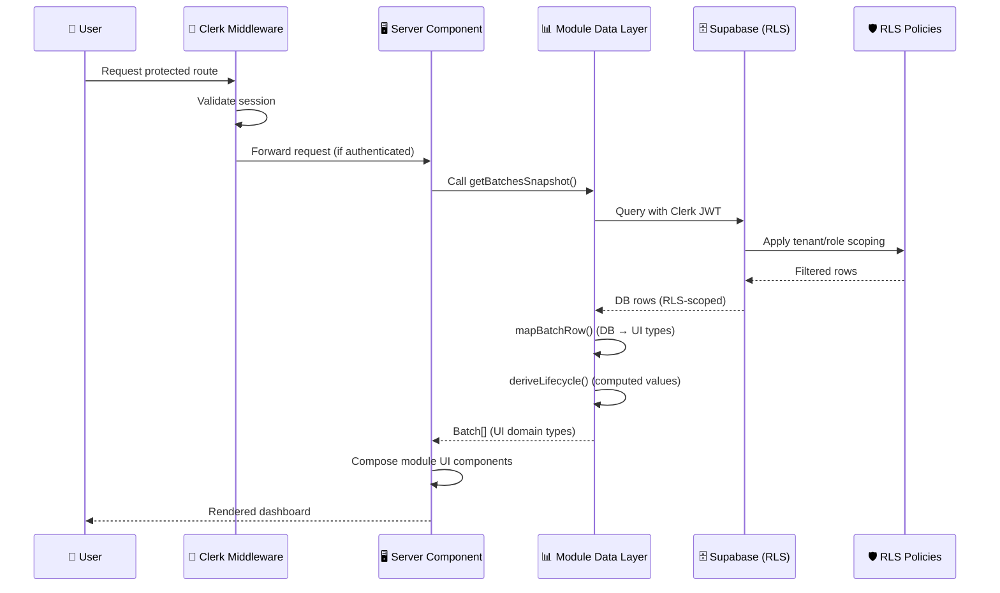
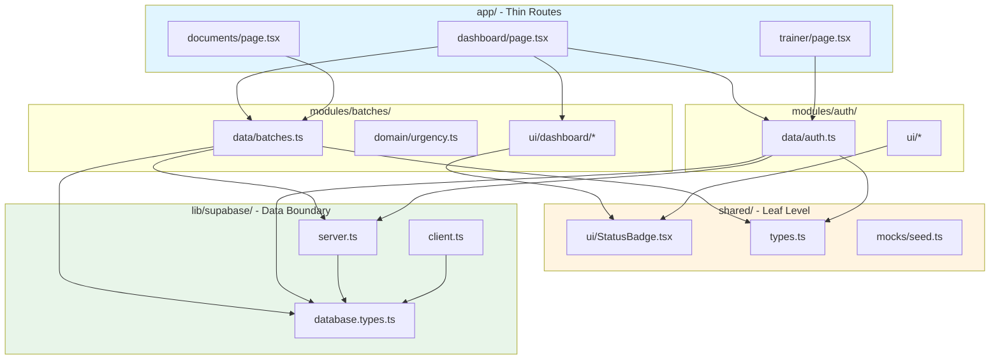
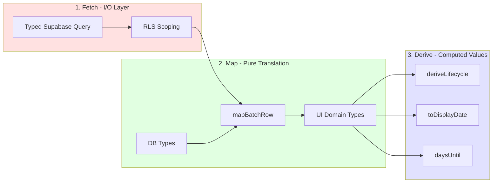
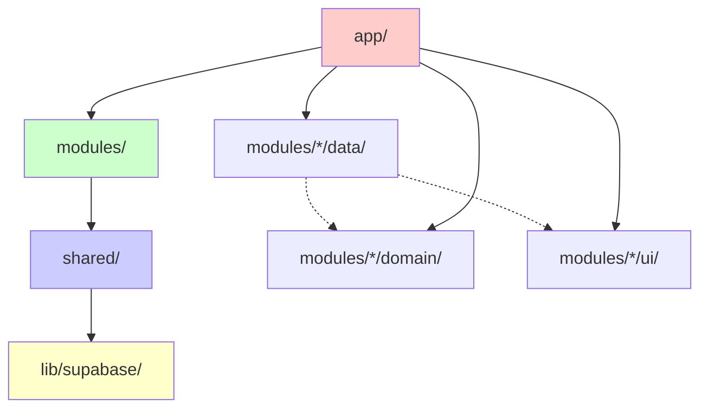
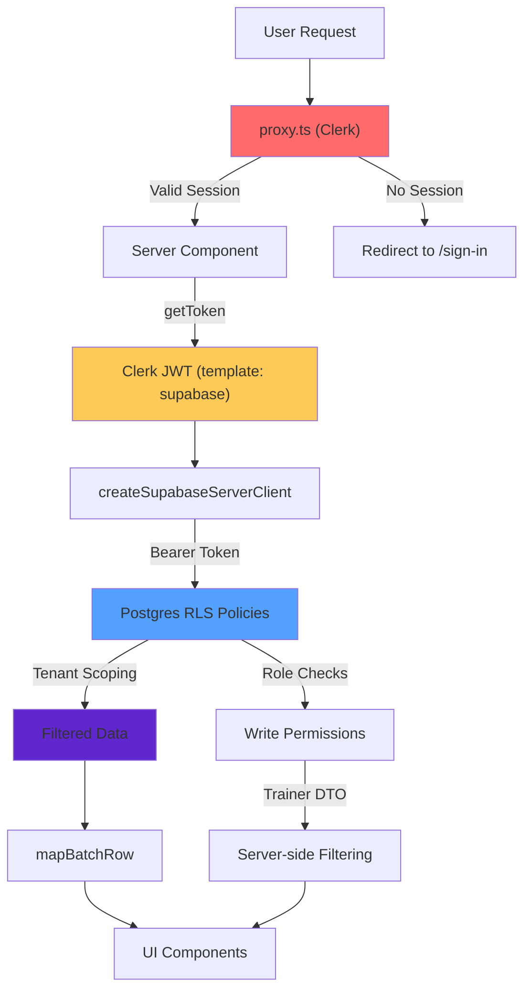

# TVI-CAMS Architecture Diagrams

Comprehensive architecture documentation for TVI-CAMS showing key components, data flow, and security boundaries.

## System Overview

TVI-CAMS is a Next.js 16 App Router application (React 19, TypeScript strict, Tailwind v4) that serves as an internal multi-tenant compliance tool for TVI schools running TESDA scholarship batches. It uses:

- **Clerk** for authentication
- **Supabase** (Postgres + Storage) for data
- Domain-driven design with module-based architecture
- Row-Level Security (RLS) as the primary security boundary

## High-Level Architecture

```mermaid
architecture-beta
    group client(dashboard)[Client Browser]
    group nextjs(cloud)[Next JS App]
    group auth(cloud)[Authentication]
    group data(database)[Data Layer]

    service user(internet)[User] in client
    service app(server)[App Router] in nextjs
    service clerk(cloud)[Clerk] in auth
    service supabase(database)[Supabase] in data

    user:R --> L:app
    app:T --> B:clerk
    app:B --> T:supabase
    clerk:R --> L:supabase
```

## Authentication & Data Flow Sequence

## Module Structure & Layering

## Data Layer Pattern (fetch → map → derive)

## Import Direction (ESLint-enforced)

## Security Architecture

## Key Architectural Patterns

### 1. Authentication Chain
`proxy.ts` (Clerk middleware) → `lib/supabase/server.ts` (attaches Clerk JWT) → Postgres RLS policies

### 2. Code Organization (Domain Modules)
- `app/` - Thin App Router routes (Server Components)
- `modules/<domain>/{data,domain,ui}` - One module per functional requirement
- `shared/` - Presentational primitives and shared types
- `lib/supabase/` - External data boundary

### 3. Data Layer Pattern (fetch → map → derive)
1. **fetch** - Typed Supabase query with RLS scoping
2. **map** - Pure DB-row → domain translation
3. **derive** - Lifecycle/date helpers computed from row

### 4. Import Direction (ESLint-enforced)
`app → modules → shared → lib/supabase`

## Security Architecture

- RLS is the security boundary (UI hiding is usability only)
- Service-role key never reaches client code
- Clerk session token supplied via the `accessToken` callback (native third-party auth)
- Tenant context lives in URL path segment
- Role-based access control (admin, coordinator, trainer, viewer)

## Data Flow

1. User requests protected route
2. Clerk middleware validates session
3. Server Component fetches data via module's `data/` layer
4. Supabase client includes Clerk JWT in Authorization header
5. RLS policies scope data to user's tenant/role
6. Data is mapped from DB types to UI domain types
7. Derived values computed (lifecycle, urgency, dates)
8. Server Component composes module UI components
9. Response rendered to user