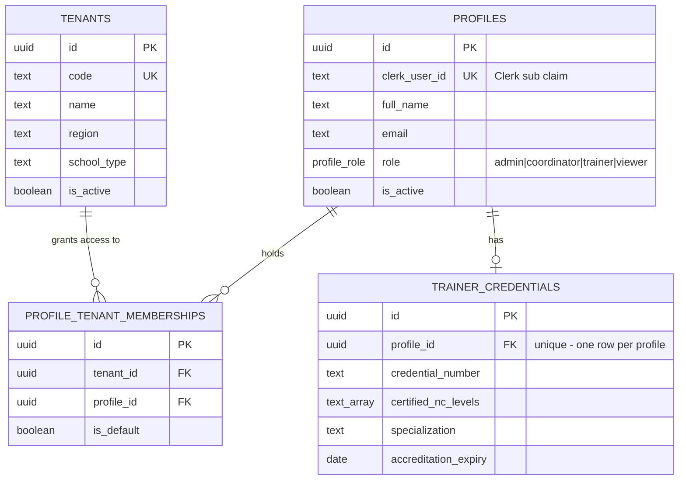
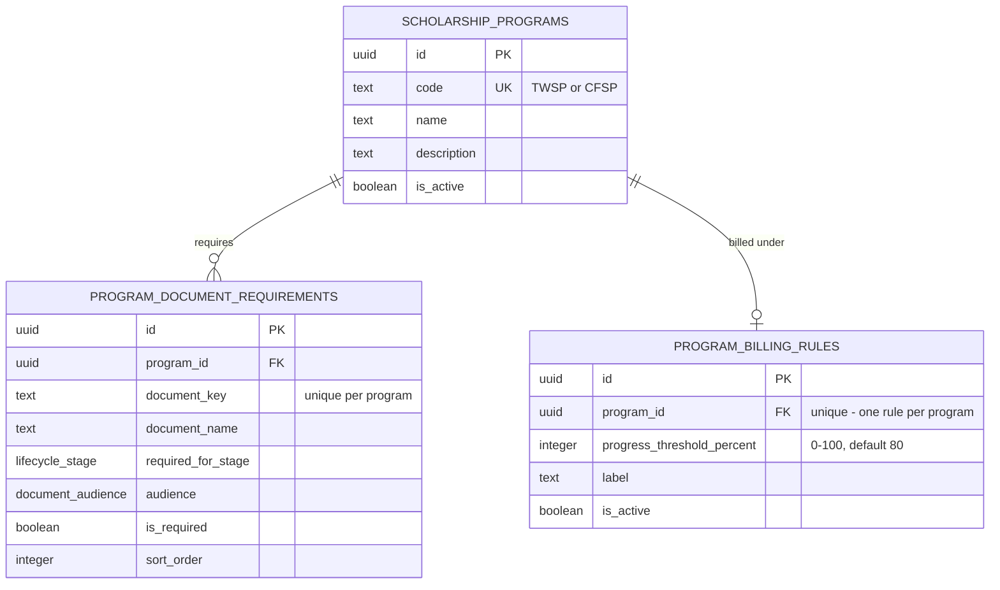
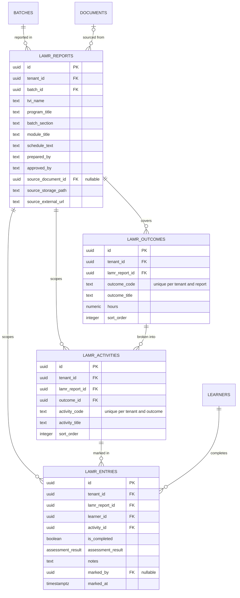
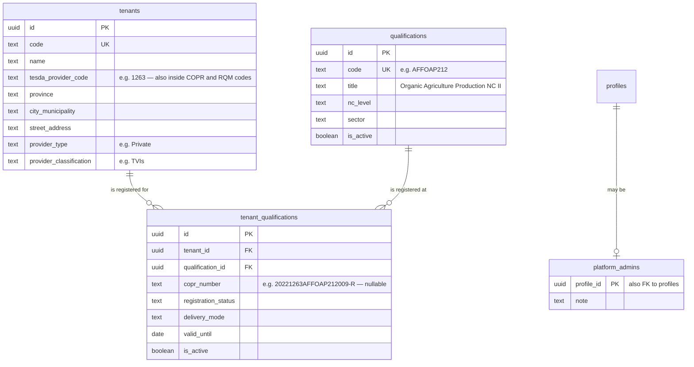

# Data model

Entity-relationship reference for the `public` schema, generated from the migration history
as of these seven versions. **Applied** means present in the live Supabase project;
**pending** means committed here but not yet run against it, so the database does not have it:

| Version | Migration | Status |
|---|---|---|
| `20260528160300` | `create_tenant_scoped_schema` — canonical schema, 14 tables, RLS | applied |
| `20260705070510` | `add_trainer_credentials` | applied |
| `20260717054607` | `migrate_akb_tenant_and_drop_rogue_table` | applied |
| `20260831120000` | [`seed_dev_operational_data`](../supabase/seeds/20260831120000_seed_dev_operational_data.sql) (data only, no DDL) — **moved to `supabase/seeds/`**, no longer a migration | not recorded; rows present |
| `20260904120000` | [`add_user_admin_write_policies`](../supabase/migrations/20260904120000_add_user_admin_write_policies.sql) (RLS policies only, no DDL) | **applied, not recorded** |
| `20260906120000` | [`ensure_invitation_membership_atomic`](../supabase/migrations/20260906120000_ensure_invitation_membership_atomic.sql) (one function, no DDL) | **genuinely missing** |
| `20260906114735` | [`add_school_registry_and_platform_admin`](../supabase/migrations/20260906114735_add_school_registry_and_platform_admin.sql) — 3 tables, 6 `tenants` columns, 2 functions, RLS ([ADR-006](adr/ADR-006-platform-admin-and-school-registry.md)) | applied |

Status re-verified against the live project on **2026-09-10** by catalog query
(`pg_proc`, `pg_policies`), not inferred — see [#230](https://github.com/shuakyle21/tesda-compliance-manager/issues/230).
Two entries changed:

- `20260904120000` was listed as pending. Its four policies are in fact present; it was
  applied by hand without being recorded.
- `20260831120000`'s fixture rows are present in the hosted project. The file has been moved
  out of `migrations/` — it self-describes as "a DEV fixture, not real data" and should never
  have been something tooling applies automatically. Moving it does not remove the rows.

**"Recorded" and "applied" are different things here.** The database is *ahead* of its own
migration table: objects exist that the table does not know about. So neither this ledger nor
`list_migrations` alone is authoritative — check objects by name (`pg_proc`, `pg_policies`).

**Version ≠ filename.** `add_school_registry_and_platform_admin` is recorded as
`20260906114735`, and its file was renamed to match (it was `20260906130000`). Supabase keys
the migration table on the version string, so a filename that disagrees with the record makes
`db push` try to re-run an applied migration.

The one real gap is `public.ensure_profile_tenant_membership`, which
`modules/auth/data/provisioning.ts` calls and which does not exist.

The live schema is therefore **18 tables and 36 foreign keys**. The four cluster diagrams below
still draw the 15 pre-existing tables; the three new ones have their own section at the end
rather than being redrawn into the clusters.

The three still-pending migrations change behaviour rather than shape. Most consequentially:
until `20260904120000` runs, no client can write `profiles` or `profile_tenant_memberships`, so
`/users/new` cannot assign anyone — **including the school admin that `/schools/new` expects you
to seat next**. The two screens are a pair; the second is not usable until that migration lands.

If you add a migration, update this file in the same PR — nothing enforces that automatically,
so the version table above is how a reader tells whether this is current. Applying a migration
is a separate, deliberate step; move its row to `applied` only after it has actually run.

**15 tables, 33 foreign keys.** `tenants` and `profiles` are the two hubs, with 9 inbound
references each. Diagrams are split into four clusters because a single graph of 15 tables is
unreadable; every table appears in exactly one cluster, and every foreign key is drawn on
exactly one diagram.

Cardinality is taken from the column definitions, not from intent: a `not null` foreign key
renders as `||` on the parent side, a nullable one as `|o`.

---

## 1. Identity and tenancy

`tenants` and `profiles` are the roots of the entire schema. Neither carries a `tenant_id` —
they define the scope rather than living inside it. `profile_tenant_memberships` is the join
table that makes a user a member of a school, and it is what every RLS policy ultimately
consults.

`trainer_credentials.profile_id` is `unique`, so the relationship is one-to-zero-or-one, not
one-to-many.

---

## 2. Program catalog

Global reference data. These three tables have no `tenant_id` — a scholarship program and its
document requirements are the same for every school. Tenant scoping enters only when a batch
references a program.

---

## 3. Operational core

The working tables. All four carry `tenant_id` and are RLS-scoped. `batches` is the centre of
the application — one row is one RQM-coded training batch moving through the lifecycle.

Two notes on what this diagram deliberately does not draw:

- `batches.created_by` and `batches.updated_by` are real foreign keys to `profiles`, shown as
  attributes rather than edges. Drawing all three `profiles → batches` references as separate
  lines buries the one that carries meaning (`trainer_profile_id`).
- `activity_log.entity_type` / `entity_id` are a polymorphic pointer with no foreign key
  constraint, so no line can be drawn. The database will not stop an `entity_id` pointing at
  a deleted row.

---

## 4. LAMR evidence

Learning Activity and Module Record data. Four tables, all tenant-scoped, forming a
report → outcome → activity → per-learner-entry hierarchy. `tenants` and `profiles` edges are
omitted here to keep the shape readable; every one of these tables has `tenant_id not null`,
and `lamr_entries.marked_by` is a nullable reference to `profiles`.

`lamr_entries` carries both `lamr_report_id` and `activity_id`, which is denormalised — the
report is already reachable through the activity. The redundant column exists so RLS policies
and the `lamr_entries_report_idx` index can filter by report without a join.

---

## The part no ER diagram can show

Foreign keys describe what *connects*. They say nothing about what a given user can *see*,
and in this schema that is the more important question. RLS is the security boundary; hiding
things in the UI is a usability nicety on top of it.

**Nine of fifteen tables carry `tenant_id`** and are filtered by tenant membership:
`profile_tenant_memberships`, `batches`, `learners`, `documents`, the four `lamr_*` tables,
and `activity_log`.

**Six deliberately do not**, for three different reasons:

- `tenants`, `profiles` — the roots that *define* scope, so they cannot sit inside it.
- `scholarship_programs` — a global catalog, readable by every authenticated user.
- `program_document_requirements`, `program_billing_rules`, `trainer_credentials` — scoped
  indirectly through their parent row.

### Policies by table

| Table | Read | Write |
|---|---|---|
| `tenants` | assigned tenants only | *no write policy* |
| `profiles` | own, or same-tenant | *no write policy* |
| `profile_tenant_memberships` | assigned tenants | *no write policy* |
| `trainer_credentials` | own, or same-tenant as admin/coordinator | own, trainer only |
| `scholarship_programs` | any authenticated user | admin, coordinator |
| `program_document_requirements` | any authenticated user | admin, coordinator |
| `program_billing_rules` | any authenticated user | admin, coordinator |
| `batches` | tenant members | admin, coordinator (separate insert/update/delete) |
| `learners` | tenant members | admin, coordinator |
| `documents` | tenant members | admin, coordinator; trainers may insert/update their own assigned training documents |
| `lamr_reports` | tenant members | admin, coordinator, assigned trainer |
| `lamr_outcomes` | tenant members | admin, coordinator, assigned trainer |
| `lamr_activities` | tenant members | admin, coordinator, assigned trainer |
| `lamr_entries` | tenant members | admin, coordinator, assigned trainer |
| `activity_log` | tenant members | insert only, `can_access_tenant(tenant_id)` — **any role**, viewer included; no update or delete policy |

Three tables have no write policy at all. That is intentional: `tenants`, `profiles`, and
`profile_tenant_memberships` are provisioned out-of-band, not through the authenticated
client.

A `viewer` has read access wherever their membership reaches. Their only write path is
`activity_log`: its insert policy checks `app_private.can_access_tenant(tenant_id)` and
nothing else, so unlike every other write policy in the schema it applies no role predicate.
Every other table restricts writes to `admin` / `coordinator` / assigned `trainer`, and
`activity_log` has no update or delete policy, so the append-only behaviour holds — a viewer
can add an entry but cannot alter or remove one.

> **Note for reviewers.** `CLAUDE.md` states that viewer is read-only and must be
> server-denied on writes. The `activity_log` insert policy is the one place where the
> database does not enforce that on its own. Whether appending an audit entry counts as a
> "write" for the purposes of that invariant is a product decision, not something this
> document can settle — flagging it rather than assuming either reading is correct.

Every policy resolves through the `app_private` helpers, which read the Clerk `sub` claim off
the JWT: `current_clerk_user_id()` → `current_profile_id()` → `current_role()` /
`can_access_tenant()` / `can_manage_tenant()`.

Storage objects in the evidence bucket carry their own parallel policies, scoped by the tenant
segment of the object path.

---

## Enums

| Type | Values |
|---|---|
| `profile_role` | `admin`, `coordinator`, `trainer`, `viewer` |
| `lifecycle_stage` | `aou`, `ntp`, `tip`, `training`, `assessment`, `billing`, `completed`, `blocked` |
| `batch_status` | `pending`, `ongoing`, `completed`, `blocked` |
| `document_status` | `missing`, `pending`, `submitted`, `verified` |
| `document_audience` | `admin`, `coordinator`, `trainer`, `viewer`, `all` |
| `assessment_result` | `competent`, `not_yet_competent`, `pending` |
| `activity_action` | `created`, `updated`, `uploaded`, `verified`, `submitted`, `deleted`, `system_note` |

These are the *database* spellings. The UI uses different names for three lifecycle stages
(`training→train`, `assessment→assess`, `billing→bill`), DB `blocked` surfaces as UI
`pending`, and the UI adds an `entre` stage that has no database column. That translation
happens in `DB_TO_UI_STAGE` in `modules/batches/data/batches.ts` and nowhere else.

---

## School registry (applied 2026-09-06 — migration `20260906114735`)

Added by [ADR-006](adr/ADR-006-platform-admin-and-school-registry.md). Three tables and six
`tenants` columns. Drawn separately from the four clusters above; folding it in is a tidy-up
nobody has done yet.

### Why the split

`qualifications` is **national reference data**, not tenant data: "Organic Agriculture
Production NC II" means the same thing at every school, and storing it per-tenant would produce
one spelling per school. What differs per school is the *registration* — the COPR number, its
status, delivery mode and expiry — so that lives on the link row.

Do not confuse `qualifications` with `scholarship_programs`. The latter holds TWSP and CFSP, the
**funding** programs ADR-001 builds billing on. They are unrelated axes: a batch has one
scholarship program and one qualification.

`copr_number` is nullable by design — a school is routinely entered before its certificate is
issued — which is why the unique constraint is `(tenant_id, qualification_id)` and not the COPR.
The certificate says COPR; the T2MIS import/export columns say CTPR. Same number.

### Access

`platform_admins` has RLS enabled and **no policies at all**, so every operation is denied and
the role cannot be self-granted from the app. Note it *does* carry the usual grants —
Supabase's default privileges grant every new `public` table to `anon` and `authenticated`
regardless — so the deny comes entirely from RLS-with-no-policies, verified by probe after
applying. The Supabase linter's `rls_enabled_no_policy` (INFO) on this table is the design;
adding a policy to silence it would open the door.
`app_private.is_platform_admin()` (`security definer`) is what policies consult, and
`public.current_user_is_platform_admin()` exposes only the caller's own boolean to the app.

A platform admin reaches `tenants`, `qualifications`, `tenant_qualifications`, unassigned
`profiles`, and `profile_tenant_memberships` — **and nothing else**. No policy grants them
`batches`, `learners`, `documents`, `lamr_*` or `activity_log`. Adding one is a boundary change
that needs its own ADR.

`profile_tenant_memberships` is the sharp edge: `app_private.can_access_tenant()` resolves purely
from that table, so an unconstrained INSERT there is equivalent to granting every compliance
table at once. The policy therefore forbids seating **yourself**
(`profile_id <> app_private.current_profile_id()`) and only admits a tenant that has no members
yet. Both predicates are load-bearing — see ADR-006 §P3.

`public.create_school(...)` is `security invoker`: it buys one transaction for the school plus
its programs, not a privilege. RLS still evaluates every statement inside it.
