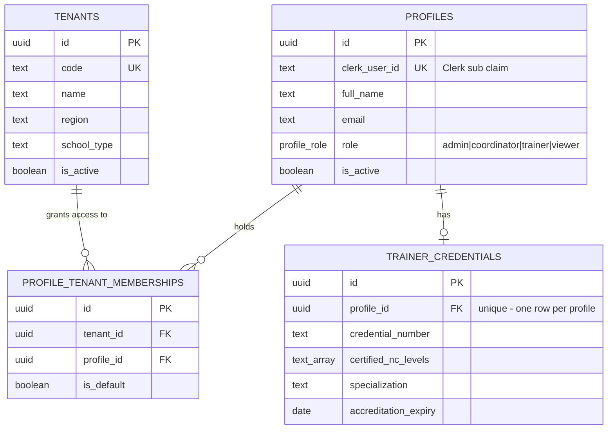
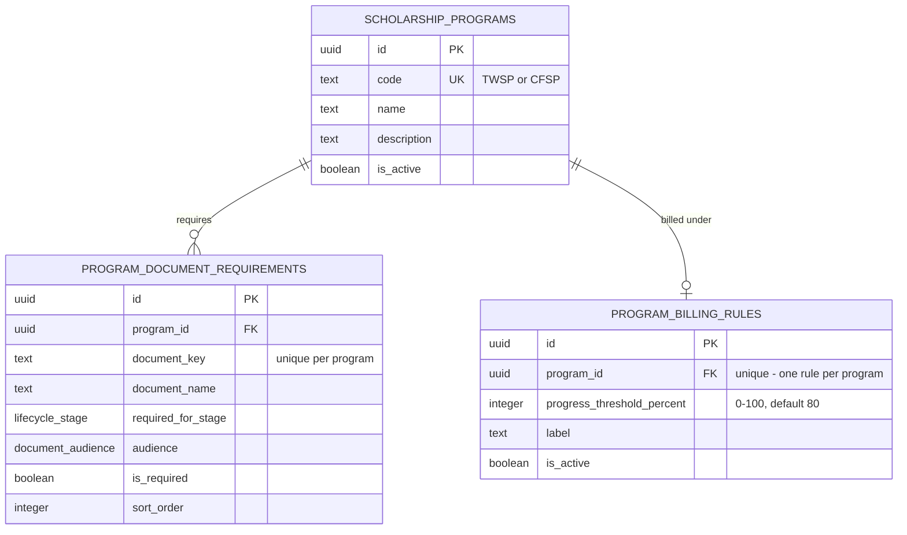
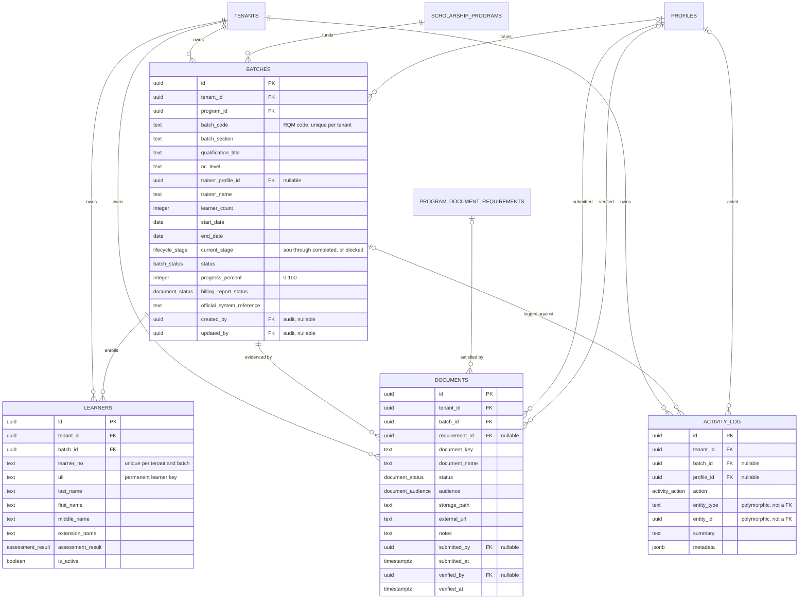
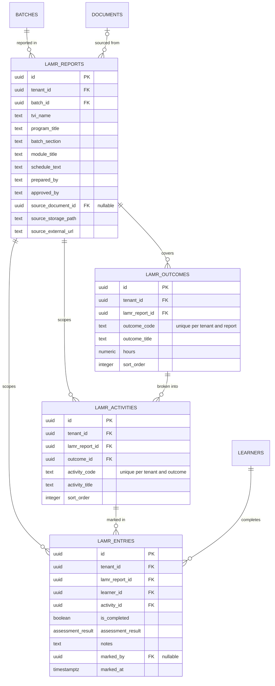

# Data model

Entity-relationship reference for the `public` schema, generated from the migration history
as of these four versions:

| Version | Migration |
|---|---|
| `20260528160300` | `create_tenant_scoped_schema` — canonical schema, 14 tables, RLS |
| `20260705070510` | `add_trainer_credentials` |
| `20260717054607` | `migrate_akb_tenant_and_drop_rogue_table` |
| `20260831120000` | `seed_dev_operational_data` (data only, no DDL) |

If you add a migration, update this file in the same PR — nothing enforces that automatically,
so the version table above is how a reader tells whether this is current.

**15 tables, 33 foreign keys.** `tenants` and `profiles` are the two hubs, with 9 inbound
references each. Diagrams are split into four clusters because a single graph of 15 tables is
unreadable; every table appears in exactly one cluster, and every foreign key is drawn on
exactly one diagram.

Cardinality is taken from the column definitions, not from intent: a `not null` foreign key
renders as `||` on the parent side, a nullable one as `|o`.

---

## 1. Identity and tenancy

`tenants` and `profiles` are the roots of the entire schema. Neither carries a `tenant_id` —
they define the scope rather than living inside it. `profile_tenant_memberships` is the join
table that makes a user a member of a school, and it is what every RLS policy ultimately
consults.

`trainer_credentials.profile_id` is `unique`, so the relationship is one-to-zero-or-one, not
one-to-many.

---

## 2. Program catalog

Global reference data. These three tables have no `tenant_id` — a scholarship program and its
document requirements are the same for every school. Tenant scoping enters only when a batch
references a program.

---

## 3. Operational core

The working tables. All four carry `tenant_id` and are RLS-scoped. `batches` is the centre of
the application — one row is one RQM-coded training batch moving through the lifecycle.

Two notes on what this diagram deliberately does not draw:

- `batches.created_by` and `batches.updated_by` are real foreign keys to `profiles`, shown as
  attributes rather than edges. Drawing all three `profiles → batches` references as separate
  lines buries the one that carries meaning (`trainer_profile_id`).
- `activity_log.entity_type` / `entity_id` are a polymorphic pointer with no foreign key
  constraint, so no line can be drawn. The database will not stop an `entity_id` pointing at
  a deleted row.

---

## 4. LAMR evidence

Learning Activity and Module Record data. Four tables, all tenant-scoped, forming a
report → outcome → activity → per-learner-entry hierarchy. `tenants` and `profiles` edges are
omitted here to keep the shape readable; every one of these tables has `tenant_id not null`,
and `lamr_entries.marked_by` is a nullable reference to `profiles`.

`lamr_entries` carries both `lamr_report_id` and `activity_id`, which is denormalised — the
report is already reachable through the activity. The redundant column exists so RLS policies
and the `lamr_entries_report_idx` index can filter by report without a join.

---

## The part no ER diagram can show

Foreign keys describe what *connects*. They say nothing about what a given user can *see*,
and in this schema that is the more important question. RLS is the security boundary; hiding
things in the UI is a usability nicety on top of it.

**Nine of fifteen tables carry `tenant_id`** and are filtered by tenant membership:
`profile_tenant_memberships`, `batches`, `learners`, `documents`, the four `lamr_*` tables,
and `activity_log`.

**Six deliberately do not**, for three different reasons:

- `tenants`, `profiles` — the roots that *define* scope, so they cannot sit inside it.
- `scholarship_programs` — a global catalog, readable by every authenticated user.
- `program_document_requirements`, `program_billing_rules`, `trainer_credentials` — scoped
  indirectly through their parent row.

### Policies by table

| Table | Read | Write |
|---|---|---|
| `tenants` | assigned tenants only | *no write policy* |
| `profiles` | own, or same-tenant | *no write policy* |
| `profile_tenant_memberships` | assigned tenants | *no write policy* |
| `trainer_credentials` | own, or same-tenant as admin/coordinator | own, trainer only |
| `scholarship_programs` | any authenticated user | admin, coordinator |
| `program_document_requirements` | any authenticated user | admin, coordinator |
| `program_billing_rules` | any authenticated user | admin, coordinator |
| `batches` | tenant members | admin, coordinator (separate insert/update/delete) |
| `learners` | tenant members | admin, coordinator |
| `documents` | tenant members | admin, coordinator; trainers may insert/update their own assigned training documents |
| `lamr_reports` | tenant members | admin, coordinator, assigned trainer |
| `lamr_outcomes` | tenant members | admin, coordinator, assigned trainer |
| `lamr_activities` | tenant members | admin, coordinator, assigned trainer |
| `lamr_entries` | tenant members | admin, coordinator, assigned trainer |
| `activity_log` | tenant members | tenant members (append-only insert) |

Three tables have no write policy at all. That is intentional: `tenants`, `profiles`, and
`profile_tenant_memberships` are provisioned out-of-band, not through the authenticated
client. A `viewer` has read access wherever their membership reaches and no write policy
anywhere.

Every policy resolves through the `app_private` helpers, which read the Clerk `sub` claim off
the JWT: `current_clerk_user_id()` → `current_profile_id()` → `current_role()` /
`can_access_tenant()` / `can_manage_tenant()`.

Storage objects in the evidence bucket carry their own parallel policies, scoped by the tenant
segment of the object path.

---

## Enums

| Type | Values |
|---|---|
| `profile_role` | `admin`, `coordinator`, `trainer`, `viewer` |
| `lifecycle_stage` | `aou`, `ntp`, `tip`, `training`, `assessment`, `billing`, `completed`, `blocked` |
| `batch_status` | `pending`, `ongoing`, `completed`, `blocked` |
| `document_status` | `missing`, `pending`, `submitted`, `verified` |
| `document_audience` | `admin`, `coordinator`, `trainer`, `viewer`, `all` |
| `assessment_result` | `competent`, `not_yet_competent`, `pending` |
| `activity_action` | `created`, `updated`, `uploaded`, `verified`, `submitted`, `deleted`, `system_note` |

These are the *database* spellings. The UI uses different names for three lifecycle stages
(`training→train`, `assessment→assess`, `billing→bill`), DB `blocked` surfaces as UI
`pending`, and the UI adds an `entre` stage that has no database column. That translation
happens in `DB_TO_UI_STAGE` in `modules/batches/data/batches.ts` and nowhere else.
