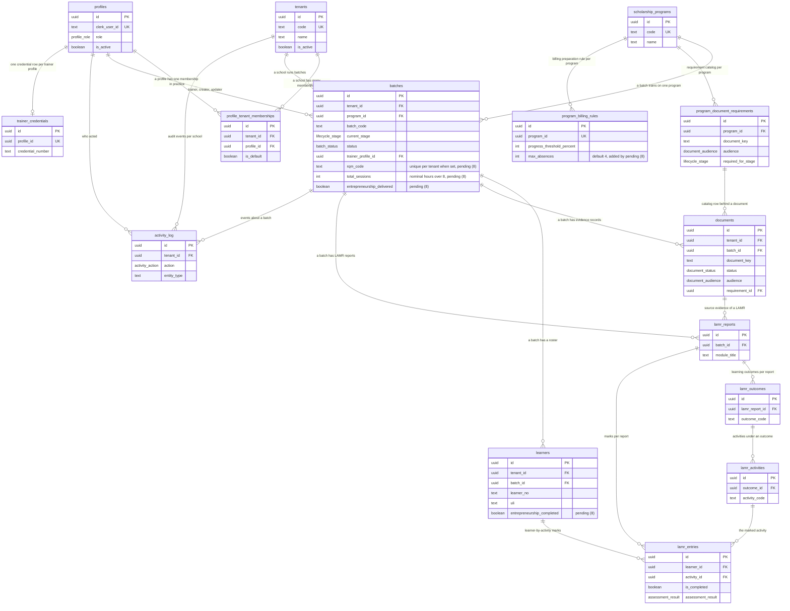
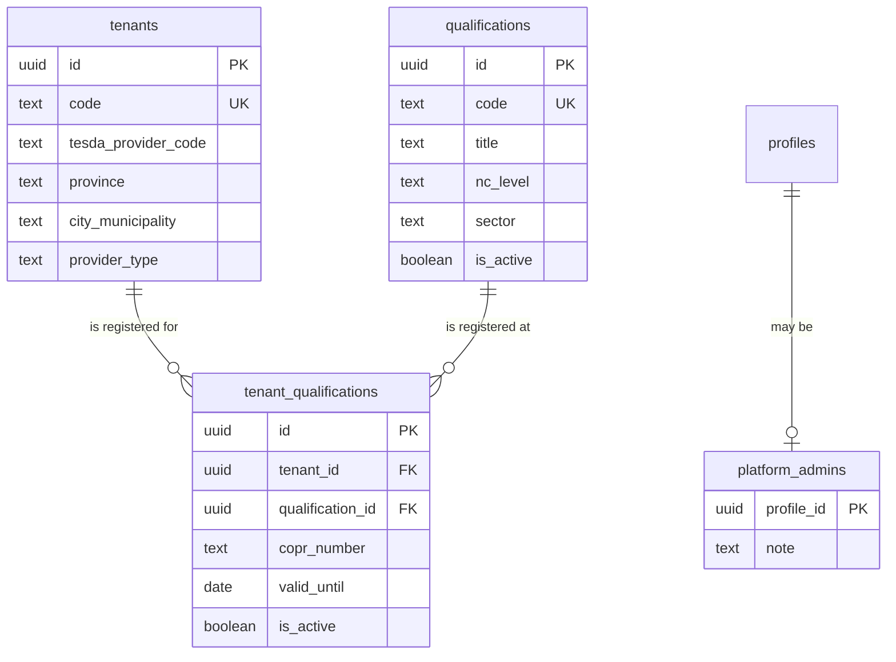
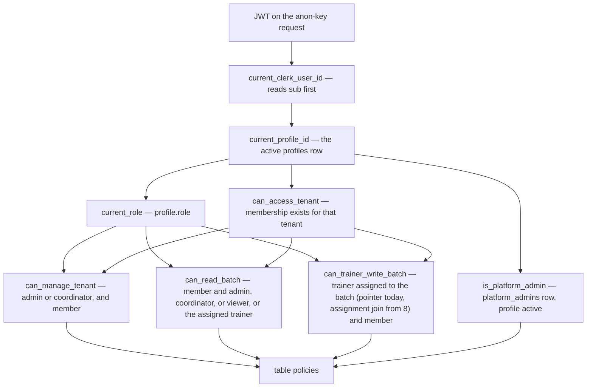

# Supabase Data Model and RLS Policies

This page documents the database: what the schema is, how Postgres row-level security decides every authorization, which migration created what, and the contract that keeps the TypeScript types honest. TVI-CAMS is a single Next.js app talking directly to **one hosted Supabase project (Postgres + Storage)** with Clerk as identity — there is no separate backend and no staging environment; the code side of the chain (Clerk token → anon-key client → RLS) is covered in [Client wiring and the anon-key pattern](#client-wiring-and-the-anon-key-pattern) below. The checked-in history is **eight migrations — four applied, four pending**. The live schema is **18 tables and 36 foreign keys** with seven enums; the checked-in target is **25 tables and 52 foreign keys** with eight enums once the pending ADR-001 billing domain (migration 8) lands. Two migrations after the 15-table era change table shape: ADR-006's school registry and platform admin (applied) and ADR-001's billing domain (pending, the newest file). One caveat frames everything: since the 2026-09-10 **#230** verification, "applied" and "pending" mean *per the records* — the ledger, the migration headers, and the plan doc — never a fresh look at the live project (RULES §10 forbids it), because the live database is ahead of its own migration table in places and the ledger is behind the repo in places.

Three ground rules frame everything below:

- **RLS is the security boundary; UI hiding is usability only.** Every authorization decision is made by Postgres RLS through the `app_private.*` helper functions (RULES §1.1, [`RULES.md`](/RULES.md)). A JS-side tenant filter is a bug **even when it returns the right answer** (RULES §1.2) — it signals the query was written assuming no RLS.
- **Supabase holds internal working copies only.** TESDA SIS, T2MIS, and BSRS remain the authoritative systems; nothing in this schema may be presented as official TESDA approval ([`docs/SUPABASE_SCHEMA_GUIDE.md`](/docs/SUPABASE_SCHEMA_GUIDE.md)). This includes the billing domain: `billing_records` is an append-only *generation log* (ADR-001 NoLedger), not an accounts ledger and not an official TESDA billing record — the TESDA Provincial Office reconciles totals, and the app must not appear to.
- **Platform admin is a different axis, not a bigger role.** It is not a fifth `profile_role` value and grants nothing inside any tenant — its reach is the school registry only, and widening that is a boundary change needing its own ADR (RULES §7.30, [ADR-006](/docs/adr/ADR-006-platform-admin-and-school-registry.md)).

## Migration history

The checked-in migration history is the only trustworthy description of the schema. [`docs/DATA_MODEL.md`](/docs/DATA_MODEL.md) is its status ledger, and its version table (last checked against the live project on **2026-09-06**) is the source for applied vs pending below — with two caveats: the table still lists only **seven** versions (the same-PR ledger update for row 8 that RULES §3.20 requires has not landed, so the migrations directory is ahead of its own ledger), and the 2026-09-10 **#230** verification found the live project's own records out of step with both (see below). Applied vs pending is therefore read from the ledger plus the migration header notes, never by querying the live project (RULES §10):

| # | Version | File | Purpose | Status |
|---|---------|------|---------|--------|
| 1 | `20260528160300` | [`create_tenant_scoped_schema.sql`](/supabase/migrations/20260528160300_create_tenant_scoped_schema.sql) | **The canonical migration.** Creates the `app_private` schema, the seven enums, all 14 original tables, indexes, `set_updated_at` triggers, every `app_private.*` RLS helper, RLS enablement, all `public`-table policies, the reference-data seeds (tenants, programs, document catalog, billing rules), and the `compliance-evidence` storage bucket plus its policies. | applied |
| 2 | `20260705070510` | [`add_trainer_credentials.sql`](/supabase/migrations/20260705070510_add_trainer_credentials.sql) | Adds `trainer_credentials` (one row per trainer profile) with its trigger, RLS, and two policies. | applied |
| 3 | `20260717054607` | [`migrate_akb_tenant_and_drop_rogue_table.sql`](/supabase/migrations/20260717054607_migrate_akb_tenant_and_drop_rogue_table.sql) | Corrective migration: reconciles a hand-created rogue `public.tenant` table by copying its one real record (AKB) into the canonical `public.tenants` and dropping the rogue table. | applied |
| 4 | `20260831120000` | [`seed_dev_operational_data.sql`](/supabase/migrations/20260831120000_seed_dev_operational_data.sql) | Seeds **dev operational data** — five `DEV-`-prefixed batches, placeholder learner rosters, per-batch document rows, and the `documents_batch_id_document_key_key` unique index. Data only, no DDL. | **pending** |
<!-- openwiki: broken internal link [/app/(dashboard] file "/app/(dashboard" does not exist. Fix the href or restore the target, then delete this comment. -->
| 5 | `20260904120000` | [`add_user_admin_write_policies.sql`](/supabase/migrations/20260904120000_add_user_admin_write_policies.sql) | Four admin-only write policies that make [`/users/new`](/app/(dashboard)/users/new/page.tsx) executable. Policies only, no DDL. | **pending** |
| 6 | `20260906120000` | [`ensure_invitation_membership_atomic.sql`](/supabase/migrations/20260906120000_ensure_invitation_membership_atomic.sql) | `public.ensure_profile_tenant_membership(...)` — the atomic invitation-membership function used by the Clerk webhook. One function, no DDL. | **pending** |
| 7 | `20260906130000` | [`add_school_registry_and_platform_admin.sql`](/supabase/migrations/20260906130000_add_school_registry_and_platform_admin.sql) | **ADR-006**: three tables (`qualifications`, `tenant_qualifications`, `platform_admins`), six new `tenants` columns, `app_private.is_platform_admin()`, `public.current_user_is_platform_admin()`, `public.create_school(...)`, the platform-admin policies, and an idempotent six-qualification seed. | applied |
| 8 | `20260910120000` | [`add_adr001_billing_domain.sql`](/supabase/migrations/20260910120000_add_adr001_billing_domain.sql) | **ADR-001 Phase 0.1** (issue #36, EPIC #19): seven tables (`program_modules`, `scholarship_cost_schedule`, `learner_identities`, `attendance_records`, `batch_trainer_assignments`, `billing_records`, `tenant_settings`), 16 new foreign keys, the `billing_type` enum (the eighth), columns on `batches`/`learners`/`program_billing_rules`, the widened `can_trainer_write_batch`, the `storage.objects` DELETE policy, and the cost-schedule seed. A **shape change**, not behaviour-only. | **pending** |

**Applied out of order — and the checked-in history and the live schema currently differ.** `20260906130000` was applied on 2026-09-06 while `20260831120000`, `20260904120000`, and `20260906120000` were still pending — it depends on none of them, only on the base schema. Supabase records migrations by version, so applying the earlier three later is fine; **just do not assume "highest applied version" means everything below it has run.** As things stand, the live database's migration table holds exactly the four applied rows above — not all eight files — so read the Status column, not the version numbers, when asking what the running schema contains. Each row was re-verified against the eight files in `supabase/migrations/`.

**#230: the repo and the live database have drifted (verified 2026-09-10).** The live project's migration history returns four versions: the three applied base ones plus the school registry — recorded under **`20260906114735`** while its file is named **`20260906130000`** (the same migration under two versions). Three checked-in migrations are untracked (`20260831120000`, `20260904120000`, `20260906120000`). The verification recorded in the 8th migration's header and in [docs/DEMO_DATA_VALIDATION_PLAN.md](/docs/DEMO_DATA_VALIDATION_PLAN.md) Phase 0 found the database **ahead of its own records rather than behind them**: those objects exist, applied by hand — the dev seed's batches/learners/documents row counts (5/89/40) match its content exactly — and the one real gap is **`public.ensure_profile_tenant_membership`**, which does not exist on live even though [`modules/auth/data/provisioning.ts`](/modules/auth/data/provisioning.ts) calls it. Two consequences: the `documents_batch_id_document_key_key` unique index is of unknown existence (any new seed using `on conflict (batch_id, document_key)` fails without it), and **reconcile #230 before assuming a clean `db push`** — the 8th migration depends on nothing of that reconciliation (every table and function it references was verified present), but the push mechanics need sorting out first.

**The three older pending migrations change behaviour, not shape — and #230 complicates even that.** Per the ledger: until `20260904120000` runs, no client can write `profiles` or `profile_tenant_memberships`, so `/users/new` cannot assign anyone — **including the school admin that `/schools/new` expects you to seat next**; the two screens are a pair, the second not usable until that migration lands. Per the #230 verification, those four policies are in fact present on live (untracked), so the direct path is not RLS-denied today — the ledger just hasn't caught up. What is really missing on live is `ensure_profile_tenant_membership`: until the function exists, the membership half of an invitation grant cannot land, and the webhook rethrows (500) so Clerk keeps retrying — the profile row itself still lands, because the webhook runs on the service-role client. `20260831120000` seeds the dev operational rows the dashboard and the isolation assertion need — also present on live per #230, untracked.

**The fourth pending migration — the newest — is a shape change.** [The ADR-001 billing domain](#the-adr-001-billing-domain-migration-8-pending) adds seven tables, 16 foreign keys, columns on three existing ones, an eighth enum, a widened RLS helper, and a storage DELETE policy; it is unapplied and unexecuted as of writing.

**New migrations are additive; migration 1 is canonical.** After any migration you regenerate `lib/supabase/database.types.ts`, then update the affected mappers and domain types (RULES §3.20, see [The database types regeneration contract](#the-database-types-regeneration-contract)).

Two further details matter for the history:

- **Migration 3 is guarded.** No migration ever created `public.tenant` — it was made by hand in the hosted project with non-conforming columns (camelCase, int PK). On any database rebuilt from this history (fresh `db reset`, CI) the table is absent, so the migration wraps its statements in a `do $$ … $$` block with a `to_regclass('public.tenant') is null` short-circuit: PL/pgSQL resolves statement names at execution, so a rebuilt database skips the block instead of failing with `42P01`. The file carries the version it was applied under on the hosted project (2026-07-17) so the ledger and the repo agree and it is never re-applied.
- **Dev-only seeds.** Migration 4 is a dev fixture in migration form (it only inserts `DEV-` rows). `supabase/seeds/` holds two hand-run seeds on top of it — [`dev_profile_memberships.sql`](/supabase/seeds/dev_profile_memberships.sql) and [`verify_user_admin_setup.sql`](/supabase/seeds/verify_user_admin_setup.sql) — both seeds rather than migrations because they hardcode Clerk user IDs, and Clerk development and production instances issue *different* IDs for the same person. A migration carrying those values would run in production and insert rows keyed to users that cannot exist there — dead identities in the table RLS trusts most ([ADR-005](/docs/adr/ADR-005-demo-account-tenant-scoping.md)). Migrations carry schema and reference data; these are environment-specific fixture data, run manually via `psql`. See [Dev-only seeds](#dev-only-seeds).

## Core tables

The live schema has **18 tables** — the 15 pre-ADR-006 tables (14 in the canonical migration + `trainer_credentials`) plus the three school-registry tables — all in `public`, joined by 36 foreign keys; the checked-in target after migration 8 is **25 tables and 52 foreign keys**. [`docs/DATA_MODEL.md`](/docs/DATA_MODEL.md) is the in-repo ER companion: its four cluster diagrams still draw the 15 pre-existing tables, the three ADR-006 tables get a separate section at the end rather than being redrawn into the clusters (folding them in is a tidy-up nobody has done yet), and its version table still lists only seven versions with "18 tables and 36 foreign keys" — the same-PR update (RULES §3.20) for the 8th migration has not landed, so the migrations directory is ahead of its own ledger. It must be updated in the same PR as any new migration — nothing enforces that automatically, and its version table is how a reader tells whether the doc is current. [`docs/SUPABASE_SCHEMA_GUIDE.md`](/docs/SUPABASE_SCHEMA_GUIDE.md) is superseded for implementation (banner dated 2026-09-05) and kept for the design rationale and the TESDA boundary. Every tenant-owned table carries a `tenant_id`, and the tenant boundary is enforced structurally as well as by RLS: composite natural keys are tenant-scoped (e.g. `batches` unique on `(tenant_id, batch_code)`, `learners` on `(tenant_id, batch_id, learner_no)`, the three LAMR detail tables all include `tenant_id` in their uniqueness constraints) — the four new tenant-scoped billing-domain tables follow the same pattern, and their three global ones (`program_modules`, `scholarship_cost_schedule`, `learner_identities`) are deliberately tenant-less.

*The original 15 tables and their relationships (the four clusters of `docs/DATA_MODEL.md`, flattened). `batches.program_id` references `scholarship_programs` with no delete behavior (restrict); most other references cascade, and profile references that record authorship (`created_by`, `submitted_by`, `verified_by`, `marked_by`) use `ON DELETE SET NULL` so deleting a profile never destroys compliance history. The attributes marked **(8)** on `batches`, `learners`, and `program_billing_rules` are added by the pending ADR-001 migration — for those three shapes the diagram shows the checked-in target, not the live schema.*

### Table catalog

- **`tenants`** — the schools (AKB, J3ED, NEN in the seed). Natural key `code`; `region`/`school_type` are plain text. ADR-006 added six columns: `tesda_provider_code` (the school's TESDA provider number, e.g. `1263` — it appears inside both COPR numbers and batch RQM codes, the join between a school's certificates and its batches; nothing parses it yet, the column records the fact), `province`, `city_municipality`, `street_address`, `provider_type`, `provider_classification` (the last two exist to unblock the T2MIS export, which hardcoded `'Private'` and `'TVIs'`; `province`/`city_municipality` are authoritative going forward while `region` keeps its free-text shape and the export falls back to splitting it for the three seeded schools).
- **`profiles`** — one row per Clerk user: `clerk_user_id` (unique), `role` (`profile_role`), `is_active`. This is the row RLS actually reads. There is **no insert/update policy for `authenticated` in the applied base schema** — profiles are written by the service-role Clerk-webhook provisioning path and, per migration 5 (present on live untracked per #230, pending per the ledger), by admin assignments via [`/users/new`](#profile-provisioning-and-user-administration) (see [Per-table policy map](#per-table-policy-map)).
- **`profile_tenant_memberships`** — the join table granting a profile access to a tenant; unique `(tenant_id, profile_id)`, `is_default` flag, `ON DELETE CASCADE` on both ends. In practice a profile holds exactly **one** membership (ADR-005 decision 1; multi-membership is out of scope in [`CONTEXT.md`](/CONTEXT.md)). `can_access_tenant` grants on *any* membership and ignores `is_default`, which is why a second membership would merge tenants into one unscoped list.
- **`scholarship_programs`** — configurable TESDA *funding* programs (TWSP, CFSP), keyed by `code`. Deliberately **not** the home for a school's programs — those are TESDA-registered qualifications (see `qualifications`); reusing the table would corrupt the ADR-001 billing model. The billing domain keeps the two axes apart structurally: `program_modules` and `scholarship_cost_schedule` each join a `scholarship_programs` row to a `qualifications` code.
- **`program_document_requirements`** — the per-program document catalog: `document_key`, name, `required_for_stage`, `audience`, `sort_order`; unique `(program_id, document_key)`. Powers the compliance checklist.
- **`program_billing_rules`** — one row per program (unique `program_id`); `progress_threshold_percent` CHECK 0–100, seeded at **80**. Explicitly an internal billing-*preparation* signal, not TESDA billing approval. Pending **(8)** adds `max_absences integer not null default 4` (the ADR-001 Elig cap — see [The ADR-001 billing domain](#the-adr-001-billing-domain-migration-8-pending)).
- **`batches`** — the central record. Tenant-scoped, unique `(tenant_id, batch_code)`. Carries `current_stage` (`lifecycle_stage`, default `'aou'`), `status` (`batch_status`, default `'pending'`), `progress_percent` and `billing_report_status` (CHECK-bounded), `trainer_profile_id` (nullable, `SET NULL`), plus denormalized `trainer_name` and `official_system_reference`. `qualification_title` stays **free text with no FK to `qualifications`** — making it one would break `mapBatchRow` and every existing row (ADR-006 consequence). Pending **(8)** adds 15 columns — the RQM/NTP authorization, the schedule, the BB1 cost snapshot, and `entrepreneurship_delivered` — plus the partial unique index enforcing one RQM code per tenant; deliberately *not* `billing_deadline` or `sessions_held` (see [The ADR-001 billing domain](#the-adr-001-billing-domain-migration-8-pending)).
- **`learners`** — the roster; unique `(tenant_id, batch_id, learner_no)`, `uli` is the permanent learner key (null for synthetic rows), `assessment_result` default `'pending'`. Pending **(8)** adds `entrepreneurship_completed` (the Flag-3x dual-training guard) and the partial `uli` index the key never got.
- **`documents`** — one evidence record per (batch, document key): `status` default `'missing'`, `audience` default `'all'`, `storage_path`/`external_url`, `submitted_by`/`verified_by` (`SET NULL`). `document_key` is plain text — **no FK to the catalog**, so an unknown key produces a silently orphaned "untracked" row (the open half of the doc-key mismatch noted in migration 4; see [ADR-004](/docs/adr/ADR-004-untracked-document-semantics.md)).
- **`lamr_reports` / `lamr_outcomes` / `lamr_activities` / `lamr_entries`** — the Learners Achievement Monitoring Report structure: a report header per batch (with optional source document), outcomes under it, activities under outcomes, and learner-by-activity marks (`is_completed`, `assessment_result`, `marked_by`). Uniqueness is tenant-scoped at each level: `(tenant_id, lamr_report_id, outcome_code)`, `(tenant_id, outcome_id, activity_code)`, `(tenant_id, learner_id, activity_id)`. `lamr_entries` denormalizes `lamr_report_id` next to `activity_id` so RLS policies and its index can filter by report without a join. Pending **(8)** expects one LAMR per module per batch — the `lamr_reports.module_id` FK that would enforce it is deliberately deferred to its own migration.
- **`activity_log`** — append-only audit trail: `action` (`activity_action`), `entity_type`/`entity_id` (polymorphic pointer, no FK), `summary`, `metadata jsonb`. Only `created_at` — no `updated_at`. Pending **(8)** reuses it for attendance corrections (X2: every edit appends an event).
- **`trainer_credentials`** — one row per profile (unique `profile_id`, `CASCADE`): `credential_number`, `certified_nc_levels text[]`, `specialization`, `accreditation_expiry`.
- **`qualifications`** (ADR-006) — the **national** qualifications registry: unique TESDA `code` (e.g. `AFFOAP212`), `title`, `nc_level`, `sector`, `is_active`. Shared reference data, not tenant data — "Organic Agriculture Production NC II" means the same thing at every school, and storing it per-tenant would produce one spelling per school. Seeded idempotently with six rows (the qualifications appearing in current batch rows plus Organic Agriculture). One seeded row, `AFFACP211` (Agricultural Crops Production NC II), is the anchor of the unresolved code discrepancy in the pending cost-schedule seed — see [The ADR-001 billing domain](#the-adr-001-billing-domain-migration-8-pending).
- **`tenant_qualifications`** (ADR-006) — the per-school registration link row: `tenant_id` (CASCADE) + `qualification_id` (no delete behavior), unique `(tenant_id, qualification_id)`, plus the per-school facts that differ: `copr_number` (**nullable** — a school is routinely entered while its certificate is still being issued, and a required field would make the operator invent a number), `registration_status`, `delivery_mode`, `valid_until`. The certificate says COPR; the T2MIS import/export code says CTPR — same number, and the column takes the certificate's name while the export's `'CTPR'` header stays because it must match the file TESDA hands back.
- **`platform_admins`** (ADR-006) — one row per platform admin: `profile_id` (primary key, `references profiles ON DELETE CASCADE`), `note`, `created_at`. RLS enabled with **no policies** — the table is unreadable and unwritable through the anon client, which is what stops the role from being self-granted. See [School registry and platform admin](#school-registry-and-platform-admin-adr-006).
- **`program_modules`** (8, pending) — the fixed module list per (funding program, qualification): `module_title`, `module_order`, `nominal_hours`, `is_active`; unique `(program_id, qualification_code, module_order)`. Global reference data, no `tenant_id`.
- **`scholarship_cost_schedule`** (8, pending) — the TESDA Schedule of Cost as reference data, current rates only: `training_hours`, `training_days`, `training_cost`, `assessment_fee` (recorded, never billed), `tsf_day_rate` (default 160), `new_normal`, `insurance_fee`, `entrepreneurship_fee`; unique `(program_id, qualification_code)`. Global reference data, no `tenant_id`; the batch snapshots its matching row at creation.
- **`learner_identities`** (8, pending) — ADR-001 Q1's thin global learner-identity dimension and a **future seam only**: `uli` (PK), `full_name`. Created empty, left empty in MVP, RLS-enabled with **no policy and no grant** — a deliberate deny-all for every role until an agreed purpose justifies opening it.
- **`attendance_records`** (8, pending) — per-learner, per-session-date attendance: `attendance_date`, `time_in`, `time_out`, `present`, `notes`, `marked_by`/`marked_at`; unique `(tenant_id, batch_id, learner_id, attendance_date)`. Mutable in place, never locked even post-billing; sessions held is a count over this table.
- **`batch_trainer_assignments`** (8, pending) — the trainer↔batch join (M2): `trainer_profile_id`, `is_lead`, `assigned_by`; unique `(tenant_id, batch_id, trainer_profile_id)`. Supersedes the single `batches.trainer_profile_id` pointer, which is retained.
- **`billing_records`** (8, pending) — the **NoLedger generation log**: `billing_type`, `tranche`, `version`, `amount`, `scholar_snapshot jsonb`, `generated_by`; unique `(tenant_id, batch_id, billing_type, tranche, version)`. No `updated_at`, no UPDATE/DELETE policy — append-only enforced in the database. Not a ledger, not an invoice, not an official TESDA billing record.
- **`tenant_settings`** (8, pending) — one row per school (`tenant_id` unique): signatories (`prepared_by`/`approved_by` + titles), `letterhead_ref`, `addressee`, `partial_billing_enabled`, plus nullable `max_absences` / `progress_threshold_percent` overrides of `program_billing_rules` (null = inherit).

### The enums

Seven in the applied schema — created in the canonical migration and mirrored 1:1 in `database.types.ts` — and an eighth, `billing_type`, in the checked-in target:

| Enum | Values | Used by |
|------|--------|---------|
| `profile_role` | `admin`, `coordinator`, `trainer`, `viewer` | `profiles.role` |
| `lifecycle_stage` | `aou`, `ntp`, `tip`, `training`, `assessment`, `billing`, `completed`, `blocked` | `batches.current_stage`, `program_document_requirements.required_for_stage` |
| `batch_status` | `pending`, `ongoing`, `completed`, `blocked` | `batches.status` |
| `document_status` | `missing`, `pending`, `submitted`, `verified` | `documents.status`, `batches.billing_report_status` |
| `document_audience` | `admin`, `coordinator`, `trainer`, `viewer`, `all` | `documents.audience`, `program_document_requirements.audience` |
| `assessment_result` | `competent`, `not_yet_competent`, `pending` | `learners.assessment_result`, `lamr_entries.assessment_result` |
| `activity_action` | `created`, `updated`, `uploaded`, `verified`, `submitted`, `deleted`, `system_note` | `activity_log.action` |
| `billing_type` **(8, pending)** | `training_cost`, `tsf_allowance`, `entrepreneurship` | `billing_records.billing_type` |

ADR-006 deliberately added **no** enum: platform admin is a table, not a fifth `profile_role` value, and `school_type` stays free text (TESDA's provider vocabulary shifts between issuances). The first new enum since the canonical migration is `billing_type` (8): it mirrors `BillingTrackId` in [`modules/billing/domain/tracks.ts`](/modules/billing/domain/tracks.ts) exactly, so the mapper needs **no** enum bridge for it, and the assessment fee is absent by design — ADR-001 TVI-scope assigns it to the Assessment Center, and adding it here would imply the app generates billing it must not generate. Because the mappers use **total** enum-bridge maps for the existing enums (e.g. `DB_TO_UI_STAGE` in `modules/batches/data/batches.ts`, `DB_TO_UI_ROLE` in `modules/tenancy/data/tenancy.ts`), a new enum variant added by a migration fails compilation until its UI treatment is chosen — the enum set is a contract, not just data.

### Triggers

A single shared function, `public.set_updated_at()` (before-update, sets `updated_at = now()`), is attached to **15 tables on live**: the 12 updatable tables of the canonical migration, `trainer_credentials` (migration 2), and the two ADR-006 tables `qualifications` and `tenant_qualifications` (migration 7). `profile_tenant_memberships`, `activity_log`, and `platform_admins` have no `updated_at` column and no trigger — memberships converge explicitly (the dev seed deletes and reinserts), the audit log is append-only, and the admin list is grant-once. `execute` on `set_updated_at` is revoked from `anon` and `authenticated`. Pending **(8)** adds the trigger to six of its seven new tables (`attendance_records`, `batch_trainer_assignments`, `tenant_settings`, `program_modules`, `scholarship_cost_schedule`, `learner_identities`) for 21 post-apply, and deliberately to **none** on `billing_records` — it has no `updated_at` column and no UPDATE policy, so a before-update trigger could never fire; the absence is part of the append-only signal.

## School registry and platform admin (ADR-006)

Migration 7 ([`20260906130000`](/supabase/migrations/20260906130000_add_school_registry_and_platform_admin.sql)), implemented by [ADR-006](/docs/adr/ADR-006-platform-admin-and-school-registry.md) (accepted 2026-09-06, supersedes the PRD's FR-02 "Super Admin is not implemented" prohibition), closes the hole the user screen left: `/users/new` grants a person access to a school that **already exists**, and nothing created the school — the three tenants were inserted by hand at the bottom of the canonical migration, so onboarding a new TVI meant editing SQL. (Record-keeping note: the live migration table carries this migration under version `20260906114735` rather than the file name `20260906130000` — see the #230 note in [Migration history](#migration-history).)

Two structural facts made that more than a missing form:

1. `tenants` has no INSERT policy, and its SELECT policy is membership-scoped — a freshly created school has no members, so even with an INSERT policy the creator could not read back the row they just wrote. Creation genuinely requires an actor **outside** the tenant boundary.
2. `scholarship_programs` holds funding programs, not school qualifications — the wrong home on a different axis.

*The ADR-006 cluster, drawn separately from the original 15-table diagrams, as `docs/DATA_MODEL.md` does. `tenant_qualifications` is the only table that carries both a tenant FK and a reference-to-the-national-registry FK.*

**A platform admin exists (P1).** An operator outside every tenant who provisions schools on request, in the way TESDA itself issues T2MIS/BSRS accounts. The alternative readings were all worse: an admin auto-enrolling themselves in a created school would let every school admin mint schools; keeping schools migration-only means no add-school screen, which is the requirement.

**A table, not an enum value (P2).** `profile_role` is a *tenant-scoped* vocabulary — every base policy switches on `current_role()`, so a fifth value would silently widen or narrow each one until re-audited. Platform admin is a different axis: not "a bigger admin" but "not in any tenant". `platform_admins` carries **no policies and no grants for `authenticated`**, so it cannot be read or written through the Clerk-scoped anon client at all — that is what stops the role from being self-granted through any application path. Note the deny comes from RLS-with-no-policies, not from withholding privileges: Supabase ships default privileges that grant every new `public` table to `anon` and `authenticated` regardless, and the post-apply probe confirmed `authenticated` holds all seven privileges on the table while an `insert` still fails with a row-level-security violation. The Supabase linter's `rls_enabled_no_policy` (INFO) on this table is the design, not a defect — any policy here is a way in. Enrolling a platform admin is a statement run against the project directly (gated by RULES §10): `insert into public.platform_admins (profile_id) select id from public.profiles where email = '<operator email>';`.

**Resolution.** `app_private.is_platform_admin()` — `stable`, `security definer`, `search_path ''`, granted to `authenticated` and revoked from `public`/`anon` — is `exists (platform_admins join profiles where profile_id = current_profile_id() and is_active = true)`. The application asks through `public.current_user_is_platform_admin()`, a second `security definer` that returns **only the caller's boolean, never the membership list** (the table is deliberately unreadable, so this is the one question a SELECT cannot answer). [`modules/tenancy/data/platform.ts`](/modules/tenancy/data/platform.ts) wraps it in a `cache()`-ed snapshot — `getPlatformAdminSnapshot()` returns `data === true` (an unresolved answer shows the smaller surface, never the larger), and the `isPlatformAdmin()` convenience treats every failure as *not* a platform admin for the sidebar, where a failed check should hide the row rather than link into a denial.

**The boundary (P3).** A platform admin can create a school, read every school's name and program list, and seat a school's first member. They cannot read one scholar record, one document, or one billing figure. The reach is exactly: `tenants` (SELECT/INSERT/UPDATE), `qualifications` (active-row SELECT for any authenticated user, FOR ALL for platform admins), `tenant_qualifications` (SELECT for tenant members or platform admins, FOR ALL for platform admins), `profiles` (unassigned only, SELECT), and `profile_tenant_memberships` (SELECT all rows, INSERT first members only) — checkable as `grep is_platform_admin` over the migrations. **Granting `is_platform_admin()` access to any compliance table (`batches`, `learners`, `documents`, `lamr_*`, `activity_log`), or letting it seat itself into a tenant, is a boundary change that needs its own ADR** (RULES §7.30).

The one sharp edge is the seating INSERT policy, "Platform admins can seat a tenant's first members". Without it, a newly created school is permanently unstaffable — the admin grant policy of pending migration 5 requires `can_access_tenant(tenant_id)`, which a platform admin, belonging to no tenant by design, can never satisfy. The policy carries **two guards, and neither may be removed**:

1. `profile_id <> app_private.current_profile_id()` — the operator seats other people, never themselves. This is what closes the escalation: `can_access_tenant()` resolves purely from `profile_tenant_memberships`, so an unconstrained INSERT there would let an operator hand *themselves* everything that function gates in one statement. The first draft of the migration lost exactly this boundary — written as a plain `with check (app_private.is_platform_admin())` that constrains the actor and says nothing about the row — and it was caught in review before the migration was applied.
2. a `not exists` subquery admitting only tenants that have **no members yet** — "first members", as the name says. Racy under concurrent inserts, which is tolerable because guard 1 holds regardless; the worst outcome is two seated members rather than one.

Guard 2 has an ordering dependency: its subquery reads `profile_tenant_memberships` through that table's SELECT policies, so it is correct only because the companion policy "Platform admins can read tenant memberships" shows the caller every row. Deleting or narrowing that SELECT policy would silently weaken the INSERT. Neither SELECT policy recurses — both resolve through `security definer` helpers that read `platform_admins`/`profiles`, never back into the memberships table. There is **no matching DELETE**: revoking a membership is the school admin's operation, and the platform admin seats the first admin and steps back out.

**`create_school` (P6).** `public.create_school(p_code, …, p_qualifications jsonb) returns uuid` is **`security invoker`, deliberately** — the function exists for transactionality (a school and its program list must land together, because a partial write leaves a school with no registered program, which cannot legally run a batch, with nothing on screen to say so), not for authorization. RLS still evaluates every statement inside it, so a caller who is not a platform admin gets a policy violation from the INSERT, not a privilege — the security boundary stays exactly where RULES §1 puts it. It is granted to `authenticated` (revoked from `public`/`anon`), because its caller is a signed-in operator — unlike `ensure_profile_tenant_membership` (pending migration 6), which is also `security invoker` but granted to `service_role` only because the webhook has no session.

**Writes to `tenant_qualifications` are platform-admin-only for now (P7).** School admins maintaining their own program list is a deliberate follow-up (one additional policy), not an oversight. Deliberately not done: no `/schools` list route, no edit or deactivate flow, and `batches.qualification_title` stays free text.

## The ADR-001 billing domain (migration 8, pending)

[`20260910120000_add_adr001_billing_domain.sql`](/supabase/migrations/20260910120000_add_adr001_billing_domain.sql) is the checked-in Phase 0.1 schema of [ADR-001](/docs/adr/ADR-001-billing-and-domain-model.md) (issue #36, EPIC #19; [IMPLEMENTATION_PLAN](/docs/IMPLEMENTATION_PLAN.md) §0.1): the tables ADR-001 §11 requires so the billing engine can have attendance-derived progress, per-batch authorization and cost snapshots, and a generation log for the documents it produces. It is **additive** — seven new tables, columns on three existing ones, a widened RLS helper, a closed storage-policy gap — and it **alters no existing column and drops nothing**. It is **pending**: its header records it as *unapplied and unexecuted as of writing*, and because there is one hosted project and no staging (RULES §10), the file has never been parsed by Postgres — the header asks you to read it before it runs. Post-apply, the schema grows from **18 to 25 tables, 36 to 52 foreign keys, 7 to 8 enums**, and `set_updated_at` attaches to 21 tables.

```mermaid
erDiagram
    scholarship_programs ||--o{ program_modules : "fixed modules per program"
    qualifications ||--o{ program_modules : "modules keyed by qualification"
    scholarship_programs ||--o{ scholarship_cost_schedule : "rates per program"
    qualifications ||--o{ scholarship_cost_schedule : "costs per qualification"
    tenants ||--o{ attendance_records : "owns"
    batches ||--o{ attendance_records : "session attendance"
    learners ||--o{ attendance_records : "one row per learner per date"
    tenants ||--o{ batch_trainer_assignments : "owns"
    batches ||--o{ batch_trainer_assignments : "assigned trainers"
    profiles ||--o{ batch_trainer_assignments : "the trainer"
    tenants ||--o{ billing_records : "owns"
    batches ||--o{ billing_records : "versioned snapshots"
    tenants ||--o| tenant_settings : "one row per school"
    learners |o..o{ learner_identities : "shared uli value, not an FK"

    program_modules {
        uuid id PK
        uuid program_id FK
        text qualification_code FK
        text module_title
        int module_order
        numeric nominal_hours
        boolean is_active
    }
    scholarship_cost_schedule {
        uuid id PK
        uuid program_id FK
        text qualification_code FK
        int training_hours
        int training_days
        numeric training_cost
        numeric tsf_day_rate "default 160"
        numeric assessment_fee "recorded, never billed"
    }
    learner_identities {
        text uli PK
        text full_name
    }
    attendance_records {
        uuid id PK
        uuid tenant_id FK
        uuid batch_id FK
        uuid learner_id FK
        date attendance_date
        time time_in
        time time_out
        boolean present
        uuid marked_by FK
    }
    batch_trainer_assignments {
        uuid id PK
        uuid tenant_id FK
        uuid batch_id FK
        uuid trainer_profile_id FK
        boolean is_lead
    }
    billing_records {
        uuid id PK
        uuid tenant_id FK
        uuid batch_id FK
        billing_type billing_type
        int tranche
        int version
        numeric amount
        jsonb scholar_snapshot
    }
    tenant_settings {
        uuid id PK
        uuid tenant_id UK
        text prepared_by
        text approved_by
        boolean partial_billing_enabled
        int max_absences "nullable override"
    }
```

*The seven ADR-001 tables, drawn as their own cluster — the same convention `docs/DATA_MODEL.md` uses for the ADR-006 tables — rather than redrawn into the 15-table clusters. `program_modules` and `scholarship_cost_schedule` sit on the (funding program × TESDA qualification) pair; the dotted `learner_identities` edge is a value relationship (the same ULI across tenant-scoped rows), not a foreign key.*

**`billing_type` — the eighth enum.** Values `training_cost`, `tsf_allowance`, `entrepreneurship`, mirroring `BillingTrackId` in [`modules/billing/domain/tracks.ts`](/modules/billing/domain/tracks.ts) exactly, so the mapper needs no enum bridge (contrast `DB_TO_UI_STAGE`, which exists because `lifecycle_stage` and the UI stage keys diverged). The assessment fee is **absent by design**: ADR-001 TVI-scope assigns it to the Assessment Center, not the TVI, and adding it here would imply the app generates billing it must not generate. It is not yet in `database.types.ts` — the file is unregenerated for this migration (see [The database types regeneration contract](#the-database-types-regeneration-contract)).

**The seven tables.**

- **`program_modules`** and **`scholarship_cost_schedule`** are **global reference tables with no `tenant_id`** — TESDA's module lists and rates are the same for every school, and a `tenant_id` would not be extra safety, it would assert that two schools can hold different official rates for the same qualification — exactly the kind of drift a compliance tool exists to prevent. Both reference `scholarship_programs` (the *funding* program) **and** `qualifications` (the national TESDA registry) — the two axes ADR-006 keeps apart; collapsing them corrupts the billing model. The cost schedule holds **current rates only** (BB1-prune: no `circular_no`/`effectivity_date` — version-safety lives in the batch snapshot, so effectivity columns here would create a second, competing versioning mechanism), and records `assessment_fee` for completeness while the app never bills it.
- **`learner_identities`** is Q1's future seam: ULI uniqueness is **by value, not by shared row** — the same person at two schools is two tenant-scoped `learners` rows carrying the same ULI. It does not perform cross-school double-enrollment detection, and TESDA's systems remain the authoritative lifetime record. Created empty, stays empty in MVP, and is deliberately granted no policy at all — a seam nobody can read cannot leak cross-school learner data by accident; opening it up is a deliberate act that should come with the decision that justifies it.
- **`attendance_records`** implements C2/PathA/X2: per learner per session date with `time_in`/`time_out`; OCR is deferred, so trainers enter these rows manually and upload the signed paper sheet as evidence, and when OCR lands it writes the same rows — the schema does not change, only the writer. Rows stay **mutable in place, never locked, even post-billing** (deliberately no lock flag); each correction appends an `activity_log` event.
- **`batch_trainer_assignments`** (M2) supports co-trainers and trainers who work across schools. It supersedes the single `batches.trainer_profile_id` pointer, which is **retained** — still populated, still read for display — so nothing breaks; see the helper widening below.
- **`billing_records`** is the **NoLedger generation log** — explicitly *not* an accounts-receivable ledger and not an invoice table: no running envelope, no over-billing guard, no balance, because the TESDA Provincial Office reconciles totals and the app must not appear to. Y-hybrid re-generation appends a NEW row at the next `version` (the "student 5 forgotten" case: ₱137,000 → ₱145,200), and that append-only property is **enforced in the database, not by convention**: the RLS section grants SELECT and INSERT and deliberately grants no UPDATE and no DELETE policy, the table carries no `updated_at` column and no trigger, and the table comment says "do not add them". ADR-003 keeps the boundary on top: a packet is a projection over `(batch_id, billing_type, tranche)`, only the `generated` state writes here, and `submitted`/`settled` are user-asserted bookkeeping marks, never system-verified facts (P3).
- **`tenant_settings`** holds the per-school document settings the generated `.docx` needs (W1 keeps the school's own template): signatories (`prepared_by`/`approved_by` + titles), `letterhead_ref`, `addressee`, `partial_billing_enabled`, one row per school. Its `max_absences` **overrides** `program_billing_rules.max_absences` when set — null means "use the program rule": a nullable override, never a duplicate default, so the two cannot silently disagree. `progress_threshold_percent` (0–100) is the tenant-level analogue.

**Columns on existing tables.** `batches` gains **15 columns** — all nullable except the boolean, because existing batches predate these facts, and defaulting them to a made-up value would be worse than an honest null in a compliance tool: the RQM/NTP authorization (`rqm_code`, `ntp_number`, `approved_slots` — the billable-pax cap, bill fewer for dropouts never more; `total_amount` — the RQM funding envelope, recorded but not enforced as a ledger; `indicative_start_date`, `ntp_approval_date`, `ntp_received_date` — Card: one RQM code = one batch), the schedule (`schedule_pattern` — free text per D3: the weekly pattern affects how fast sessions are consumed and the calendar duration, **never** the session count; `total_sessions` — E2: nominal hours ÷ 8, snapshotted at creation, immune to later circular changes, 360 hrs → 45 sessions), the five BB1 cost snapshots (`training_cost_snapshot`, `tsf_day_rate_snapshot`, `new_normal_snapshot`, `insurance_fee_snapshot`, `entrepreneurship_fee_snapshot`), and `entrepreneurship_delivered` (the batch-level marker that triggers the entrepreneurship billing track). The **partial unique index** `batches_tenant_rqm_code_key` on `(tenant_id, rqm_code) where rqm_code is not null` enforces the RQM domain fact per tenant without colliding the existing all-null rows. `learners` gains `entrepreneurship_completed` (the Flag-3x dual-training guard, set by the registrar after verifying T2MIS/BSRS — three effects: TSF −3 days = −₱480, training duration −3 days, excluded from the ₱800 entrepreneurship billing) and `learners_uli_idx`, the partial index on `uli` the permanent learner key never got. `program_billing_rules` gains `max_absences integer not null default 4` — the Elig rule is `absences > max_absences`, i.e. **a 5th absence disqualifies**, which is why the default is 4, not 5.

**`can_trainer_write_batch` is widened — backfill first.** Section 7's **order matters**: the backfill copies every existing `batches.trainer_profile_id` into the join (`is_lead = true`, `on conflict do nothing`) *before* the `create or replace`, so at the moment the widened predicate takes effect the assignment set is exactly equal to the pointer set — it grants **nobody** new access on the day this applies, and only becomes meaningful when someone adds a co-trainer row. The `OR` (rather than replacing the pointer check outright) is a second belt: even if the backfill missed a row, no trainer loses access. That is what makes an edit to the security boundary safe to ship without a staging rehearsal.

**Three deliberate non-changes, recorded in the header as load-bearing decisions.**

1. **No `batches.billing_deadline`**, though issue #130 asks for one. ADR-003 P5 locks "`due_date` is derived, never stored — computed on read from the batch's tranche schedule", and per RULES §7 the ADR outranks the issue. #130's real defect is that [`modules/batches/data/batches.ts`](/modules/batches/data/batches.ts) substitutes `end_date` for the missing column (a `TODO(contract)` in the mapper) — a stored column would make that bug permanent.
2. **No `batches.sessions_held`.** ADR-001 §11 and TRD:267 both list `total_sessions` and stop. With `attendance_records` in place, sessions held is a **count over that table**. Storing it would create a second source of truth for progress, free to drift from the attendance it claims to summarise — the same failure mode as (1).
3. **No `lamr_reports.module_id` FK**, though ADR-001 §11 requires it: it alters a table holding live rows and changes its uniqueness, so it earns its own migration and its own review — folding a destructive change into an additive one hides it.

**The storage gap is closed here too.** Section 9 adds the missing `storage.objects` DELETE policy for the `compliance-evidence` bucket — scoped tighter than its siblings (`can_manage_tenant`, not `can_access_tenant`): reading and uploading evidence is ordinary work for a trainer; destroying evidence in a compliance tool is not. See [Storage policies](#storage-policies).

**The cost-schedule seed — traceable values only.** Section 10 seeds one row each for TWSP and CFSP (a `select` from `scholarship_programs`, so it inserts zero rows rather than failing if the programs are absent; idempotent via `on conflict (program_id, qualification_code)`): every figure appears verbatim in ADR-001 §3, which cites Circular 015 s.2026 — 360 hrs → 45 days; TSF 45 × ₱160 = ₱7,200; New Normal ₱1,000; Insurance ₱100.80; Entrepreneurship ₱800; Training Cost ₱15,390 (carried from the source template "BILLING - FULL TRAINING COST.docx"). CFSP-only components (New Normal, Insurance, Entrepreneurship) are left **null** rather than zeroed on the TWSP row: null reads "does not apply to this program", zero reads "applies, and is free".

- **What is deliberately not seeded:** [`modules/billing/domain/rates.ts`](/modules/billing/domain/rates.ts) also carries training costs for Rice Machinery Operations and Cookery, but its own header calls them "representative stand-ins". They are not seeded here. A missing rate row is a visible gap that stops a billing document from generating; a wrong rate row generates an official TESDA document with a wrong peso amount on it. Supply the remaining qualifications from Circular 015 s.2026.
- **Code discrepancy, unresolved:** ADR-001 §3 writes Agricultural Crops Production NC II as `AFFACP213`. The school-registry migration seeded the same qualification as `AFFACP211`. This seed uses `AFFACP211` because that is the row that exists and the FK requires it. Which code is correct against TESDA's registry has **not** been verified — if it is `AFFACP213`, both this seed and the registry seed need correcting.
- **A recorded introspection trap:** the seed comment notes that an earlier draft called `scholarship_programs` empty based on a `list_tables` `reltuples` estimate; a real `count(*)` corrected it (2 rows, TWSP + CFSP, and `qualifications` holds 6 including `AFFACP211` — so the seed inserts both rows on the current database).

**Single-shot, not re-runnable.** `add column` and `create index` are guarded with `if not exists`, but `create type`, `create table`, `create trigger`, and `create policy` are **not** — Postgres offers no `if not exists` for policies, so guarding only some of it would give a false impression that a re-run is safe. It is not: a second run fails at `create type public.billing_type`. That is fine when the migration runs inside a transaction, which is how the Supabase CLI and the MCP `apply_migration` tool both apply it — a failure rolls the whole file back and the re-run starts clean. Run it any other way (piping to `psql` without an explicit `BEGIN`), a partial failure leaves objects behind that you must drop by hand before retrying. The likeliest failure point is the `storage.objects` policy in section 9, which requires ownership of that table. And per the header's #230 note: **reconcile #230 before assuming a clean `db push`** — nothing in this file depends on that reconciliation (every table and function it references was verified present), but the push mechanics need sorting out first.

**Nothing reads these tables yet.** No application code fetches or writes any of the seven tables: [`modules/billing/data/billing.ts`](/modules/billing/data/billing.ts) derives billing cards from the batch plus the document matrix and notes the real `billing_records` fetch slots in "when the table lands"; [`packets.ts`](/modules/billing/domain/packets.ts) and [`statement.ts`](/modules/billing/domain/statement.ts) still carry "table not yet migrated" comments, and the packet's `generated` state stands in from batch state (the ADR-002 prototype portrayal, completed batches as `settled`). The data-layer wiring and the `database.types.ts` regeneration (IMPLEMENTATION_PLAN Phase 0.2, which depends on Phase 0.1 applying) both follow the apply.

## The RLS decision machinery

RLS is enabled on all `public` tables — 18 on live, 25 once migration 8 lands — and `authenticated` holds blanket `select, insert, update, delete` on the `public` tables, **except** `billing_records`, which receives only `select, insert` (migration 8) — the **policies are the only gate** (the base migration's blanket grants were one-time statements over the objects that existed then, so each ADR-006 table carries its own grant, migration 8's tables carry their own, and `platform_admins` receives the usual Supabase default privileges, which is why its deny must come from RLS). All decision logic lives in the `app_private` schema as small, `stable`, `security definer` functions with `set search_path = ''`, and every one of them is granted to `authenticated`.

The identity chain: the request carries the Clerk session token (see [client wiring](#client-wiring-and-the-anon-key-pattern)); RLS needs **only the standard `sub` claim** — no custom claims and no JWT template (Clerk deprecated Supabase JWT templates on 1 Apr 2025, and this schema never needed one). `app_private.current_clerk_user_id()` prefers `auth.jwt() ->> 'sub'`, with defensive fallbacks to a `clerk_user_id` claim and `app_metadata.clerk_user_id`.

*How a row-level policy resolves the caller: JWT `sub` → profile → role, plus tenant membership and the platform-admin axis, feeding the composite predicates every policy composes from.*

The helpers, in dependency order:

1. **`current_clerk_user_id()`** → text. `coalesce` of the JWT `sub`, `clerk_user_id`, and `app_metadata.clerk_user_id`.
2. **`current_profile_id()`** → uuid. The `profiles` row where `clerk_user_id` matches **and `is_active = true`** (limit 1). An inactive or missing profile resolves to `NULL`, which fails every predicate — that is how deactivation cuts access instantly.
3. **`current_role()`** → `profile_role`. The matched profile's `role`.
4. **`can_access_tenant(target_tenant_id)`** → boolean. True iff a `profile_tenant_memberships` row links the current profile to that tenant and the profile is active. Grants on **any** membership; `is_default` is never consulted.
5. **`can_manage_tenant(target_tenant_id)`** → boolean. `current_role() in ('admin','coordinator')` **and** `can_access_tenant`. The management predicate for batches, learners, documents, LAMR, the reference tables — and, from migration 8, attendance deletes, assignments, tenant settings, and billing appends.
6. **`can_read_batch(target_batch_id)`** → boolean. The batch exists, the caller can access its tenant, **and** the role is `admin`/`coordinator`/`viewer` — or the caller is the batch's `trainer` with `trainer_profile_id = current_profile_id()`. The read predicate for `batches`, `learners`, `documents` (indirectly), and all LAMR tables — and, from migration 8, attendance reads. Deliberately **not** the read predicate for `billing_records`, whose SELECT is an explicit role allowlist excluding trainers.
7. **`can_trainer_write_batch(target_batch_id)`** → boolean. The caller is `trainer`, can access the tenant, and is the batch's assigned `trainer_profile_id`. The trainer write predicate for documents and LAMR — and, from migration 8, attendance insert/correct. **Pending (8) widens it** with an `or exists (batch_trainer_assignments …)` for the same batch and tenant, backfilled from the pointer first so nobody gains access on apply day (see [The ADR-001 billing domain](#the-adr-001-billing-domain-migration-8-pending)).
8. **`is_platform_admin()`** → boolean (ADR-006). `exists` over `platform_admins` for the current profile with `is_active = true`. A separate axis from `current_role()` — it reads `platform_admins`, never `profile_role`, and a platform admin typically holds no membership and may hold any tenant role without it mattering.

Three invariants follow from these definitions and are load-bearing:

- **In the applied schema, `admin` and `coordinator` are indistinguishable** — every check pairs them. The role therefore records who someone *is* (school proprietor vs. day-to-day staff, per [`CONTEXT.md`](/CONTEXT.md) and ADR-005), not what they may do, and both will silently gain any future admin-only capability. The first deliberate split is pending migration 5, which scopes user administration to `current_role() = 'admin'` alone (not `can_manage_tenant`) as a recorded scope decision.
- **Trainers are batch-scoped, not tenant-scoped.** A trainer sees only batches where `trainer_profile_id` is themselves (or, post-apply of migration 8, where the assignment join links them), can insert documents and manage LAMR only for those batches, and the document gate additionally requires `audience in ('trainer','all')`. From migration 8 on, the same scoping keeps trainers out of `billing_records` entirely (the SELECT allowlist names `admin`, `coordinator`, `viewer` — never `trainer`). Viewers are read-only in the app (RULES §1.4 server-denies their writes) — and the one applied write policy that reaches them at all is the `activity_log` append (`can_access_tenant`, no role predicate): the single place where the database does not itself enforce the read-only rule ([`docs/DATA_MODEL.md`](/docs/DATA_MODEL.md) flags the tension explicitly rather than assuming either reading is correct).
- **Platform admin is orthogonal to the tenant role.** Holding `admin` at a school grants nothing on `/schools/new`; being the operator makes you an admin nowhere. The `/schools/new` gate checks the platform boolean, never `profile_role`, and never the `?role=` preview override.

## Per-table policy map

The policy sections across the eight migrations give the following map. Unmarked rows are the applied base; **(7)** rows are applied with ADR-006; **(5)** rows are checked in and pending per the ledger — with the #230 caveat that the four policies are already present on live (untracked), so those cells may already be populated; **(8)** rows are checked in and pending with the ADR-001 billing domain — until migration 8 runs, none of the seven new tables exists on live at all:

| Table | SELECT | INSERT | UPDATE / DELETE |
|-------|--------|--------|-----------------|
| `tenants` | `can_access_tenant(id)`, **or** `is_platform_admin()` (7) | `is_platform_admin()` (7) | `is_platform_admin()` (7); no delete policy |
| `profiles` | own row, or admin/coordinator of a profile sharing any tenant (membership join); **plus** unassigned profiles for `admin` (5) and for platform admins (7) | — (service-role provisioning only) | `admin`, role/`is_active` on visible profiles, `with check` repeats the admin test (5) |
| `profile_tenant_memberships` | `can_access_tenant(tenant_id)`, **or** `is_platform_admin()` — all rows (7) | `admin` + `can_access_tenant(tenant_id)` (5); **platform admin: first-member guards only** (7) | `admin` + `can_access_tenant(tenant_id)` (5); no delete for platform admin |
| `qualifications` | `is_active = true` (any authenticated user) (7) | `is_platform_admin()` (FOR ALL) (7) | `is_platform_admin()` (FOR ALL) (7) |
| `tenant_qualifications` | `can_access_tenant(tenant_id)` **or** `is_platform_admin()` (7) | `is_platform_admin()` (FOR ALL) (7) | `is_platform_admin()` (FOR ALL) (7) |
| `platform_admins` | — (RLS enabled, **no policies**: every operation denied) (7) | — | — |
| `scholarship_programs` | `is_active = true` (any authenticated user) | admin/coordinator role check | same |
| `program_document_requirements` | `true` (any authenticated user) | admin/coordinator | same |
| `program_billing_rules` | `is_active = true` | admin/coordinator | same |
| `batches` | `can_read_batch(id)` | `can_manage_tenant(tenant_id)` | `can_manage_tenant` (using + with check) |
| `learners` | `can_read_batch(batch_id)` | `can_manage_tenant(tenant_id)` | `can_manage_tenant` |
| `documents` | `can_manage_tenant(tenant_id)` **or** (viewer + `can_access_tenant`) **or** (`can_trainer_write_batch` + `audience in ('trainer','all')`) | admin/coordinator (`can_manage_tenant`); **trainer**: `can_trainer_write_batch` + `audience in ('trainer','all')` | admin/coordinator via the `for all` policy; **trainer**: only their own submission (`submitted_by = current_profile_id()`) in a writable batch with trainer/all audience |
| `lamr_reports` | `can_read_batch(batch_id)` | admin/coordinator **or** `can_trainer_write_batch` | same |
| `lamr_outcomes` | via parent report: `can_read_batch(r.batch_id)` | same two-way gate | `with check` additionally enforces `r.tenant_id` matches the row's tenant |
| `lamr_activities` | via parent report | same two-way gate | same |
| `lamr_entries` | via parent report | same two-way gate | same |
| `activity_log` | `can_access_tenant(tenant_id)` | `can_access_tenant(tenant_id)` (append, any role including viewer) | — (no update/delete policy) |
| `trainer_credentials` | own row, or admin/coordinator of a same-tenant profile | trainer, own profile only | trainer, own profile only |
| `attendance_records` (8) | `can_read_batch(batch_id)` — a trainer cannot read another trainer's attendance | `can_trainer_write_batch(batch_id)` **or** `can_manage_tenant(tenant_id)` | update: same two-way gate (using + with check); **delete: `can_manage_tenant` only** — destroying billing evidence is not trainer work |
| `batch_trainer_assignments` (8) | `can_access_tenant(tenant_id)` | `can_manage_tenant(tenant_id)` (FOR ALL) | `can_manage_tenant(tenant_id)` (FOR ALL) |
| `billing_records` (8) | `can_access_tenant(tenant_id)` **and** `current_role() in ('admin','coordinator','viewer')` — explicit allowlist, **never trainer** | `can_manage_tenant(tenant_id)` | — (**no UPDATE or DELETE policy: append-only enforced in the database**; do not add them) |
| `tenant_settings` (8) | `can_access_tenant(tenant_id)` | `can_manage_tenant(tenant_id)` (FOR ALL) | `can_manage_tenant(tenant_id)` (FOR ALL) |
| `program_modules` (8) | `is_active = true` (any authenticated user) | admin/coordinator role check (FOR ALL, no tenant argument) | same |
| `scholarship_cost_schedule` (8) | `true` (any authenticated user) | admin/coordinator role check (FOR ALL, no tenant argument) | same |
| `learner_identities` (8) | — (RLS enabled, **no policies, no grant**: every operation denied — the deliberate future-seam deny-all) | — | — |

Notes on the map:

- The `documents` row is the one where **audience matters**: the `audience` enum gates the *trainer* read/insert/update path to `('trainer','all')`. The viewer branch reads any document in an accessible tenant, and the management branch reads everything — so `billing_report` (audience `admin`) is hidden from trainers, not from viewers, at the database layer; trainer-facing DTOs strip financial fields server-side as a separate rule (RULES §1.5).
- LAMR detail tables resolve access **through the parent `lamr_reports` row** (`exists (select 1 from lamr_reports r where r.id = …)`), since they point at the report rather than the batch directly.
- The reference tables (`scholarship_programs`, requirements, billing rules) are effectively **global, not tenant-scoped** — read by any authenticated user (requirements unconditionally, programs/billing rules when active) and managed by admin/coordinator with no tenant argument. `qualifications` (7) follows the same global-read pattern for the national registry, and the (8) reference pair (`program_modules` active rows, `scholarship_cost_schedule` unconditionally) continues it for the billing domain.
- **`billing_records` (8) is the one table where the role list is spelled out.** SELECT admits `admin`, `coordinator`, and `viewer` — but never `trainer`: the read deliberately does not use `can_read_batch` (which would admit the assigned trainer, who would then read the billing amounts for their own batch, against RULES §1.5) nor `can_manage_tenant` (which would lock out `viewer`, and RULES §1.4 makes viewer read-only, not blind). Spelling the roles out also means a fifth role added later needs a decision here instead of silently inheriting one. INSERT is `can_manage_tenant`; there is no UPDATE or DELETE policy, and the grants omit them too — code cannot mutate a snapshot even if it tries.
- **`learner_identities` (8) is the second deliberate no-policy deny-all after `platform_admins`** — but for a different reason: `platform_admins` blocks self-granting of a role the app needs, while `learner_identities` is an unpopulated seam that should stay unreadable until its purpose is decided.
- No table has a policy for `anon`: unauthenticated requests see nothing, and a signed-in user with no profile or membership also sees nothing — zero rows, no error (see [failure semantics](#failure-semantics)).
- **Admin-only is a scope decision, not an oversight (5).** `can_manage_tenant()` would have admitted coordinators, but a coordinator who could grant tenant access while an admin alone could set roles is a split boundary that drifts — one role owns the whole operation. Policy 1 (unassigned read) is deliberately **not** scoped to the admin's own tenants: an unassigned profile has no tenant to scope by, which is the whole point; the exposure is bounded to name/email of users who hold no access anywhere, and it ends the moment the profile is assigned.
- **The seating guards are the whole P3 boundary (7).** See [School registry and platform admin](#school-registry-and-platform-admin-adr-006) — both predicates on "Platform admins can seat a tenant's first members" are load-bearing, and the policy is correct only while the all-rows membership SELECT for platform admins exists. No (8) policy touches the platform-admin surface, and none grants it any billing table — the boundary holds by absence.

## Storage policies

Evidence files live in the **private** `compliance-evidence` bucket (50 MiB limit), which the canonical migration creates idempotently alongside the schema. On the live project, three policies on `storage.objects` scope every operation to the caller's tenant **by the UUID path prefix, not by RLS on a column** — `storage.objects` has no tenant column, so the first path segment of the object name is the tenant UUID:

- **SELECT**, **INSERT**, **UPDATE** — all allowed only when `bucket_id = 'compliance-evidence'` **and** `can_access_tenant((storage.foldername(name))[1]::uuid)`.
- **DELETE — none on live. Pending (8) adds one**: `bucket_id = 'compliance-evidence'` **and** `can_manage_tenant((storage.foldername(name))[1]::uuid)` — scoped **tighter** than its siblings, because reading and uploading evidence is ordinary work for a trainer, while destroying evidence in a compliance tool is not; the gap was filed during the #41 evidence-storage work, where the missing policy meant a file uploaded in error could be overwritten but never deleted.

Note the path coupling: a document's `storage_path` must be laid out as `<tenant-uuid>/…` or its RLS predicates evaluate against the wrong (or no) tenant. No ADR-006 policy touches storage — a platform admin cannot read a single evidence file. Nor does any (8) policy: the new DELETE is `can_manage_tenant`, and a platform admin holds no membership, so it stays out of reach.

## Profile provisioning and user administration

`profiles` has no write policy for `authenticated` in the applied base schema, so identity rows are created by the server-only webhook path in [`modules/auth/data/provisioning.ts`](/modules/auth/data/provisioning.ts), which runs on the **service-role** client (bypasses RLS by design — the only sanctioned use), reached from [`app/api/webhooks/clerk/route.ts`](/app/api/webhooks/clerk/route.ts) (Clerk-signed, unauthenticated by design):

- **`upsertProfileFromClerkUser`** — on `user.created`: inserts with `role` from a parseable **invitation grant** when one is present, otherwise `viewer` (least privilege), and **no membership row unless a grant carries one** — a self sign-up lands with no tenant access at all. On `user.updated`: syncs only `full_name`/`email`, then **repairs a missing invitation membership** (a membership insert that failed on `user.created` used to be permanent — the route still answered 200, so Clerk never retried). Role and `is_active` are never touched on update, so a Clerk profile edit can never change app-side authorization.
- **Membership writes go through `ensure_profile_tenant_membership`** (pending migration 6 — and the one object the #230 verification found **really missing on live**): the function's atomic zero-membership gate means a grant can never add a second school or move someone an admin has already placed, and it makes `is_default: true` correct by construction — the service-role client sees the whole truth, so "no members" there means *none*, unlike the RLS-scoped client in the admin path. Until the function exists on live, this call fails, is logged and rethrown (the webhook answers 500 and Clerk retries), and an invited user's profile row lands with the granted role but no membership.
- **`deactivateProfileFromClerkUser`** — on `user.deleted`: sets `is_active = false` instead of deleting. A hard delete would cascade or orphan every FK pointing at the profile and destroy the audit trail; deactivation matches `current_profile_id()`'s `is_active = true` filter, so access stops immediately and history survives.

The assignment flow itself has shipped as two screens, both writing through the **anon-key** `createSupabaseServerClient` so Postgres RLS decides (the migration header's point: the write path is a Server Action carrying a Clerk session, so it must go through RLS — not the service-role client, whose reservation is the webhook):

<!-- openwiki: broken internal link [/app/(dashboard] file "/app/(dashboard" does not exist. Fix the href or restore the target, then delete this comment. -->
- **`/users/new`** ([`modules/tenancy/data/users.ts`](/modules/tenancy/data/users.ts) + [`actions.ts`](/app/(dashboard)/users/new/actions.ts)) — the admin-only screen (gated on `resolveTrustedRole`, never the `?role=` override, which would let anyone preview their way into the Clerk-invitation branch that has no RLS behind it). Path 1, *registered email*: `findUserByEmail` (case-insensitive with escaped ILIKE patterns plus an exact-match re-check, so a wildcard can never assign access to the wrong person; `not-registered` is ambiguous by design — distinguishing "nobody has that address" from "they belong to another school" would leak other tenants' membership) then `assignUserAccess`, which runs the role UPDATE **before** the membership INSERT (the safer half to stop after) and, on INSERT failure, performs a best-effort `restorePriorRole` compensation — a half-applied promotion to `admin` could read and set roles on the whole unassigned pool, so a grant that fails should leave no trace. The INSERT always writes `is_default: false` (an RLS-scoped empty membership list means "none this admin can see", never "none"). Path 2, *unregistered email*: `inviteUser` parks the grant (role + tenantId) on the **Clerk invitation's `publicMetadata`** — Backend-API-only, so the signee cannot forge it — parsed all-or-nothing by [`modules/auth/domain/invitationMetadata.ts`](/modules/auth/domain/invitationMetadata.ts) (a half-formed grant yields `null` and the safe fallback), and applied by the webhook when the person signs up. **Per the ledger the direct path is RLS-denied until migration 5 runs; per the #230 verification the four policies are already on live (untracked), so the direct path works today and the ledger is what lags.** The invitation's membership still cannot land: `ensure_profile_tenant_membership` is the one object #230 found missing on live, so the webhook's membership call rethrows and Clerk keeps retrying — the invitation itself and the profile row it produces (with the granted role) still land, because they live on the Clerk and service-role sides. The screen is committed; half of its database side is not.
- **`/schools/new`** ([`modules/tenancy/data/schools.ts`](/modules/tenancy/data/schools.ts) + [`platform.ts`](/modules/tenancy/data/platform.ts)) — the platform-operator screen: `listQualifications` (the national registry, readable by any signed-in user), `createSchool` (the `create_school` RPC, with failures told apart — `42501` → `denied`, `23505` on `tenants.code` → `duplicate-code`, anything else → `sync-failed`), and the platform gate. This screen **works on the live project** (migration 7 applied) — and it is the first half of the pair: a brand-new school can get its first member only through the applied platform-admin seating policy (a database capability the screen itself does not perform), while the admin grant path in `/users/new` that the onboarding story relies on is what the ledger calls pending (present on live per #230) — which is why the two screens are a pair until the records are reconciled.

ADR-005 still frames [`supabase/seeds/dev_profile_memberships.sql`](/supabase/seeds/dev_profile_memberships.sql) as a *stopgap*, not a substitute: a freshly provisioned user resolves to zero rows until an admin assigns a tenant. Assignment through `/users/new` is possible on live per the #230 verification (the policies are present, untracked); assignment through an invitation is not, until the membership RPC exists — so the stopgap framing holds for the invitation path and is stale for the direct one.

## Dev-only seeds

**Migration 4 (operational data).** [`20260831120000_seed_dev_operational_data.sql`](/supabase/migrations/20260831120000_seed_dev_operational_data.sql) seeds the rows the dashboard needs to demonstrate scoping (pending on the live project per the status table — with the #230 caveat: the data is present on live, untracked, and the `documents_batch_id_document_key_key` index's existence is of unknown record, which new seeds that upsert on `(batch_id, document_key)` depend on). Tenants, programs, the 8-key document catalog, billing rules, and the bucket are already seeded idempotently by migration 1; this adds only:

- **Five batches** with `DEV-` codes (`DEV-AKB-001`, `DEV-J3ED-001`, `DEV-J3ED-002`, `DEV-NEN-001`, `DEV-NEN-002`), resolved by tenant/program `code`, upserted on `(tenant_id, batch_code)`. The `DEV-` prefix is deliberate: the natural key is the RQM code from the NTP, the source mock has no RQM codes, and fabricating official-looking identifiers in a compliance tool is not acceptable — the prefix is greppable for replacement. `official_system_reference` stays NULL for the same reason, and `trainer_profile_id`/`created_by`/`updated_by` stay NULL because `profiles` is Clerk-backed (a placeholder profile would be an identity no one can authenticate as); the denormalized `trainer_name` text carries the trainer meanwhile.
- **Placeholder learners**, one row per `learner_no` sized to each batch's `learner_count`, synthetic names, `uli = NULL` (ULI is the permanent learner key — inventing one pollutes the T2MIS identity space).
- **Eight document rows per batch** (one per catalog key), statused to tell a story (the completed `DEV-J3ED-002` batch is all-`verified`).
- **A hazard closure:** `documents` had no uniqueness on `(batch_id, document_key)`, so any repeated insert silently duplicated rows. The migration adds the **unique index** `documents_batch_id_document_key_key` — it fails loudly if duplicates already exist (de-duplicate first), and being an index rather than a constraint it produces no `database.types.ts` change.
- `storage_path`/`external_url` stay NULL: the mock's `storage://` URLs point at no real object, and a dead link on a compliance document is worse than a visibly absent one.

**`seeds/dev_profile_memberships.sql` (identity fixtures).** A **DRAFT — NOT APPLIED** stopgap seed (header: "Review before running"), run manually (`psql "$DATABASE_URL" -f …` or the SQL editor), that gives the three real dev Clerk users a `profiles` row and a membership so RLS has something to match. Per ADR-005:

- **One membership per profile.** Demo: `demo@tvicams.app` → `viewer`, **AKB only** (least privilege — viewer is read-only through the app's `canWrite = role !== 'viewer'` while no policy denies it any read, so it can see every screen the isolation check needs). The two human accounts → `admin` (the school's proprietor): `klynejoshua13` for AKB and `nenitarmo` for NEN.
- **Convergence by delete + reinsert**, scoped to the three `clerk_user_id`s it manages — `ON CONFLICT DO UPDATE` alone can add and amend but never remove a row, and a stale membership is a live grant because `can_access_tenant` fires on any.
- **Warning — the file no longer matches the dev database (open deviation, recorded on PR #174).** The dev database was converged to decision 2 *only* (demo = viewer, AKB). The developer account deliberately **keeps its AKB + J3ED + NEN grants (three memberships)** because, when the file was written, nothing in the app performed tenant assignment — dropping them means hand-writing SQL to get back into either school, and J3ED would fall to zero members. That retained state is the exact harm decision 1 exists to prevent (all three schools merged into one unscoped list, since `can_access_tenant` grants on any membership), left open on one account; `/users/new` has since landed in the repo and its write policies are present on live per #230 (untracked — the ledger still says pending), so the stopgap framing is stale for the direct path and holds for the invitation path. It does not affect the isolation assertion, which runs as demo and is AKB-scoped either way.
- **Warning — the membership delete is unconditional *for the three managed accounts*.** It deletes *every* membership of the three managed `clerk_user_id`s — and the developer is one of the three — so running the file as written **will remove the developer's two retained grants** (J3ED, NEN): a real change, not a no-op; the file says decide before you run it, not after. The scoping does mean the two orphaned rows below are untouched. To apply decision 2 alone, the whole diff is one statement (`update profiles set role = 'viewer'` for demo), and demo's delete-then-insert just churns five rows to arrive where it started.
- **The isolation assertion:** signed in as demo on `/dashboard`, exactly one batch (`DEV-AKB-001`) must be visible; a scoping regression shows five. It must be verified in the app, not in SQL (the file's own verification query joins through memberships, so a tenant with no member never appears — J3ED by design), and it is only meaningful when the snapshot is `ok`. The file's caveat about a mock fallback on `unconfigured`/`sync-failed` predates the mock-data retirement: the dashboard now renders an honest empty state on those paths and never substitutes mock rows (RULES §3.19 — `selectBatchesForDisplay` returns `[]` for any non-`ok` snapshot, and `shared/mocks/` is gone), so any non-empty count comes from the live RLS-scoped query. Confirm the "Data as of" stamp is present before trusting the count.
- `is_default` is redundant under one-membership-per-profile (the `find(is_default) ?? [0]` fallback always resolves to the single row) and is set for forward compatibility only.
- Two orphaned profile rows for Clerk IDs that don't exist in the current instance (one an AKB admin membership, one a membership-less viewer) are **deliberately left alone** — the delete is scoped to the three managed accounts, and the orphans grant access to nobody today because no token can carry those `sub` values; deleting them is a separate, deliberate change if IDs are ever reused.

**`seeds/verify_user_admin_setup.sql` (admin-policy verification setup).** A pasteable, two-part setup in **one all-or-nothing transaction** for making the user-creation screen (PR #213 / commit `b3361a6`) observable at runtime — a **seed, not a migration**, because part 2 hardcodes a Clerk user ID (different between Clerk dev and prod instances, the same reason as `dev_profile_memberships.sql`). It exists because the ledger records migration 5 as pending on the live project while demo is deliberately a `viewer`, so `/users/new` renders its admin-only guard and neither direct write path is reachable. **Per the #230 verification the migration-5 policies are in fact present on live (untracked), so that premise is stale pending reconciliation — verify the live state before running the seed.**

- **Part 1 — the migration's four policies, made re-runnable.** The migration uses bare `create policy` (errors on a second run); the seed prepends `drop policy if exists` guards, which double as the uninstall. Semantics are otherwise identical — "a drifted copy of a security policy is worse than no copy," so change both or neither — and a real environment should run the migration, not this copy. The four policies grant `admin` (and only `admin`) the write surface the screen needs: read **unassigned** profiles, update `role`/`is_active` on visible profiles, insert membership rows **only for tenants the admin belongs to**, and delete them (otherwise the grant is a one-way door and a mis-assignment needs a DBA).
- **Part 2 — temporary demo promotion, deny-by-default by design.** One column on one row: `update profiles set role = 'admin'` for the demo's hardcoded Clerk ID; the commented-out revert sits at the bottom of the file. The promotion is guarded by a `do $$` block that raises unless `set local app.environment = 'local'` was set below `begin;` — because both parts share one transaction, aborting the guard rolls back Part 1 too, so a careless paste against a real database applies nothing. **Note the checked-in state: that opt-in line currently ships *uncommented*, so the guard is disarmed in the repo copy and the file promotes demo as written** — the header's deny-by-default description and the file's contents disagree, and the line should be verified (re-commented) before any paste. The membership is left *alone* — demo already holds exactly AKB, and an admin can only grant a tenant they belong to, so one membership exercises the whole screen. The promotion deliberately degrades the tenant-isolation canary (the DRAFT seed above) until it is reverted, and demo is promoted rather than either real admin account only because demo's credentials are the ones in `.env.local`.
- **No `database.types.ts` impact:** policies only, no tables/columns/enums — the regeneration contract does not fire; what changes on landing is the `(5)` cells of the [policy map](#per-table-policy-map) and the `20260904120000` row of `docs/DATA_MODEL.md` (moved to applied).

## The database types regeneration contract

There are two type families, deliberately separate:

1. **`lib/supabase/database.types.ts`** — the raw row types: the `Database` interface with all **18 tables** (each with `Row`/`Insert`/`Update`/`Relationships`), the seven enum aliases, and **three function signatures** — `ensure_profile_tenant_membership`, `current_user_is_platform_admin`, and `create_school` (previously empty). This is the only file allowed to know the database's exact shape. **It is not yet regenerated for migration 8** — none of the seven new tables, the `billing_type` enum, or the widened helper is in the file (regeneration is IMPLEMENTATION_PLAN Phase 0.2, which depends on Phase 0.1 applying), so until then it describes the 18-table applied shape. Note also that one of its three function signatures, `ensure_profile_tenant_membership`, is the object the #230 verification found **missing on live** — the type compiles, the runtime call fails.
2. **`shared/types.ts`** — *hand-written* UI domain types (`Batch`, `Tenant`, `User`, `DocRecord`, `LifecycleStage`, …) shaped for the screens, not the tables. `Tenant` now carries the six ADR-006 registry fields (`tesdaProviderCode`, `province`, `cityMunicipality`, `streetAddress`, `providerType`, `providerClassification`) — empty string, not `null`, so every consumer renders one without a check.

**Only module `data/` layers** (plus `lib/supabase` itself) **may import `database.types.ts`** — components import domain types only. This is lint-enforced: the `import/no-restricted-paths` zone in [`eslint.config.mjs`](/eslint.config.mjs) targets `app/**`, `shared/**`, `modules/*/ui/**`, and `modules/*/domain/**` against `lib/supabase/database.types.ts` with the message "Raw DB row types are data-layer only. Import domain types (shared/types or a module's domain/) instead."

The contract on change (RULES §3.20): **after any migration, regenerate `database.types.ts`, then update the affected mappers and domain types.** In practice for ADR-006 the new shapes were **written by hand from the migration and checked field-by-field against `generate_typescript_types` run on the live project** (the file's header records this), with two deliberate divergences from the generator: `create_school`'s nullable text parameters are typed `string | null` (the generator emits plain `string`, but the data layer passes null), and `current_user_is_platform_admin`'s `Args` stays `Record<string, never>` rather than the generator's `never`. The mappers are where DB↔UI differences live — the enum bridge (DB `training`→UI `train`, `assessment`→`assess`, `billing`→`bill`; UI-only `entre` stage; DB `blocked` surfacing as UI `pending`) is a total map, so a new enum variant is a compile error until someone chooses its UI treatment. One known wart: the file stubs every table's `Relationships` as `[]`, which is what makes supabase-js unable to infer embedded joins — the root of the four long-standing TS2352 casts in `activity.ts`, `batches.ts`, `tenancy.ts`, and `users.ts`; adopting real `Relationships` arrays would likely retire all four and is a deliberate future cleanup.

## Client wiring and the anon-key pattern

<!-- openwiki: broken internal link [/lib/supabase] file "/lib/supabase" does not exist. Fix the href or restore the target, then delete this comment. -->
The Supabase clients in [`lib/supabase/`](/lib/supabase) implement RULES §1.3:

- **`createSupabaseServerClient`** (server) and **`useSupabaseClient`** (client islands) build an **anon-key** client whose `accessToken` callback returns the **Clerk session token** — Clerk's native third-party auth integration, not a custom JWT template (deprecated 1 Apr 2025; the schema needs no custom claims because RLS reads only `sub`). The callback is re-invoked on expiry, which a hand-set `Authorization` header cannot do; setting it also means never calling `supabase.auth.*` on these clients.
- **A missing token throws** (`NO_CLERK_TOKEN_MESSAGE`), it never returns null: a null token would build an unauthenticated `anon` client, and RLS would answer every query with zero rows and *no error* — indistinguishable from "this user has no batches." For a compliance tool that silent degradation is the dangerous outcome, so the caller surfaces it as `sync-failed` instead.
- **`createSupabaseServiceClient`** — the service-role key, which **bypasses RLS entirely**, is server-only (webhook provisioning) and must never reach client code. Every tenancy write path (`users.ts`, `schools.ts`) deliberately uses the anon-key client instead so RLS stays the decision-maker.

### Failure semantics

Because every predicate bottoms out in `current_profile_id()`, the failure modes are uniform and silent-at-the-database:

| Situation | RLS outcome |
|-----------|-------------|
| No session / `anon` request | no policies for `anon` → zero rows, no error |
| Token present but no `profiles` row (or `is_active = false`) | `current_profile_id()` is NULL → every `can_*` false → zero rows |
| Profile exists, no membership (e.g. freshly provisioned `viewer`) | `can_access_tenant` false → zero rows — correct behavior that *reads* as a broken dashboard (the exact gap ADR-005 addresses) |
| Profile exists, membership in another tenant | zero rows for this tenant — the isolation boundary working |
| Trainer on an unassigned batch | `can_trainer_write_batch` false → no documents/LAMR write, no read |
| Non-platform-admin calls `create_school` | policy violation (`42501`) from the INSERT inside the `security invoker` function — not a privilege; the data layer renders `denied` |
| Any operation on `platform_admins` or `learner_identities` (8) | RLS enabled, no policies → denied, including for a holder of the full default-privilege grants |

The app must therefore distinguish "not signed in" (client throws) from "signed in but empty" (RLS zero rows), and neither path may substitute fabricated data (RULES §3.19). One non-RLS failure mode sits on top of the table: on live, the invitation webhook's `ensure_profile_tenant_membership` call fails because the function is missing (#230) — the profile row lands with the granted role, the membership never does, and the rethrow keeps Clerk retrying until the function exists.

## Operations and agent constraints (RULES §10)

There is **one hosted project and no staging**, so an unreviewed statement lands on real tenant data. RULES §10, rule 36 ([`RULES.md`](/RULES.md)) — a `[deny]`-level rule — forbids executing statements against the live project without explicit user permission or an agreed plan that covers it, and requires stating exactly what will run and why, then waiting. Its deny list, by any route (the Supabase MCP server, the CLI, or direct SQL), covers:

- `execute_sql` — **denied as a tool, including read-only `select`s** (the tool is denied, not the statement kind)
- `apply_migration` and `deploy_edge_function`
- all branch operations (`create`/`delete`/`merge`/`rebase`/`reset`)
- the CLI routes `supabase db push`, `supabase db reset`, and `supabase migration up`
- `psql`

Rule 36 names `.claude/settings.json`'s `permissions.deny` as the enforcement point — and that file is a **per-machine local registration, not part of the repo**. [`.gitignore`](/.gitignore) ignores `.claude/*` (the `/*` form is deliberate, so Git still descends into the re-included subdirs), re-including only `!.claude/hooks/`, `!.claude/agents/`, and — after `!.claude/skills/` is restored and `.claude/skills/*` ignored again — `!.claude/skills/mermaid/`. The settings file is therefore **not present in this checkout**, and its deny entries are known from RULES.md's `[deny]` declarations, not from reading it. What is durable and in-repo: [`RULES.md`](/RULES.md) itself (rule 36 and the enforcement-level legend), [`.mcp.json`](/.mcp.json) (the Supabase MCP server registration, pointing at the hosted project `azywaivpyphhsblxjgtn` — the same single project the rule protects), and the version-controlled hook scripts in `.claude/hooks/` (e.g. `protect-static-dirs.sh`, `lint-edited-file.sh`, `check-mcp-health.sh`), which are the `[hook]`-level enforcement that travels with the repo.

Consequently: **answer schema questions from the checked-in migrations, `supabase/seeds/`, and `lib/supabase/database.types.ts` first** — with the standing caveat that the checked-in history and the live schema currently differ: the ledger carries four pending migrations, the #230 drift (three untracked-but-present objects, the school registry recorded under `20260906114735`, the membership RPC missing) complicates even those, and `20260906130000` was applied out of order (see the [Migration history](#migration-history) status table and its #230 note). The read-only introspection tools (`list_tables`, `list_migrations`, `get_advisors`, `search_docs`) remain available for what those cannot answer — with the caveat that `list_tables` row counts are `reltuples` planner estimates, not counts: the 8th migration's seed comment records exactly this trap, where an earlier draft called `scholarship_programs` empty from the estimate until a real `count(*)` corrected it.

Local-stack configuration lives in [`supabase/config.toml`](/supabase/config.toml): `project_id = "tesda-compliance-manager-design-system-v"`, Postgres major version 17, migrations enabled, and `[db.seed] sql_paths = ["./seed.sql"]` — where [`supabase/seed.sql`](/supabase/seed.sql) is deliberately trivial because the real reference data is seeded idempotently by the canonical migration itself (so a fresh `db reset` reproduces tenants, programs, catalog, and bucket). Storage is enabled with a 50 MiB limit, matching the `compliance-evidence` bucket.

## Related pages

- [Quickstart and Task Routing](/openwiki/quickstart.md) — where to start, the env vars that decide `ok` versus `unconfigured`, and the current known states a schema change must account for (eight migrations: four applied, four pending — the three older pending ones present on live untracked, the school registry under a second version, the membership RPC missing; reconcile #230 before any `db push`)
- [Module Boundaries and the Data Layer Pattern](/openwiki/architecture/module-boundaries-and-data-pattern.md) — the `app → modules → shared → lib/supabase` import rules and the fetch → map → derive contract the data layers above follow
- [Design System and UI Invariants](/openwiki/architecture/design-system.md) — the mandatory screen states that RLS zero-row and `sync-failed` paths render into, and the same `.claude/` gitignore and hook-registration facts from the UI side
