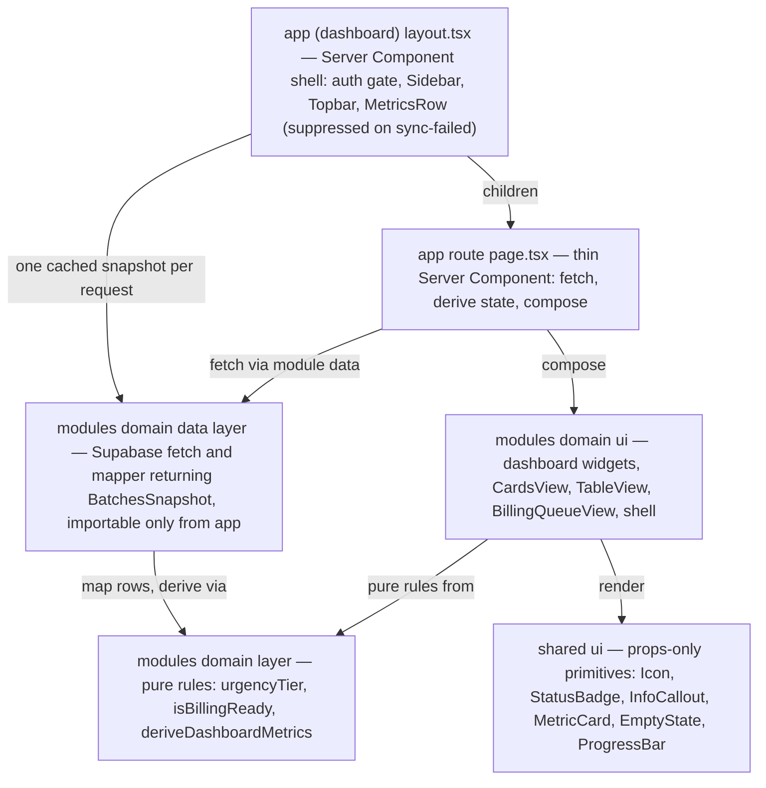
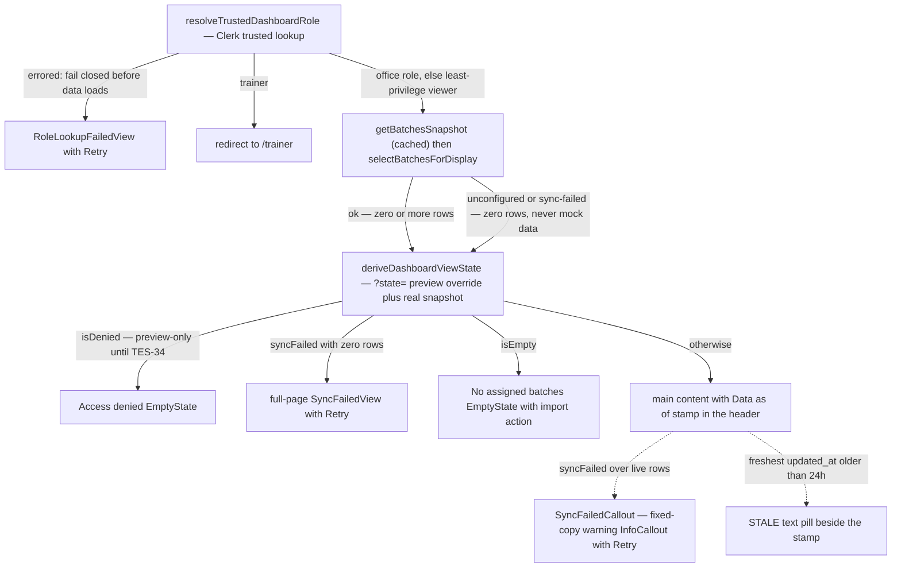

# Design System and UI Invariants

The design system in this repository exists because the product is a compliance tool: "a coordinator misreading a status by color alone is a real operational failure, not a cosmetic one" ([CLAUDE.md](/CLAUDE.md)). The non-negotiable UI rules are checklisted in [`RULES.md`](/RULES.md) §4–§6, the full visual reference is [`docs/DESIGN.md`](/docs/DESIGN.md), and the upstream v1.0 spec sheet lives at [`uploads/training-compliance-design-system.md`](/uploads/training-compliance-design-system.md). The implementation/reference split is stated in `docs/DESIGN.md` itself — deviations from spec marked `⚠ DEVIATION` win, and `docs/design/colors_and_type.css` plus `ui_kits/admin/` are the live ground truth — while `.design-sync/` (gitignored local tooling, not committed) records the design-project mapping on the machine that holds it.

## Sources of truth

| Source | Role |
|---|---|
| [`RULES.md`](/RULES.md) §4–§6 | The invariants, in checklist form with an enforcement level per rule (`[hook]`, `[lint]`, `[review]`) |
| [`docs/DESIGN.md`](/docs/DESIGN.md) | Complete design reference: principles, tokens, components, states, motion, accessibility. Implementation decisions that diverge from the upstream spec are marked `⚠ DEVIATION` and **win** over the spec; `colors_and_type.css` and `ui_kits/admin/` are the live ground truth |
| [`docs/design/colors_and_type.css`](/docs/design/colors_and_type.css) | Token definitions — "source of truth for color" per the DESIGN.md file index |
| [`uploads/training-compliance-design-system.md`](/uploads/training-compliance-design-system.md) | Original v1.0 spec — re-read before making a visual decision not covered by DESIGN.md |
| [`ui_kits/admin/`](/ui_kits/admin/), [`assets/`](/assets/), [`preview/`](/preview/), [`screenshots/`](/screenshots/), [`uploads/`](/uploads/) | Design handoff bundle, ported verbatim — **do not edit** (see [Static directories](#do-not-edit-static-directories-and-design-sync)) |

Related pages: [Module boundaries and data patterns](/openwiki/architecture/module-boundaries-and-data-pattern.md), [Architecture overview](/openwiki/architecture/overview.md), [Dashboard and role surfaces](/openwiki/domains/dashboard-and-role-surfaces.md), [Dev environment and CI](/openwiki/operations/dev-environment-and-ci.md).

## Token layer

**Where tokens live at runtime.** `app/globals.css` is the single style entry point: it imports Tailwind v4 (`@import "tailwindcss"`), bridges in Tremor's legacy `@config` (scoped to the analytics module via `tremor.config.mjs` content globs), imports the layout-only `app/design-system.css`, and then defines the entire `:root` token block **copied verbatim** from `docs/design/colors_and_type.css` (the file's own header instructs: "Do NOT delete or merge — copy the entire :root block verbatim"). `app/design-system.css` is deliberately layout-only — shell, sidebar, topbar, `.page-head`, `.metrics`, buttons, focus ring, data rows, keyframes, and screen-specific sections — and every rule in it references token variables rather than raw colors.

**Fonts.** `app/layout.tsx` self-hosts IBM Plex Sans (weights 300–600) and IBM Plex Mono (300–500) through `next/font`, exposing `--font-ibm-plex-sans` / `--font-ibm-plex-mono` on `<html>`. `:root` prepends these variables into `--font-sans` / `--font-mono`, so the optimized, layout-shift-free fonts win with the web/system names as fallbacks. The type families are spec-locked: IBM Plex Sans for UI/body, IBM Plex Mono for IDs, dates, codes, and numeric data — and Inter/Geist/Roboto/Arial are explicitly banned as primary typefaces. Semantic type roles (`.t-page-title`, `.t-label`, `.t-cell`, `.t-metric-value`, …) are defined once in `globals.css` and reused across screens.

**Semantic color system.** Six hues, each with staged tokens (`base` / `-lt` / `-dk` / `-border` / `-hover`, purple three-tiered) — and *every color carries one meaning*, applied 100% consistently:

- **Blue** — informational / TWSP / active navigation
- **Teal** — CFSP program
- **Green** — completed / approved / on-track
- **Amber** — warning / 7–21 days / pending
- **Red** — critical / <7 days / errors
- **Purple** — NC level indicators

Urgency is the most important color rule in the system: the tier (≤6 days critical/red, 7–21 warning/amber, >21 on-track/green) is pinned at data fetch — the mapper in `modules/batches/data/batches.ts` stores the whole-day `daysToBilling` on the batch (`daysUntil()` returns `Infinity` as the "no known deadline" sentinel, so missing or unparseable dates sort last and never trigger urgency tiers), and the tier itself is a pure deterministic function of that stored value (`urgencyTier` in `modules/batches/domain/urgency.ts`), so render code reads it rather than re-deriving deadlines.

**Documented deviations from the upstream spec** (DESIGN.md `⚠ DEVIATION` markers, which win):

1. Amber and red hex values were re-tinted warmer/more vivid than the spec (`#C7600F` / `#C81F1F`).
2. The spec's 3px colored left border on batch cards, InfoCallouts, and warning/critical MetricCards was removed — urgency is communicated via the badge in the card header and the billing-deadline value color; callouts use a 1px tinted full-perimeter border instead; MetricCards tint the label icon and sub-label.

**Other locked values.** 4px spacing grid (2px half-steps for micro-spacing only), border radius ≤ 12px (`9999px` only for avatars/toggles/bars), minimal shadows (structure comes from borders, not elevation), motion tokens (100/150/300/400 ms plus a 2 s pipeline pulse) with a global `prefers-reduced-motion` kill-switch in `design-system.css`.

## Iconography and the no-emoji rule

- **No emoji anywhere in the UI** (RULES §4.21). DESIGN.md extends this: no Unicode glyph icons, no PNG icons; emoji "read as consumer-app delight" in a government-compliance tool.
- **Icons are Tabler line icons**, 2px stroke, currentColor inheritance. Two mechanisms exist:
  - [`shared/ui/Icon.tsx`](/shared/ui/Icon.tsx) renders an **inline map of Tabler SVG path strings** — ported verbatim from the design handoff so glyphs stay pixel-identical to the prototype and no runtime dependency is needed. It is pure render (no hooks), safe in both Server and Client trees, and every instance is `aria-hidden="true"`. This is the icon system used by all shared primitives and module screens.
  - `@tabler/icons-react` is the declared package dependency (`package.json`) and the spec's canonical choice; today the only direct importer is `modules/auth/ui/SignUpModal.tsx` (the Clerk sign-up form).
- Icon **semantics are pinned** in DESIGN.md §8 (batch = `folders`, warning = `alert-triangle`, critical = `alert-circle`, BSRS approved = `shield-check`, NTP = `file-invoice`, missing document = `file-off`, …) as is the sizing per context (14 px inline, 16 px in navigation, 12 px inside badges) — icon-to-label gap is always 4 px.

## Status: text + icon, never color alone

RULES §4.23 mandates that status is conveyed by **text + icon, never color alone**, targeting **WCAG 2.2 AA** (the upstream spec sheet says WCAG 2.1 AA; the repo rule is the stricter target). The design system is built around this in several ways:

- `StatusBadge` pairs a mono text label with a semantic chip variant (`ongoing` → blue-lt/blue-dk, `critical` → red-lt/red-dk, `nc-ii` → purple, …); the variant is a *pair* of tokens, never a bare hue.
- `UrgencyIndicator` renders the days value as text ("28 DAYS", "TODAY", "3D OVERDUE") alongside the tier icon and color; `BillingReadyBadge` is the green "READY FOR BILLING" chip. `ProgressBar` always shows the mono percentage next to the fill, and `MetricCard`'s warning/critical variants tint the label icon and sub-label, not just a border.
- The staleness marker is the same pattern: `DashboardHeader`'s `StaleBadge` prints the text `STALE` in a mono pill beside the freshness stamp — never color alone.
- The focus-visible ring (`2px solid var(--color-blue)`, 2px offset, inverting on primary buttons) was **added specifically because the ported stylesheet had no focus rule at all**, which failed the mandated WCAG 2.2 AA; `outline: none` is forbidden.
- Row selection in the billing queue tints the row but is announced structurally: "Selection is also announced structurally (aria-selected), never by tint alone" (comment in `design-system.css`).
- DESIGN.md §14 prescribes the ARIA patterns (batch card `aria-label` with name/status/deadline, `role="progressbar"` with value attributes, `role="list"`/`aria-current` on the pipeline, `role="img"` on charts) and the verified contrast pairs for badge tokens.

A related anti-misleading invariant lives in `modules/shell/ui/MetricsRow.tsx`: the `hasBatches` guard is load-bearing (TES-74) — with zero batches, an empty state must **not** be styled as a critical red billing deadline, and "All verified" copy must not appear when there is nothing to verify (a compliance tool must distinguish *empty* from *cleared*, per ADR-004's unknown-vs-0% rule; `docComplianceSub` prints "No batches" / "Document sync pending" instead).

## Component layering

The layering convention (RULES §2/§4, CLAUDE.md) is:

**`app/` route Server Component → `modules/<domain>/ui` screens → `shared/ui` props-only primitives.**

- `app/(dashboard)/<route>/page.tsx` is a thin Server Component: it fetches via a module's `data/` layer, applies pure `domain/` rules, and composes module UI. No business logic in `app/`.
- `modules/<domain>/ui/*` holds the screens and views (`CardsView`, `TableView`, `BatchModal`, `BillingQueueView`, the dashboard widgets in `modules/batches/ui/dashboard/*`, and the app shell in `modules/shell/ui/*`).
- `shared/ui/*` holds props-only primitives that know **nothing** about data or rules: `Icon`, `StatusBadge`, `InfoCallout`, `MetricCard`, `ProgressBar`, `EmptyState`, `TrainerAvatar`, `UrgencyIndicator`/`BillingReadyBadge`, `TrainingDayPills`, `Toast`, `Switch`, `Charts`, `FilePreviewModal`. They receive pre-computed values (a `Batch` object, a number of days, a percent) and render tokens.
- **If a `shared/ui` component starts reading data or encoding business rules, move it into its owning module** (RULES §2.15). This is why `LifecyclePipeline` lives in `modules/batches/ui/` (it encodes the batch lifecycle domain), while the shell's `Sidebar`/`Topbar`/`MetricsRow` live in `modules/shell/ui/` (they encode navigation and role-surface rules).
- Import direction is `app → modules → shared → lib/supabase`, lint-enforced by `import/no-restricted-paths` in `eslint.config.mjs`: another module's `data/` is private (only `app/` may fetch it), `shared/` can never import `modules/` or `app/`, and raw DB types from `lib/supabase/database.types.ts` are reachable only from module `data/` layers. No module `ui` file imports any `data/` layer today.
- **Server Components by default; client islands only for interactivity** (RULES §4.26). `BatchCard` is `'use client'` for hover elevation and opening `BatchModal`; `Sidebar` is `'use client'` for pathname, drawer, and tenant-switch state; the dashboard layout and page stay server.
- **Reuse existing primitives** — `BatchCard`, `BatchModal`, `StatusBadge`, `LifecyclePipeline`, `EmptyState`, `InfoCallout`, … — rather than creating parallels (RULES §4.25). `CardsView` and `TableView` both compose the same `BatchCard`/`BatchModal`/`StatusBadge`/`EmptyState` set, differing only in arrangement.

*Component layering: fetch is confined to `app/`, screens compose props-only `shared/ui` primitives, and pure domain rules are shared between mappers and screens.*

## The six mandatory screen states

Every data screen must implement all six states (RULES §4.24):

| State | Mandated treatment |
|---|---|
| **loading** | The dashboard is the only route with a route-level `loading.tsx` (TES-8): a Suspense fallback that mirrors the real layout — page head, six KPI blocks, charts row, wide panels — with `aria-busy` and the label "Loading dashboard", blocks shaded from the shared surface/border tokens. Elsewhere server fetches render once, so DESIGN.md §12's write-back treatments (`.btn.loading` spinner in the leading slot, width-stable, `aria-busy`) apply to client islands and pending actions |
| **empty** | `EmptyState` with icon + heading + the next administrative action (e.g. "No assigned batches" → *Import a batch* link). Since mock data was retired, an honest empty state is *also* what unconfigured and sync-failed snapshots render — never fabricated rows |
| **no-results** | `EmptyState` "No batches match" when search/program filters remove all rows (see `CardsView` and `TableView`) |
| **error / sync-failed** | RULES §3.19: `unconfigured` and `sync-failed` both render an honest empty state (mock/fabricated data substitution is forbidden), and `sync-failed` **must** additionally surface the sync-failed banner — a full-page `SyncFailedView` when the failure yields zero rows, or a fixed-copy warning `InfoCallout` (`SyncFailedCallout`) over the loaded data. Raw Supabase/SQL errors, table names, and internal IDs are never leaked to the UI (RULES §1.6) |
| **permission-denied** | Full-page guard: `EmptyState` "Access denied — your role does not have access to this school's dashboard" — preview-only via `?state=denied` until the tenant/role resolver lands (TES-34) |
| **stale-data** | A `STALE` mono text pill beside the `Data as of` stamp when the freshest row's `updated_at` is older than the 24 h threshold |

**Mechanism — the dashboard's canonical state mapping.** Data functions return **discriminated snapshots**: `getBatchesSnapshot()` in `modules/batches/data/batches.ts` (`cache()`-wrapped so the layout and its nested page share one query per request) yields `BatchesSnapshot` = `ok` (rows + `dataAsOf` from the freshest `updated_at`) / `sync-failed` (configured but errored) / `unconfigured` (no Supabase env), and `selectBatchesForDisplay()` returns rows **only** on `ok` — the retired `shared/mocks/` directory (RULES §2.16) had the old silent fallback, which no longer exists. The dashboard route maps snapshot → UI through named render-derivation helpers pulled out of the component body: `resolveDataAsOfDate()` (real timestamp only from an `ok` snapshot with data), `dataAsOfLabelFor()`/`formatDataStamp()`, `isEmptyDashboard()`, `isSyncFailedDashboard()`, `isStaleDashboard()` (freshest `updated_at` vs `DATA_STALE_AFTER_MS` = 24 h), and `syncFailedMessageFor()`, folded by `deriveDashboardViewState(forcedState, snapshot, batchCount)` into a `DashboardViewState` of `{ isDenied, isEmpty, syncFailed, isStale, dataAsOfLabel, syncFailedMessage }`. The `?state=` query param is a manual preview override for every state; `denied` is preview-only (the real signal is the TES-34 tenant/role resolver, marked `TODO(#32)` in code), and `stale` derives from real data freshness.

The guard-clause order in `DashboardPage` is itself an invariant: **trusted-lookup failure → trainer redirect → denied → `syncFailed && zero rows` → empty → content**. A real sync failure yields zero batches (no mock fallback), which would otherwise satisfy the empty guard and hide the retry banner behind a misleading "no batches — import one" message, so `SyncFailedView` is checked before `EmptyBatchesView` (RULES §3.19 calls out exactly this ordering hazard). And before any of it, `resolveTrustedDashboardRole()` — which reads only Clerk's trusted role, never `?role=` — distinguishes *lookup succeeded, no role set* (least-privilege viewer fallback) from *the lookup itself errored* (identity unknown); the latter renders `RoleLookupFailedView` ("Couldn't verify your access" + Retry) fail-closed before any data loads, rather than letting a real trainer whose lookup happened to fail fall through to the office dashboard.

*State derivation on the dashboard route: the trusted role lookup gates everything, the snapshot status chooses the data source, terminal guards (denied → sync-failed → empty) short-circuit, and stale/sync-failed render as overlays on the main content.*

**The sync-failed banner copy is fixed.** `SyncFailedCallout` (in `modules/batches/ui/dashboard/DashboardCallouts.tsx`, the single surviving definition) prints *"Sync with Supabase failed — showing the last cached snapshot{ from <stamp>}."* only when `isShowingCachedFallback` — i.e. the rows on screen actually came from a non-`ok` snapshot — otherwise *"…showing the currently loaded data."*, because a `?state=sync-failed` preview over live rows must not claim cached provenance; both variants end with a *Retry* link. The dashboard layout applies the same honesty at the shell level: it suppresses `MetricsRow` entirely on the `/dashboard` route (which has its own KPI grid) and whenever the snapshot is `sync-failed`, so the shell never renders derived metrics over a failed fetch.

**"Data as of" timestamp.** Screens that show relative dates must show an **exact** "Data as of" timestamp (RULES §4.24). The dashboard formats the freshest live `updated_at` across rows as e.g. `Jun 19, 2026 · 14:02` (hour cycle `h23` so midnight prints `00:02`, never `24:02`) and degrades to the literal `unknown` (`DATA_AS_OF_FALLBACK` in `DashboardHeader`) whenever there is no real timestamp to read — no fake precise timestamps, and deliberately not the word "cached", because the fallback also covers an `ok` snapshot with zero rows. `BillingQueueView` receives its `dataAsOf` as an explicit prop and stamps `Packet readiness · Data as of {dataAsOf}` (plus ` · STALE`); the billing route's `formatAsOf` still degrades to a fixed fallback date when no row carries `updated_at` — the one hardcoded stamp left in the tree.

## Copy rules and product framing

- **UI copy must never imply official TESDA approval or submission** (RULES §5.27). This is an internal working layer; TESDA SIS/T2MIS/BSRS remain authoritative. Badges may show `APPROVED` / `NOT APPROVED` for the batch's own BSRS field, but no copy may frame anything as having been submitted to or approved by TESDA.
- The voice (DESIGN.md §2) is **administrative, exact, never decorative**: direct and structural ("Training ongoing — Day 31 of 42."), no exclamation marks, no "we"/"you", Title Case for data-system nouns (*Batch*, *Scholar*, *Trainer*, *Billing Deadline*, *NTP*, *BSRS*, *NC II*), sentence case for buttons and inline text, **always include the unit** ("31 days", "71.4%" — naked numbers are forbidden), abbreviations explained on first use, and auto-remarks written as imperative-mode summaries. Vague urgency words ("soon", "shortly"), "Click here", and branded mascot language never appear.

## Do-not-edit static directories and design sync

- **`assets/`, `preview/`, `screenshots/`, `ui_kits/`, `uploads/` are ported verbatim** from the design bundle and excluded from lint and build (`eslint.config.mjs` `globalIgnores`). A PreToolUse hook enforces the rule at `[hook]` level (RULES §6.28); the committed hook script is `.claude/hooks/protect-static-dirs.sh`, which exits non-zero on any `Edit`/`Write` under those directories with the instruction to edit the source design file instead. `public/assets/` is explicitly exempt in the script — it is the app's real runtime static directory (served at the site root) that merely shares the name. (Hook registration lives in `.claude/settings.json`, which is gitignored per-machine state — the `.gitignore` keeps only `.claude/hooks/` and `.claude/agents/` in the committed tree.)
- **`FIGMA FILES/`, `diagrams/`, `.design-sync/` are design artifacts, not app code** (RULES §6.29, review-level). Neither `FIGMA FILES/` nor `.design-sync/` is materialized in the committed tree — Figma pages are referenced by node ID in code comments instead (e.g. `8:4330` for the primary navigation aside, `840:5128` for the billing packet queue), and `.design-sync/` is listed in `.gitignore` under IDE/local tooling. `diagrams/` holds the architecture/ER Mermaid sources (`.mmd`) and rendered PNGs.
- **Design changes go to the source design files first.** The handoff bundle *is* the source: `ui_kits/admin/index.html` is the working no-build prototype of the dashboard views, `ui_kits/admin/*.jsx` are the prototype components the local ones were ported from (each ported component carries a "ported from components/X.jsx" header), `preview/` holds standalone HTML sheets for type/color/spacing/components, and `assets/icons/` is the curated offline SVG subset of the Tabler icons. When spec and deviation conflict, the deviation wins and `colors_and_type.css` + `ui_kits/admin/` are the live ground truth (DESIGN.md header; the kit's own README repeats the deviation list).
- A PostToolUse hook (`lint-edited-file.sh`) lints every file an agent edits, so design-system violations surface immediately at edit time.

## Invariant checklist

| # | Invariant | Enforcement |
|---|---|---|
| 21 | No emoji anywhere in UI; icons are Tabler line icons | `[review]` |
| 22 | IBM Plex fonts; semantic color tokens only — never raw hex in components (the legacy `shared/ui/Charts.tsx` palette and the spec-pinned `TrainerAvatar` trainer colors are the acknowledged exceptions) | `[review]` |
| 23 | Status conveyed by text + icon, never color alone; WCAG 2.2 AA target | `[review]` |
| 24 | All six states on every data screen; exact "Data as of" timestamp on screens with relative dates | `[review]` |
| 25 | Reuse existing primitives rather than creating parallels | `[review]` |
| 26 | Default to Server Components; client islands only for interactivity | `[review]` |
| 27 | UI copy must never imply official TESDA approval or submission | `[review]` |
| 28 | `assets/`, `preview/`, `screenshots/`, `ui_kits/`, `uploads/` do-not-edit — PreToolUse hook blocks edits | `[hook]` |
| 29 | `FIGMA FILES/`, `diagrams/`, `.design-sync/` are design artifacts, not app code | `[review]` |
