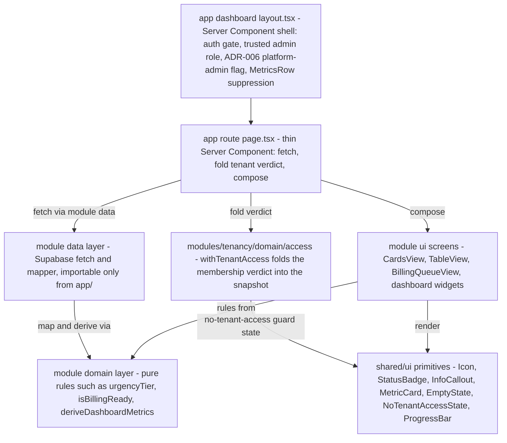
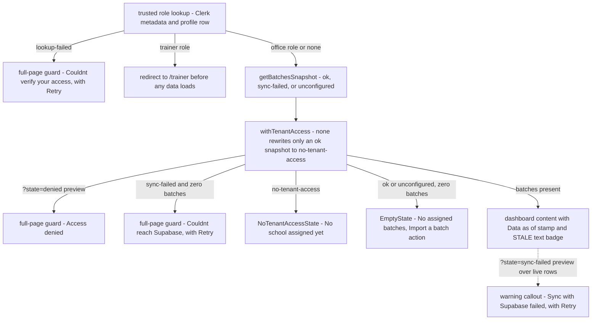

# Design System and UI Invariants

The design system in this repository exists because the product is a compliance tool: "a coordinator misreading a status by color alone is a real operational failure, not a cosmetic one" ([CLAUDE.md](/CLAUDE.md)). The non-negotiable UI rules are checklisted in [`RULES.md`](/RULES.md) §3–§6, the full visual reference is [`docs/DESIGN.md`](/docs/DESIGN.md), and the upstream v1.0 spec sheet lives at [`uploads/training-compliance-design-system.md`](/uploads/training-compliance-design-system.md). DESIGN.md states the precedence: key deviations from the spec are marked `⚠ DEVIATION` and **win** over the spec, with `colors_and_type.css` and `ui_kits/admin/` as the live ground truth.

## Sources of truth

| Source | Role |
|---|---|
| [`RULES.md`](/RULES.md) §3–§6 | The invariants, in checklist form with an enforcement level per rule (`[hook]`, `[lint]`, `[review]`, …) |
| [`docs/DESIGN.md`](/docs/DESIGN.md) | Complete design reference: principles, tokens, components, states, motion, accessibility. Implementation decisions that diverge from the upstream spec are marked `⚠ DEVIATION` and **win** over the spec |
| [`docs/design/colors_and_type.css`](/docs/design/colors_and_type.css) | Token definitions — "source of truth for color" per the DESIGN.md file index |
| [`uploads/training-compliance-design-system.md`](/uploads/training-compliance-design-system.md) | Original v1.0 spec — re-read before making a visual decision not covered by DESIGN.md |
| [`ui_kits/admin/`](/ui_kits/admin/), [`assets/`](/assets/), [`preview/`](/preview/), [`screenshots/`](/screenshots/), [`uploads/`](/uploads/) | Design handoff bundle, ported verbatim — **do not edit** (see [Static directories](#do-not-edit-static-directories-and-design-sync)) |

Related pages: [Module boundaries and data patterns](/openwiki/architecture/module-boundaries-and-data-pattern.md), [Architecture overview](/openwiki/architecture/overview.md), [Batches and lifecycle](/openwiki/domains/batches-and-lifecycle.md), [Quickstart](/openwiki/quickstart.md).

## Token layer

**Where tokens live at runtime.** `app/globals.css` is the single style entry point: it imports Tailwind v4 (`@import "tailwindcss"`), imports the layout-only `app/design-system.css`, and then defines the entire `:root` token block **copied verbatim** from `docs/design/colors_and_type.css` (the block's own header warns: "Do NOT delete or merge — copy the entire :root block verbatim"). It also bridges Tremor's legacy v3-style chart config through `@config "../tremor.config.mjs"` plus `@source inline(...)` utilities, scoped to `modules/analytics/**` so no other screen touches the Tremor palette. `app/design-system.css` is deliberately layout-only — shell, sidebar, topbar, `.page-head`, `.metrics`, buttons, focus ring, data rows, keyframes, and screen-specific sections — and every rule in it references token variables rather than raw colors.

**Fonts.** `app/layout.tsx` self-hosts IBM Plex Sans (weights 300–600) and IBM Plex Mono (300–500) through `next/font`, exposing `--font-ibm-plex-sans` / `--font-ibm-plex-mono` on `<html>`. `:root` prepends these variables into `--font-sans` / `--font-mono`, so the optimized, layout-shift-free fonts win with the web/system names as fallbacks. The type families are spec-locked: IBM Plex Sans for UI/body, IBM Plex Mono for IDs, dates, codes, and numeric data — and Inter/Geist/Roboto/Arial are explicitly banned as primary typefaces. Semantic type roles (`.t-page-title`, `.t-label`, `.t-cell`, `.t-metric-value`, …) are defined once in `globals.css` and reused across screens.

**Semantic color system.** Six hues, each with staged tokens (`base` / `-lt` / `-dk` / `-border` / `-hover`; purple defines the base three), and *every color carries one meaning*, applied 100% consistently:

- **Blue** — informational / TWSP / active navigation
- **Teal** — CFSP program
- **Green** — completed / approved / on-track
- **Amber** — warning / 7–21 days / pending
- **Red** — critical / <7 days / errors
- **Purple** — NC level indicators

Urgency is the most important color rule in the system. The deadline math happens once, at data fetch: the mapper stores `daysToBilling` on the batch, where `daysUntil()` returns `Infinity` as the "no known deadline" sentinel so missing or unparseable dates never trigger urgency tiers (and sort last). The tier itself is the pure domain function `urgencyTier()` in `modules/batches/domain/urgency.ts` applied to that stored value — ≤6 days critical/red, 7–21 warning/amber, >21 on-track/green; `UrgencyIndicator` adds an `overdue` tier for negative day counts.

**Documented deviations from the upstream spec** (DESIGN.md `⚠ DEVIATION` markers, which win):

1. Amber and red hex values were re-tinted warmer/more vivid than the spec (`#C7600F` / `#C81F1F`).
2. The spec's 3px colored left border on batch cards, InfoCallouts, and warning/critical MetricCards was removed — urgency is communicated via the badge in the card header and the billing-deadline value color; callouts use a 1px tinted full-perimeter border instead; MetricCards tint the label icon and sub-label.

**Other locked values.** 4px spacing grid (2px half-steps for micro-spacing only), border radius ≤ 12px (`9999px` only for avatars/toggles/bars), minimal shadows (structure comes from borders, not elevation), motion tokens (100/150/300/400 ms plus a 2 s pipeline pulse) with a global `prefers-reduced-motion` kill-switch in `design-system.css`.

## Iconography and the no-emoji rule

- **No emoji anywhere in the UI** (RULES §4.21). DESIGN.md extends this: no Unicode glyph icons, no PNG icons; emoji "read as consumer-app delight" in a government-compliance tool.
- **Icons are Tabler line icons**, 2px stroke, currentColor inheritance. Two mechanisms exist:
  - [`shared/ui/Icon.tsx`](/shared/ui/Icon.tsx) renders an **inline map of Tabler SVG path strings** — ported verbatim from the design handoff so glyphs stay pixel-identical to the prototype and no runtime dependency is needed. It is pure render (no hooks), safe in both Server and Client trees, and every instance is `aria-hidden="true"`. This is the icon system used by all shared primitives and module screens.
  - `@tabler/icons-react` is the declared package dependency (`package.json`) and the spec's canonical choice; today the only direct importer is `modules/auth/ui/SignUpModal.tsx` (the Clerk sign-up form).
- Icon **semantics are pinned** in DESIGN.md §8 (batch = `folders`, warning = `alert-triangle`, critical = `alert-circle`, BSRS approved = `shield-check`, NTP = `file-invoice`, missing document = `file-off`, …) as is the sizing per context (14 px inline, 16 px in navigation, 12 px inside badges) — icon-to-label gap is always 4 px.

## Status: text + icon, never color alone

RULES §4.23 mandates that status is conveyed by **text + icon, never color alone**, targeting **WCAG 2.2 AA** (the upstream spec sheet says WCAG 2.1 AA; the repo rule is the stricter target). The design system is built around this in several ways:

- `StatusBadge` pairs a mono text label with a semantic chip variant (`ongoing` → blue-lt/blue-dk, `critical` → red-lt/red-dk, `nc-ii` → purple, …); the variant is a *pair* of tokens, never a bare hue.
- `UrgencyIndicator` renders the days value as text ("28 DAYS", "TODAY", "3D OVERDUE") alongside the tier icon and color; `BillingReadyBadge` is the green "READY FOR BILLING" chip. `ProgressBar` always shows the mono percentage next to the fill, and `MetricCard`'s warning/critical variants tint the label icon and sub-label, not just a border.
- The focus-visible ring (`2px solid var(--color-blue)`, 2px offset, inverting on primary buttons) was **added specifically because the ported stylesheet had no focus rule at all**, which failed the mandated WCAG 2.2 AA; `outline: none` is forbidden.
- Row selection in the billing queue tints the row but is announced structurally: "Selection is also announced structurally (aria-selected), never by tint alone" (comment in `design-system.css`).
- DESIGN.md §14 prescribes the ARIA patterns (batch card `aria-label` with name/status/deadline, `role="progressbar"` with value attributes, `role="list"`/`aria-current` on the pipeline, `role="img"` on charts) and the verified contrast pairs for badge tokens.

A related anti-misleading invariant lives in `modules/shell/ui/MetricsRow.tsx`: the `hasBatches` guard is load-bearing (TES-74) — with zero batches, the Earliest Billing card must **not** be styled as a critical red deadline, and the Doc Compliance subline says "No batches" (the code comment: "'All verified' must not appear when there is nothing to verify"). A compliance tool must distinguish *empty* from *cleared*, per ADR-004's unknown-vs-0% rule. The `(dashboard)` layout goes one step further and omits the `MetricsRow` entirely on `sync-failed` or `no-tenant-access` — a zero-metrics strip would be a claim about a school that isn't established.

## Component layering

The layering convention (RULES §2/§4, CLAUDE.md) is:

**`app/` route Server Component → `modules/<domain>/ui` screens → `shared/ui` props-only primitives.**

- `app/(dashboard)/<route>/page.tsx` is a thin Server Component: it fetches via a module's `data/` layer, applies pure `domain/` rules, and composes module UI. No business logic in `app/`.
- `modules/<domain>/ui/*` holds the screens and views (`CardsView`, `TableView`, `BatchModal`, `BillingQueueView`, the dashboard widgets in `modules/batches/ui/dashboard/*`, and the app shell in `modules/shell/ui/*`).
- `shared/ui/*` holds props-only primitives that know **nothing** about data or rules: `Icon`, `StatusBadge`, `InfoCallout`, `MetricCard`, `ProgressBar`, `EmptyState`, `NoTenantAccessState`, `TrainerAvatar`, `UrgencyIndicator`/`BillingReadyBadge`, `TrainingDayPills`, `Toast`, `Switch`, `Charts`, `FilePreviewModal`. They receive pre-computed values (a `Batch` object, a number of days, a percent) and render tokens.
- **If a `shared/ui` component starts reading data or encoding business rules, move it into its owning module** (RULES §2.15). This is why `LifecyclePipeline` lives in `modules/batches/ui/` (it encodes the batch lifecycle domain), while the shell's `Sidebar`/`Topbar`/`MetricsRow` live in `modules/shell/ui/` (they encode navigation and role-surface rules).
- Import direction is `app → modules → shared → lib/supabase`, lint-enforced by `import/no-restricted-paths` in `eslint.config.mjs`: another module's `data/` is private (only `app/` may fetch it), `shared/` can never import `modules/` or `app/`, and raw DB types from `lib/supabase/database.types.ts` are reachable only from module `data/` layers. No module `ui` file imports any `data/` layer today.
- **Server Components by default; client islands only for interactivity** (RULES §4.26). `BatchCard` is `'use client'` for hover elevation and opening `BatchModal`; `Sidebar` is `'use client'` for pathname, drawer, and tenant-switch state; the dashboard layout and page stay server. The layout is also where role surfaces are resolved server-side: `isAdmin` from the trusted profile role (never the `?role=` preview) drives the admin-only "Add user" nav row, and the ADR-006 platform-admin axis is resolved separately through the boolean-only `isPlatformAdmin()` helper (a `security definer` RPC over the deliberately unreadable `platform_admins` table) so any failure hides the "Add school" row rather than rendering a link into a denial.
- **Reuse existing primitives** — `BatchCard`, `BatchModal`, `StatusBadge`, `LifecyclePipeline`, `EmptyState`, `InfoCallout`, … — rather than creating parallels (RULES §4.25). `CardsView` and `TableView` both compose the same `BatchCard`/`BatchModal`/`StatusBadge`/`EmptyState` set, differing only in arrangement.

*Component layering: fetch is confined to `app/`, the tenancy membership verdict is folded into the snapshot at the route, screens compose props-only `shared/ui` primitives, and pure domain rules are shared between mappers and screens.*

## The six mandatory screen states

Every data screen must implement all six states (RULES §4.24):

| State | Mandated treatment |
|---|---|
| **loading** | Skeleton shimmer for initial load/refresh; the dashboard ships a route-level `app/(dashboard)/dashboard/loading.tsx` Suspense boundary whose token-based shimmer blocks mirror the real layout (`aria-busy="true"`). Write-back buttons show the `.btn.loading` spinner in the leading slot (width-stable) with `aria-busy`. DESIGN.md §12 |
| **empty** | `EmptyState` with icon + heading + the next administrative action (e.g. "No assigned batches" → *Import a batch* link) |
| **no-results** | `EmptyState` "No batches match" when search/program filters remove all rows (see `CardsView` and `TableView`) |
| **error / sync-failed** | **Must** surface: a full-page `SyncFailedView` ("Couldn't reach Supabase" + *Retry*) when the failure yields zero rows — checked *before* the empty guard, or the banner is swallowed behind "import a batch" (RULES §3.19) — and a warning `SyncFailedCallout` banner over the rows on display when non-empty data coexists with the failure (e.g. the `?state=sync-failed` preview). Raw Supabase/SQL errors, table names, and internal IDs are never leaked to the UI (RULES §1.6) |
| **permission-denied** | Full-page guard: `EmptyState` "Access denied — your role does not have access to this school's dashboard" |
| **stale-data** | A `STALE` text badge beside the `Data as of` stamp when the data is older than the 24 h threshold |
| **no-tenant-access** (beyond the six RULES lists) | `NoTenantAccessState` "No school assigned yet" — the dashboard's fourth terminal state, checked before the empty guard because RLS makes a non-member's read look identical to an empty tenant's |

**Mechanism.** Data functions return **discriminated snapshots** so Server Components map states straight to UI. `getBatchesSnapshot()` in `modules/batches/data/batches.ts` (React `cache`-wrapped, so the layout and its nested page share one query per request) yields `BatchesSnapshot` = `ok` (rows + `dataAsOf` from the freshest `updated_at`) / `sync-failed` (configured but errored) / `unconfigured` (no Supabase env). `no-tenant-access` is never produced by the query — RLS answers it with a successful, empty read — so routes fold the tenancy verdict (`granted` / `none` / `unknown`) in via `withTenantAccess` (from `modules/tenancy/domain/access`, composed at the route because tenancy's `data/` is private to its module). The fold replaces **only** an `ok` snapshot: a real fetch failure is never masked by the tidier explanation, and an unverified verdict changes nothing.

`selectBatchesForDisplay` **never substitutes mock data** — any non-`ok` snapshot renders `[]`. `shared/mocks/` was removed entirely in the mock-data retirement, and RULES §3.19 bans the pattern: neither `unconfigured` nor `sync-failed` may render mock or fabricated data — both render an honest empty or failure state.

The dashboard (the canonical implementation) guards in a fixed order: role-lookup-failed (fail-closed "Couldn't verify your access" + *Retry*, instead of defaulting to a permissive role) → trusted trainer redirect to `/trainer` → `denied` → `sync-failed` with zero batches → `no-tenant-access` → `empty` → main content. `?state=` remains a manual preview override for each state: `denied` is preview-only until the real tenant/role resolver lands (TES-34 / issue #32), `stale` is real data freshness — the freshest row's `updated_at` older than the 24 h `DATA_STALE_AFTER_MS` threshold — or forced, and a `?state=sync-failed` preview over a live non-empty snapshot falls through to the banner. `?role=` may pick which office-role variant (coordinator/admin/viewer, with a least-privilege viewer fallback) is displayed, but never gates the trainer redirect.

*State derivation on the dashboard: the snapshot status and the folded tenant verdict choose the data source, terminal guards run in a fixed order (lookup-failed → trainer → denied → sync-failed → no-tenant-access → empty), and stale/sync-failed render as overlays on the main content.*

**"Data as of" timestamp.** Screens that show relative dates must show an **exact** "Data as of" timestamp (RULES §4.24). The dashboard formats the freshest `updated_at` across live rows as e.g. `Jun 19, 2026 · 14:02` (hour cycle `h23` so midnight prints `00:02`, never `24:02`). A stamp is only produced from an `ok` snapshot — when there is no live `updated_at` to read, `DashboardHeader` degrades to the literal word `unknown` rather than printing a fake precise timestamp, and staleness renders as a text `STALE` badge beside the stamp, never by color alone. `BillingQueueView` receives its `dataAsOf` as an explicit prop and stamps `Packet readiness · Data as of {dataAsOf}` (plus ` · STALE` when stale).

## Copy rules and product framing

- **UI copy must never imply official TESDA approval or submission** (RULES §5.27). This is an internal working layer; TESDA SIS/T2MIS/BSRS remain authoritative. Badges may show `APPROVED` / `NOT APPROVED` for the batch's own BSRS field, but no copy may frame anything as having been submitted to or approved by TESDA.
- The voice (DESIGN.md §2) is **administrative, exact, never decorative**: direct and structural ("Training ongoing — Day 31 of 42."), no exclamation marks, no "we"/"you", Title Case for data-system nouns (*Batch*, *Scholar*, *Trainer*, *Billing Deadline*, *NTP*, *BSRS*, *NC II*), sentence case for buttons and inline text, **always include the unit** ("31 days", "71.4%" — naked numbers are forbidden), abbreviations explained on first use, and auto-remarks written as imperative-mode summaries. Vague urgency words ("soon", "shortly"), "Click here", and branded mascot language never appear.

## Do-not-edit static directories and design sync

- **`assets/`, `preview/`, `screenshots/`, `ui_kits/`, `uploads/` are ported verbatim** from the design bundle and excluded from lint (`eslint.config.mjs` `globalIgnores`, which also ignores the vendored `.claude/**`/`.agents/**` tooling). The PreToolUse hook script **`.claude/hooks/protect-static-dirs.sh` blocks agent edits there** — `Edit`/`Write` under any of the five directories exits 2 with the instruction to edit the source design file instead (or confirm with the user first). `public/assets/` is explicitly exempt — it is the app's real runtime static directory (served at the site root) that merely shares the name.
- **Where the hook is registered:** the registration file `.claude/settings.json` is gitignored by design (`.gitignore` ignores `.claude/*` and re-includes only `skills/`, `hooks/`, and `agents/`), so it is a per-machine local configuration and is **not present in this checkout**. The version-controlled artifacts are the hook scripts themselves, the `[hook]`/`[deny]` declarations in RULES.md (which name `.claude/settings.json` as the registration point, including the Supabase `permissions.deny` entries in §10), and the CLAUDE.md documentation. Enforcement therefore exists on machines that keep the local settings file; the repo's durable record of the invariant is the script plus the `[hook]` rule.
- **`FIGMA FILES/`, `diagrams/`, `.design-sync/` are design artifacts, not app code** (RULES §6.29, review-level). `FIGMA FILES/` and `.design-sync/` are not currently materialized in the tree — Figma pages are referenced by node ID in code comments instead (e.g. `8:4330` for the primary navigation aside in `Sidebar`, `840:5128` for the billing packet queue in the billing route, `522:2367`/`382:3`/`394:723` for the three dashboard role variants). `diagrams/` holds the architecture/ER Mermaid sources plus rendered PNG/HTML.
- **Design changes go to the source design files first.** The handoff bundle *is* the source: `ui_kits/admin/index.html` is the working no-build prototype of the dashboard views, `ui_kits/admin/*.jsx` are the prototype components the local ones were ported from, `preview/` holds standalone HTML sheets for type/color/spacing/components, and `assets/icons/` is the curated offline SVG subset of the Tabler icons. When spec and deviation conflict, the deviation wins and `colors_and_type.css` + `ui_kits/admin/` are the live ground truth.
- A PostToolUse hook (`lint-edited-file.sh`) lints only the file an agent just edited (TS/JS) via `eslint_d` with a plain `eslint` fallback, so design-system and boundary violations surface immediately at edit time without tripping on pre-existing repo debt.

## Invariant checklist

| # | Invariant | Enforcement |
|---|---|---|
| 21 | No emoji anywhere in UI; icons are Tabler line icons | `[review]` |
| 22 | IBM Plex fonts; semantic color tokens only — never raw hex in components (the legacy `shared/ui/Charts.tsx` palette and the spec-pinned `TrainerAvatar` trainer colors are the acknowledged exceptions) | `[review]` |
| 23 | Status conveyed by text + icon, never color alone; WCAG 2.2 AA target | `[review]` |
| 24 | All six states on every data screen; exact "Data as of" timestamp on screens with relative dates | `[review]` |
| 25 | Reuse existing primitives rather than creating parallels | `[review]` |
| 26 | Default to Server Components; client islands only for interactivity | `[review]` |
| 27 | UI copy must never imply official TESDA approval or submission | `[review]` |
| 28 | `assets/`, `preview/`, `screenshots/`, `ui_kits/`, `uploads/` do-not-edit — PreToolUse hook blocks edits | `[hook]` |
| 29 | `FIGMA FILES/`, `diagrams/`, `.design-sync/` are design artifacts, not app code | `[review]` |
