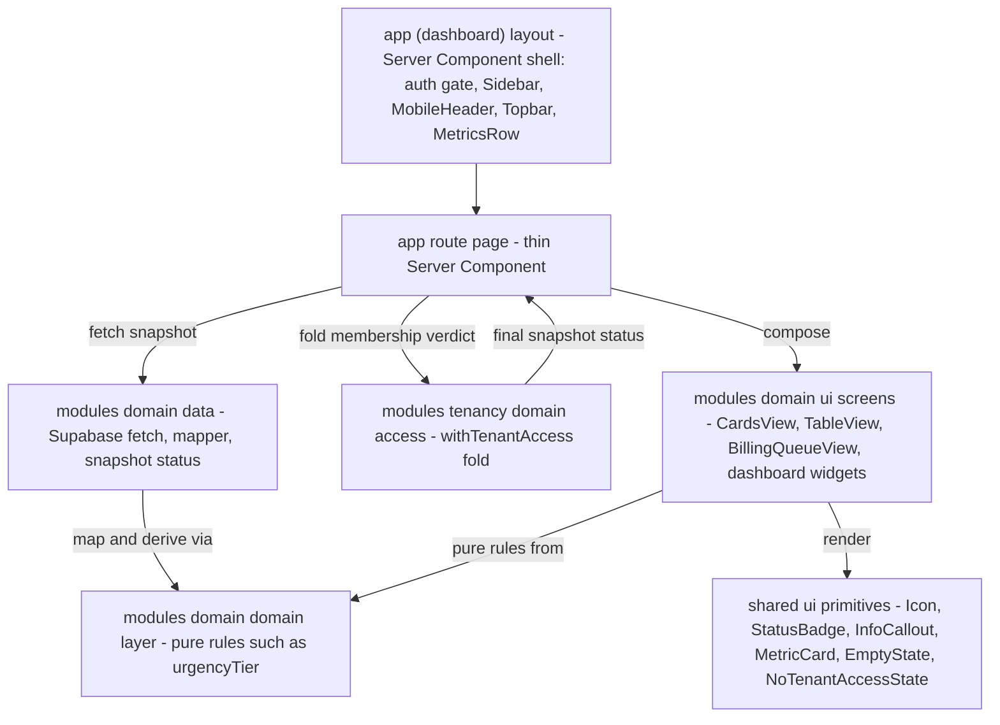
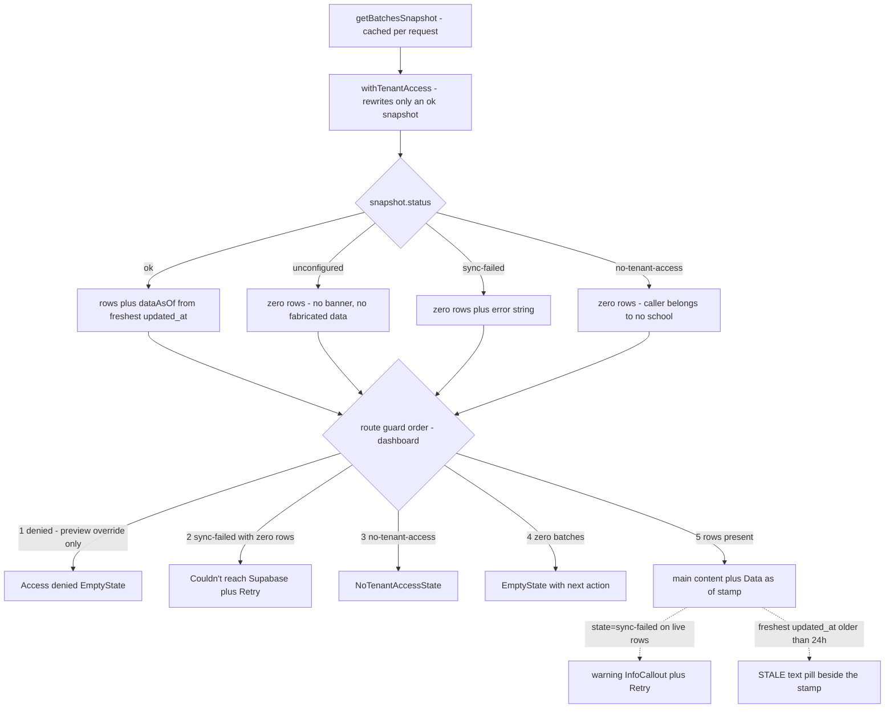

# Design System and UI Invariants

The design system in this repository exists because the product is a compliance tool: "a coordinator misreading a status by color alone is a real operational failure, not a cosmetic one" ([CLAUDE.md](/CLAUDE.md) §Design system). The non-negotiable UI rules are checklisted in [`RULES.md`](/RULES.md) §4–§6, the full visual reference is [`docs/DESIGN.md`](/docs/DESIGN.md), and the upstream v1.0 spec sheet lives at [`uploads/training-compliance-design-system.md`](/uploads/training-compliance-design-system.md). The handoff bundle (`ui_kits/admin/*.jsx`) is the *design reference*; the local Next.js TypeScript components are the implementation layer.

## Sources of truth

| Source | Role |
|---|---|
| [`RULES.md`](/RULES.md) §4–§6 | The invariants, in checklist form with an enforcement level per rule (`[hook]`, `[lint]`, `[types]`, `[rls]`, `[deny]`, `[review]` — legend at the top of the file) |
| [`docs/DESIGN.md`](/docs/DESIGN.md) | Complete design reference: principles, voice, tokens, components, states, motion, accessibility. Implementation decisions that diverge from the upstream spec are marked `⚠ DEVIATION` and **win** over the spec; `colors_and_type.css` and `ui_kits/admin/` are the live ground truth |
| [`docs/design/colors_and_type.css`](/docs/design/colors_and_type.css) | Token definitions — "the single source of truth for visual decisions", and per the DESIGN.md file index, "Source of truth for color" |
| [`ui_kits/admin/README.md`](/ui_kits/admin/README.md) | The handoff kit: the four deviations restated at source, plus the instruction to keep the kit as visual reference |
| [`uploads/training-compliance-design-system.md`](/uploads/training-compliance-design-system.md) | Original v1.0 spec — re-read before making a visual decision not covered by DESIGN.md |
| [`ui_kits/admin/`](/ui_kits/admin/), [`assets/`](/assets/), [`preview/`](/preview/), [`screenshots/`](/screenshots/), [`uploads/`](/uploads/) | Design handoff bundle, ported verbatim — **do not edit** (see [Static directories](#do-not-edit-static-directories-and-design-artifacts)) |

<!-- openwiki: broken internal link [/openwiki/domains/batches-and-lifecycle.md] file "/openwiki/domains/batches-and-lifecycle.md" does not exist. Fix the href or restore the target, then delete this comment. -->
<!-- openwiki: broken internal link [/openwiki/workflows/add-a-data-driven-screen.md] file "/openwiki/workflows/add-a-data-driven-screen.md" does not exist. Fix the href or restore the target, then delete this comment. -->
Related pages: [Module boundaries and data patterns](/openwiki/architecture/module-boundaries-and-data-pattern.md), [Security and auth chain](/openwiki/architecture/security-and-auth-chain.md), [Batches and lifecycle](/openwiki/domains/batches-and-lifecycle.md), [Add a data-driven screen](/openwiki/workflows/add-a-data-driven-screen.md).

## Token layer

**Where tokens live at runtime.** `app/globals.css` is the single style entry point: it imports Tailwind v4 (`@import "tailwindcss"`), bridges Tremor's legacy v3 config with `@config "../tremor.config.mjs"` plus `@source inline(...)` (scoped to `modules/analytics` by that file's content globs), imports the layout-only `app/design-system.css`, and then defines the `:root` token block **copied verbatim** from `docs/design/colors_and_type.css` — the file's own header instruction reads "Do NOT delete or merge — copy the entire :root block verbatim from colors_and_type.css". The one deliberate exception is `--font-sans` / `--font-mono`, where `globals.css` prepends the `next/font` variables (see below); re-copying the block wholesale from `colors_and_type.css` would silently undo the font optimization. `app/design-system.css` is layout-only — its header says so ("Tokens come from ../../colors_and_type.css") — and covers the shell, sidebar, topbar, `.page-head`, `.metrics`, buttons, focus, data rows, billing queue, activity log, trainer surfaces, and keyframes, always referencing token variables rather than raw colors.

**Fonts.** `app/layout.tsx` loads IBM Plex Sans (weights 300–600) and IBM Plex Mono (300–500) through `next/font`, exposing `--font-ibm-plex-sans` / `--font-ibm-plex-mono` as CSS variables on `<html>`. `:root` prepends those variables to `--font-sans` / `--font-mono`, so the optimized, layout-shift-free fonts win with the web/system names as fallbacks. The families are spec-locked: IBM Plex Sans for UI/body, IBM Plex Mono for IDs, dates, codes and numeric data — and Inter/Geist/Roboto/Arial are explicitly banned as primary typefaces. Semantic type roles (`.t-page-title`, `.t-label`, `.t-cell`, `.t-badge`, `.t-metric-value`, `.t-mono`, `.t-remark`, `.t-hero`, …) are defined once in `globals.css` and reused across screens.

**Semantic color system.** Six hues, each carrying exactly one meaning and applied 100% consistently:

- **Blue** — informational / TWSP / active navigation (`base`/`-lt`/`-dk`/`-border`/`-hover`)
- **Teal** — CFSP program (same five tiers)
- **Green** — completed / approved / on-track (same five tiers)
- **Amber** — warning / 7–21 days / pending (same five tiers)
- **Red** — critical / <7 days / errors (same five tiers)
- **Purple** — NC level indicators — **only three tiers** (`--color-purple`, `-lt`, `-dk`); it is a badge color, never a callout border or hover state

Urgency is the most important color rule in the system: **≤6 days critical/red, 7–21 warning/amber, >21 on-track/green**. What is fixed at fetch time is the *number*: the mapper in `modules/batches/data/batches.ts` stores `daysToBilling: daysUntil(row.end_date)` on each `Batch`, and `daysUntil()` returns `Number.POSITIVE_INFINITY` for a missing **or unparseable** date — the established "no known deadline" sentinel that sorts last and never triggers a tier. The tier itself is then derived from that stored number by the pure `urgencyTier()` helper in `modules/batches/domain/urgency.ts` (`BatchCard`, `BatchModal`, `AlertsPanel` all call it), so no component re-reads the calendar. `shared/ui/UrgencyIndicator` carries its own `tierOf()` for the extra `overdue` and `unknown` presentations.

**Documented deviations from the upstream spec** (DESIGN.md `⚠ DEVIATION` markers, which win — and which `ui_kits/admin/README.md` restates at the source):

1. Amber and red hex values were re-tinted warmer/more vivid than the spec (`#C7600F` / `#C81F1F`); the spec's hex values are explicitly "no longer canonical".
2. The spec's 3px colored left border on batch cards, InfoCallouts, and warning/critical MetricCards was removed — urgency is communicated by the badge in the card header and the billing-deadline value color; callouts use a 1px tinted **full-perimeter** border instead; MetricCards tint the label icon and sub-label.

**Other locked values.** 4px spacing grid (2px half-steps for micro-spacing only), border radius ≤ 12px (`9999px` only for avatars/toggles/bars), minimal shadows ("structure comes from borders, not elevation"), component sizing tokens (`--h-table-row: 40px`, `--h-input: 32px`, `--h-badge: 20px`), and motion tokens (100/150/300/400 ms plus a 2 s pipeline pulse) with a global `prefers-reduced-motion: reduce` kill-switch in `design-system.css` that clamps every animation and transition to 0.01 ms (the button spinner is separately slowed to 2 s rather than stopped, so the pending state stays visible).

## Iconography and the no-emoji rule

- **No emoji anywhere in the UI** (RULES §4.21). DESIGN.md §8 extends this: "No emoji. No Unicode glyphs. No PNG icons" — emoji "read as consumer-app delight" in a government-compliance tool. There is no automated check; this is a `[review]` rule.
- **Icons are Tabler line icons**, 2px stroke, `currentColor` inheritance. Two mechanisms coexist:
  - [`shared/ui/Icon.tsx`](/shared/ui/Icon.tsx) renders an **inline map of Tabler SVG path strings** — ported verbatim from the handoff's `components/Icon.jsx` so glyphs stay pixel-identical to the prototype and no runtime dependency is pulled in. It is pure render (no hooks), safe in both Server and Client trees, takes a closed `IconName` union, defaults to 14 px, and every instance is `aria-hidden="true"` — meaning the adjacent label is the only thing a screen reader hears, which is exactly why "never icon-only" is a design principle (DESIGN.md §1.5).
  - `@tabler/icons-react` remains the declared package dependency (`package.json`) and the spec's canonical choice; today the only direct importer in the tree is `modules/auth/ui/SignUpModal.tsx` (the Clerk sign-up form's show/hide/check/clear controls).
- Icon **semantics are pinned** in DESIGN.md §8 (batch = `folders`, warning = `alert-triangle`, critical = `alert-circle`, BSRS approved = `shield-check`, NTP = `file-invoice`, missing document = `file-off`, …) along with sizing per context (14 px inline, 16 px navigation, 13 px metric-card label, 12 px inside badges, 18 px standalone with a tooltip) — icon-to-label gap is always 4 px. `shared/vocab.ts` keeps the EGACE funnel's `icon` + `colorKey` presentation keys in one table so the dashboard and the report render the same stage the same way instead of each restating the mapping.

## Status: text + icon, never color alone

RULES §4.23 mandates status by **text + icon, never color alone**, targeting **WCAG 2.2 AA** (the upstream spec sheet says WCAG 2.1 AA; the repo rule is the stricter target). The system is built around this:

- `StatusBadge` pairs a mono text label with a semantic chip *pair* (`bg` + `fg` tokens — `ongoing` → blue-lt/blue-dk, `critical` → red-lt/red-dk, `nc-ii` → purple-lt/purple-dk), never a bare hue.
- `UrgencyIndicator` renders the days value as text ("28 DAYS", "TODAY", "3D OVERDUE") beside the tier icon and color; `BillingReadyBadge` is the green "READY FOR BILLING" chip. `ProgressBar` always shows the mono percentage next to the fill, and `MetricCard`'s warning/critical variants tint the label icon and sub-label.
- The focus-visible ring (`2px solid var(--color-blue)`, 2px offset, applied through `:where(...)` so it never adds specificity, inverting to `--color-text-primary` on primary buttons where blue-on-blue would vanish) was **added because the ported stylesheet had no focus rule at all**, failing the mandated WCAG 2.2 AA criteria 2.4.7 / 2.4.11. `outline: none` is forbidden (DESIGN.md §12).
- Row selection in the billing queue tints the row but is announced structurally: "Selection is also announced structurally (aria-selected), never by tint alone" (`design-system.css`).
- DESIGN.md §14 prescribes the ARIA patterns (batch card `aria-label` with name/status/deadline, `role="progressbar"` with value attributes, `role="list"`/`aria-current` on the pipeline, `role="img"` on charts, `aria-label` on metric cards) and lists the verified contrast pairs behind each badge token.
- Staleness is text: the dashboard renders a literal `STALE` pill, not a tinted stamp (`modules/batches/ui/dashboard/DashboardHeader.tsx`).

A related anti-misleading invariant lives in `modules/shell/ui/MetricsRow.tsx`: the `hasBatches` guard is load-bearing (TES-74). `deriveDashboardMetrics()` returns `daysToEarliestBilling: 0` when there are no batches, which `billingVariant()` would otherwise read as ≤6 days — a red critical card alarming about a deadline that does not exist. Likewise `docComplianceSub()` prints "No batches" instead of "All on file", and `docCompliancePct === null` (nothing tracked) prints `—` / "Document sync pending" rather than `0%`, per ADR-004's unknown-vs-0% rule.

## Component layering

The convention (RULES §2/§4, CLAUDE.md "Component layering") is:

**`app/` route Server Component → `modules/<domain>/ui` screens → `shared/ui` props-only primitives.**

- `app/(dashboard)/<route>/page.tsx` is a thin Server Component: it fetches via a module's `data/` layer, applies pure `domain/` rules, and composes module UI. No business logic in `app/` (RULES §2.11).
- `modules/<domain>/ui/*` holds the screens and views (`CardsView`, `TableView`, `BatchModal`, `BillingQueueView`, the dashboard widgets in `modules/batches/ui/dashboard/*`, and the app shell in `modules/shell/ui/*`).
- `shared/ui/*` holds props-only primitives that know nothing about data or rules: `Icon`, `StatusBadge`, `InfoCallout`, `MetricCard`, `ProgressBar`, `EmptyState`, `NoTenantAccessState`, `TrainerAvatar`, `UrgencyIndicator`/`BillingReadyBadge`, `TrainingDayPills`, `Toast`, `Switch`, `Charts`, `FilePreviewModal`. They receive pre-computed values and render tokens.
- **If a `shared/ui` component starts reading data or encoding business rules, move it into its owning module** (RULES §2.15). That is why `LifecyclePipeline` sits in `modules/batches/ui/`, why `deriveDashboardMetrics` was pulled out of the old mock folder into `modules/batches/domain/metrics.ts` (it had to import `modules/documents/domain/compliance`, which `shared/` may not do), and why the shell's `Sidebar`/`Topbar`/`MetricsRow` live in `modules/shell/ui/`.
- Import direction `app → modules → shared → lib/supabase` is lint-enforced by `import/no-restricted-paths` in `eslint.config.mjs`: another module's `data/` is private (only `app/` may fetch it), `shared/` can never import `modules/` or `app/`, and raw DB types from `lib/supabase/database.types.ts` are reachable only from module `data/` layers.
- **Server Components by default; client islands only for interactivity** (RULES §4.26). `BatchCard` is `'use client'` for hover elevation + `onClick` (opens `BatchModal`); `CardsView`/`TableView` are client islands owning filter and modal state; `Sidebar`, `Topbar`, `MobileHeader` and `NavDrawerProvider` are client islands because the drawer/collapse state must be shared across them. `StatusBadge`, `InfoCallout`, `MetricCard`, `EmptyState`, `NoTenantAccessState`, `Icon` and `Charts` are server-safe pure renders. The `(dashboard)` layout and every route `page.tsx` stay Server Components.
- **Reuse existing primitives** (RULES §4.25): `CardsView` and `TableView` compose the same `BatchCard`/`BatchModal`/`StatusBadge`/`EmptyState`/`UrgencyIndicator` set and differ only in arrangement.

*Component layering: fetch stays in `app/`, screens compose props-only `shared/ui` primitives, and pure domain rules are shared between mappers and screens.*

### Shell composition

`app/(dashboard)/layout.tsx` is the gate and the chrome owner: it awaits `requireAuthenticatedUser()`, reads `x-pathname` (stamped by `proxy.ts`, since Server Components cannot see the full path) to decide `isTrainerRoute`, resolves the trusted DB role and the platform-admin flag for the nav rows, wraps everything in `NavDrawerProvider`, and renders `Sidebar` → `MobileHeader` → `Topbar` → `MetricsRow` → `{children}`. Two of its decisions are design-system facts, not auth facts:

- **The metrics strip is suppressed** on `/dashboard` itself (the page renders its own KPI grid), and on `sync-failed` / `no-tenant-access` snapshots: a strip reading "0 batches / 0 scholars" is a claim about a school, and for someone attached to no school it is a claim about nothing.
- **Role surfaces are omitted server-side, never CSS-hidden** — `hideBilling` drops the billing card for trainer routes, the Sidebar shows trainer operations as Settings-only and withholds the admin "Add user" / platform "Add school" rows, and the Topbar bell is not rendered on trainer routes at all.

## Screen states

RULES §4.24 names six mandatory states for every data screen; the code enforces a **seventh distinct treatment**, `no-tenant-access`, which CLAUDE.md's error-shaping contract requires on top of them.

| State | Mandated treatment, as implemented |
|---|---|
| **loading** | `app/(dashboard)/dashboard/loading.tsx` is a route-level Suspense skeleton mirroring the real layout (header → KPI grid → charts row → panels), marked `aria-busy` with `aria-hidden` blocks and the copy "Loading latest snapshot…". Write-back buttons use `.btn.loading`, which puts a spinner in the leading slot so the button does not change width mid-action, alongside `disabled` + `aria-busy` (see `CreateUserForm` / `CreateSchoolForm`) |
| **empty** | `EmptyState` with icon + heading + the next administrative action — dashboard: "No assigned batches" + an *Import a batch* link; batch cards: "No batches yet" |
| **no-results** | `EmptyState` "No batches match / Try clearing the search or program filter" from inside `CardsView` and `TableView` |
| **no-tenant-access** | `shared/ui/NoTenantAccessState` — **never the ordinary empty state**. "No school assigned yet … An admin or registrar assigns your school and role". The copy lives in the component, not at the call sites, so all eight screens that use it (dashboard, batch cards, table view, documents, billing, analytics, report, activity log) say the same thing |
| **error / sync-failed** | RULES §3.19: `sync-failed` **must** surface the banner, and a guard clause that tests "empty" first will silently swallow it. Where a failure yields zero rows (which is now always, since nothing falls back to mock data) the dashboard and billing routes render a full-page "Couldn't reach Supabase" `EmptyState` with a *Retry* link; the batch-cards, analytics and documents routes render the warning `InfoCallout` banner instead ("Sync with the compliance database failed, so no document status is shown"). Raw Supabase/SQL errors, table names and internal IDs are never leaked (RULES §1.6) |
| **permission-denied** | Full-page guard `EmptyState` with `shield-off`: "Access denied — your role does not have access to this school's dashboard". Still reachable only via the `?state=denied` preview override; the real tenant/role resolver has not landed (TES-34 / #32) |
| **stale-data** | A `STALE` text pill beside the "Data as of" stamp when the freshest row is older than the 24 h threshold |
| **unconfigured** | No Supabase env: renders the ordinary empty state with **no banner and no fabricated rows** — honestly empty, distinct from "the fetch broke" |

**Mechanism.** Data functions return **discriminated snapshots** so Server Components map states straight to UI. `getBatchesSnapshot()` — `cache()`-wrapped so the layout and its nested page share one query per request — yields `BatchesSnapshot` = `ok` (rows + `dataAsOf`) / `sync-failed` (`error`) / `unconfigured`, and the route folds in `no-tenant-access` via `withTenantAccess`. **There is no mock or cached fallback anywhere**: `shared/mocks/` was deleted entirely (RULES §2.16), and `selectBatchesForDisplay()` returns `[]` for any non-`ok` status with the comment "Never substitutes mock data". The only screen-level preview override left is the dashboard's and billing's `?state=` query param; the other routes derive their state purely from the snapshot.

**The fold owns its precedence.** `no-tenant-access` is *never produced by a query* — RLS answers it with a successful empty read, which is precisely the ambiguity it resolves. `modules/tenancy/domain/access.ts` therefore replaces **only** an `ok` snapshot, and leaves `unknown` access (profile read failed, or no Supabase) alone: "we could not check" must not be rendered as "you have no school". `tests/unit/tenant-access.test.ts` pins both rules because their failure modes are silent.

*State derivation on the dashboard route: the snapshot status chooses the data, the guard order makes sure a failure can never read as an empty tenant, and `stale`/preview-banner render as overlays on real content. Other routes fold the same decisions with their own order — batch cards test `syncFailed` before `noTenantAccess` inside the zero-row branch.*

**"Data as of" timestamp.** Screens that show relative dates must show an exact stamp (RULES §4.24). `formatDataStamp()` renders the freshest live `updated_at` as `Jun 19, 2026 · 14:02` using `hourCycle: 'h23'` (not `hour12: false`, which implies `h24`, so midnight prints `00:02`, never `24:02`). When there is no live timestamp — `unconfigured`, `sync-failed`, or an `ok` snapshot with no rows — the header prints the literal **`unknown`** rather than a plausible-looking time; `DATA_AS_OF_FALLBACK` deliberately does not say "cached" because it isn't always cached. The banner copy mirrors the same honesty: `SyncFailedCallout` only claims "the last cached snapshot" when `isShowingCachedFallback` (i.e. `snapshot.status !== 'ok'`) is true, otherwise it says "the currently loaded data" — a `?state=sync-failed` override over live rows must not lie about provenance. `BillingQueueView` receives its `dataAsOf` as an explicit prop and stamps `Packet readiness · Data as of {dataAsOf}`; its route formats the newest row `updated_at` in the `en-PH` locale, but its own `formatAsOf` fallback is a hardcoded literal (`29 May 2026, 09:12`) rather than "unknown" — the one remaining place a fabricated timestamp can still reach the UI, along with `CardsView`'s static "loaded at 14:02" callout.

## Copy rules and product framing

- **UI copy must never imply official TESDA approval or submission** (RULES §5.27). This is an internal working layer; TESDA SIS/T2MIS/BSRS remain authoritative. Badges may show `APPROVED` / `NOT APPROVED` for the batch's own BSRS field, and forms carry explicit disclaimers of the boundary — the add-user form states "It is not a TESDA registration and changes nothing in SIS, T2MIS or BSRS."
- The voice (DESIGN.md §2) is **administrative, exact, never decorative**: direct and structural ("Training ongoing — Day 31 of 42."), no exclamation marks, no "we"/"you", Title Case for data-system nouns (*Batch*, *Scholar*, *Trainer*, *Billing Deadline*, *NTP*, *BSRS*, *NC II*), sentence case for buttons and inline text, **always include the unit** ("31 days", "71.4%" — naked numbers are forbidden), abbreviations explained on first use, and auto-remarks written as imperative-mode summaries. Vague urgency words ("soon", "shortly"), "Click here", and branded mascot language never appear.
- Grammar that supports those rules is leaf-level code, not per-screen strings: `shared/text.ts`'s `pluralize()` keeps counts and nouns paired ("1 batch" / "3 batches") everywhere, and `shared/vocab.ts` holds the closed TESDA vocabulary (EGACE stages with their presentation keys, employment statuses) because those tables are terms, not data — explicitly unaffected by the mock-data retirement.

## Do-not-edit static directories and design artifacts

- **`assets/`, `preview/`, `screenshots/`, `ui_kits/`, `uploads/` are ported verbatim** from the design bundle, excluded from lint and build by `globalIgnores` in `eslint.config.mjs`, and protected at `[hook]` level (RULES §6.28): the committed script `.claude/hooks/protect-static-dirs.sh` reads the edited path from stdin, exits `2` with the instruction to edit the source design file instead, and explicitly exempts `public/assets/` first — that is the app's real runtime static directory (served at the site root), which merely shares the name.
- **Hook registration is *not* in the repository.** `.gitignore` ignores `.claude/*` but re-includes `.claude/hooks/` and `.claude/agents/` so the scripts travel with the repo; `.claude/settings.json`, where `Edit|Write` would be wired to `protect-static-dirs.sh` and the PostToolUse `lint-edited-file.sh` (which lints only the file just edited, via `eslint_d` when present), is local machine config. Treat RULES' `[hook]` and `[deny]` levels as depending on that uncommitted registration — the scripts themselves are the reviewable artifact.
- **`FIGMA FILES/`, `diagrams/`, `.design-sync/` are design artifacts, not app code** (RULES §6.29, review-level). `FIGMA FILES/` is not materialized in the tree — Figma pages are referenced by node ID in code comments instead (`8:4330` for the primary-navigation aside, `840:5128` for the billing packet queue, `522:2367` / `382:3` / `394:723` for the role dashboards, `840:4874` for data rows). `.design-sync/` is gitignored local tooling and does not exist in a fresh clone; nothing in the app reads it.
- **Design changes go to the source design files first.** The handoff bundle *is* the reference layer: `ui_kits/admin/index.html` is a no-build working prototype of the four views, `ui_kits/admin/*.jsx` are the components the local ones were ported from, `preview/` holds standalone HTML sheets for type/color/spacing/components, and `assets/icons/` is the curated offline SVG subset of the Tabler icons. Per DESIGN.md's preamble, when spec and deviation conflict the **deviation wins** and `colors_and_type.css` + `ui_kits/admin/` are the live ground truth.

## Invariant checklist

Aligned to [`RULES.md`](/RULES.md) §4 (rules 21–26), §5 (rule 27) and §6 (rules 28–29):

| # | Invariant | Enforcement |
|---|---|---|
| 21 | No emoji anywhere in UI; icons are Tabler line icons | `[review]` |
| 22 | IBM Plex fonts; semantic color tokens only — never raw hex in components (the legacy `shared/ui/Charts.tsx` palette — whose `teal`/`purple` values have drifted from the tokens — and the spec-pinned `TrainerAvatar` palettes are the acknowledged exceptions) | `[review]` |
| 23 | Status conveyed by text + icon, never color alone; WCAG 2.2 AA target | `[review]` |
| 24 | Every state implemented on every data screen; exact "Data as of" timestamp on screens with relative dates | `[review]` |
| 25 | Reuse existing primitives rather than creating parallels | `[review]` |
| 26 | Default to Server Components; client islands only for interactivity | `[review]` |
| 27 | UI copy must never imply official TESDA approval or submission | `[review]` |
| 28 | `assets/`, `preview/`, `screenshots/`, `ui_kits/`, `uploads/` do-not-edit — `protect-static-dirs.sh` blocks edits | `[hook]` (script committed; registration is local) |
| 29 | `FIGMA FILES/`, `diagrams/`, `.design-sync/` are design artifacts, not app code | `[review]` |

Two adjacent invariants are what make the design rules enforceable at all: data functions return discriminated snapshots with **no mock substitution** (RULES §3.19), and raw DB/SQL errors never reach the UI (RULES §1.6). A screen cannot render "sync-failed honestly" if the data layer handed it fabricated rows instead.
