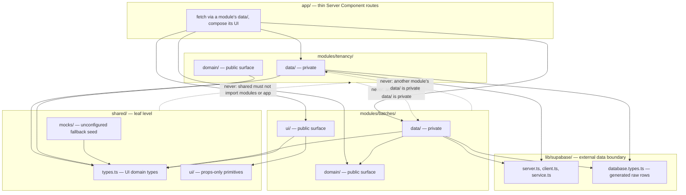
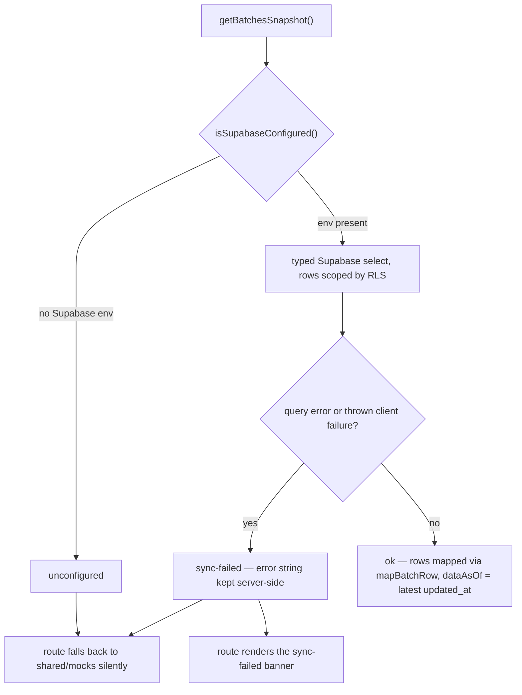

# Module Boundaries and the Data Layer Pattern

Code in this repository is grouped **by domain, not by file type** — a DDD-influenced layout introduced with TES-68. Every feature lives in a `modules/<domain>/` folder split into three sub-layers (`data/`, `domain/`, `ui/`), and everything sits inside a four-layer hierarchy with a strictly one-way import direction: `app → modules → shared → lib/supabase`. [`CLAUDE.md`](/CLAUDE.md) §Architecture explains the *why*; [`RULES.md`](/RULES.md) §2–§3 states the *what* as checklist rules, each tagged with its enforcement level (`[lint]`, `[types]`, `[review]`). Where the two documents disagree, `RULES.md` wins.

The rules that matter most for day-to-day work:

- **No business logic in `app/`.** Routes are thin Server Components: they fetch via a module's `data/` layer and compose module `ui/` + `shared/ui/` primitives (RULES §2.11, `[review]`).
- **A module's `data/` is private to that module.** Another module imports its `domain/` or `ui/` surface instead; only `app/` may fetch from any module's `data/` (RULES §2.8, `[lint]`).
- **`domain/` is pure** — business rules with no I/O (RULES §2.14, `[review]`).
- **`shared/` must never import `modules/` or `app/`** (RULES §2.9, `[lint]`).
- **No index barrels** — deep imports are the convention everywhere, including `shared/` (RULES §2.13, `[review]`).
- **Only module `data/` layers may import `lib/supabase/database.types.ts`** (besides `lib/supabase` itself); components import domain types from `shared/types.ts` only (RULES §2.10, `[lint]`).

## Layer model

Solid arrows are allowed import directions; dashed arrows are rejected by `import/no-restricted-paths` in [`eslint.config.mjs`](/eslint.config.mjs). The tenancy/batches pair illustrates the cross-module rule with two real modules.

### `app/` — thin routes only

`app/` holds App Router pages, layouts, and route handlers. A page such as `app/(dashboard)/dashboard/page.tsx` shows the shape: it imports `getBatchesSnapshot` and `selectBatchesForDisplay` from `modules/batches/data/batches`, `getCurrentUser` from `modules/auth/data/auth`, pure helpers from `modules/batches/domain/metrics` and `modules/billing/domain/readiness`, and composes `modules/*/ui` screens over `shared/ui` primitives. The route performs fetch + state mapping + composition; the computation itself lives in module `domain/` functions. New code goes inside its owning module — modules without code yet hold a README naming their FR (e.g. `modules/attendance/README.md`, FR-07, planning `data/attendance.ts`, `domain/eligibility.ts`, `ui/`), and new top-level folders are a rule violation (RULES §2.12).

### `modules/<domain>/` — one module per PRD FR

The 14 domains are: auth (FR-01), tenancy (FR-02), batches (FR-03/04/05), documents (FR-06), attendance (FR-07), lamr (FR-08), billing (FR-09), import-export (FR-10), analytics (FR-11), activity (FR-12), notifications (FR-13), settings (FR-14), reports (FR-15), and `shell` (app chrome, no FR). Within a module:

- **`data/`** — the fetch → map → derive contract and the **only** layer allowed to import `lib/supabase/database.types.ts` (plus `lib/supabase` itself). Data files are the module's private surface.
- **`domain/`** — pure business rules, no I/O (e.g. `modules/batches/domain/urgency.ts`, `modules/billing/domain/readiness.ts`), unit-tested with fixed as-of dates. This is public to other modules.
- **`ui/`** — domain-aware components. Also public to other modules, though in practice other modules reach for `domain/` logic, not each other's screens.

A module's `data/` may import its own `domain/` (e.g. `modules/tenancy/data/tenancy.ts` takes its `Profile` type from `modules/tenancy/domain/profile`), another module's `domain/` (e.g. `modules/batches/data/metrics.ts` imports `docRecordFor` from `modules/documents/domain/compliance`), and anything in `shared/` — including `shared/mocks` (e.g. `modules/billing/data/billing.ts` defaults its tenant lookup to the mock `TENANTS`).

### `shared/` — leaf level

`shared/` is the lowest layer: code here knows no module, page, or data-source context, and it must never import `modules/` or `app/` (lint-enforced). Contents: `shared/types.ts` (UI domain types, deliberately one file — see [The deferred per-module type split](#the-deferred-per-module-type-split-tes-68)), `shared/ui/` (props-only presentational primitives — `Icon`, `StatusBadge`, `EmptyState`, `MetricCard`, …; if one starts reading data or encoding business rules it moves into its owning module, RULES §2.15), and `shared/mocks/` (the seed dataset backing the `unconfigured` fallback — part of the data-layer contract, not throwaway fixtures). `shared/vocab.ts` holds fixed TESDA vocabulary (e.g. `EMPLOYMENT_STATUSES`) that is deliberately *not* re-exported from the mocks facade, to remove the "is this real or mock?" ambiguity (TES-74).

### `lib/supabase/` — the external data boundary

`lib/supabase/` wraps Supabase behind three factories plus the generated contract:

- `server.ts` — `createSupabaseServerClient()` builds an **anon-key** client and attaches the caller's Clerk session token through the `accessToken` callback (Clerk's native third-party auth; JWT templates were deprecated 1 Apr 2025, and the schema needs no custom claims because RLS reads only `sub`). If no token exists it **throws** (`NO_CLERK_TOKEN_MESSAGE`) rather than silently querying as `anon` — RLS would answer an anon query with zero rows and no error, which for a compliance tool is the dangerous outcome. `isSupabaseConfigured()` (checks `NEXT_PUBLIC_SUPABASE_URL` + `NEXT_PUBLIC_SUPABASE_ANON_KEY`) is what data functions probe to decide between live fetch and the `unconfigured` snapshot.
- `client.ts` — the browser-side client.
- `service.ts` — a service-role client that **bypasses RLS entirely**; reserved for trusted server-to-server writes with no Clerk session (the Clerk `user.created` webhook provisioning `profiles` via `modules/auth/data/provisioning.ts`). `SUPABASE_SERVICE_ROLE_KEY` must never be read outside this file.
- `database.types.ts` — the generated raw-row contract (tables' `Row`/`Insert`/`Update` plus seven Postgres enums: `profile_role`, `lifecycle_stage`, `batch_status`, `document_status`, `document_audience`, `assessment_result`, `activity_action`). Regenerate after every migration.

## Import direction is lint-enforced

[`eslint.config.mjs`](/eslint.config.mjs) implements the hierarchy with `import/no-restricted-paths` zones over `app/**`, `modules/**`, `shared/**`, and `lib/**`:

| Forbidden direction | Lint message (abridged) |
|---|---|
| `app/`, `shared/`, `modules/*/ui/`, `modules/*/domain/` ← `lib/supabase/database.types.ts` | "Raw DB row types are data-layer only. Import domain types (shared/types or a module's domain/) instead." |
| `shared/` ← `modules/` | "shared/ is the leaf level and must not import modules/." |
| `shared/` ← `app/` | "shared/ must not import app/." |
| `modules/` ← `app/` | "modules/ must not import app/." |
| `modules/!(d)/**` ← `modules/d/data/**`, for each of the 14 domains | "modules/d/data is private to that module; import its domain/ or ui/ surface, or fetch in app/." |

The per-module privacy zones are **generated from the `domains` array** at the top of the config, which lists exactly the 14 module folders — so a new module must be added there or its `data/` will not be made private. Two things to note about what lint does *not* do:

- The rules that are `[review]`-level (no business logic in `app/`, `domain/` purity, no barrels, code placement) have no automated check — a human or agent must catch them.
- A separate `complexity: ["warn", 15]` rule is a maintainability signal only (warn, not error), and `globalIgnores` excludes the do-not-edit design directories (`assets/`, `preview/`, `screenshots/`, `ui_kits/`, `uploads/`) from lint/build.

## A module's `data/` is private

The public surface of a module is `domain/` + `ui/`. Its `data/` holds the live-query coupling to Supabase, and importing it across a module boundary would smuggle that coupling in — so the rule is lint-enforced per domain, with one carve-out: **`app/` Server Components may fetch from any module's `data/`** (and `app/` is exactly where cross-module `data/` imports appear, e.g. the billing page calling both `modules/tenancy/data/tenancy` and `modules/auth/data/auth`).

Two real examples of how the boundary is respected instead of crossed:

- **Pass-by-parameter.** `profiles` RLS allows "own or same-tenant" reads, so fetching "my profile" needs the caller's Clerk user id. Resolving that id is `modules/auth/data`'s job, but its `data/` is private — so `getProfileSnapshot(clerkUserId)` in [`modules/tenancy/data/tenancy.ts`](/modules/tenancy/data/tenancy.ts) takes the id as a parameter, and `app/` (which may call both `data/` layers) wires them together.
- **Import the public surface.** `modules/batches/data/metrics.ts` needs the untracked-document rule, so it imports `modules/documents/domain/compliance` — `domain/` is public, `data/` is not.

### Hand-duplicated mappers are the price of privacy

Because `batches.ts` cannot import `documents.ts` (both are `data/` layers of different modules), it **hand-duplicates** the document-mapping logic: `MISSING_DOC`, `mapDocumentRow`, and the catalog backfill in `mapDocumentsMap` are copies of their `modules/documents/data/documents.ts` counterparts, kept in sync by hand — the file's own comment says this duplication exists *because* a module's `data/` is private, and notes it closes the `TODO(join)` gap by backfilling against the batch's requirement catalog. The same deliberate duplication appears in smaller form: `toRelativeWhen` in `activity.ts` mirrors `toDisplayDate` in `batches.ts` (same unparseable-date → empty-string convention). When fixing one, fix all copies — the lint rule is what makes the copies, not a mistake to deduplicate.

## The data contract: fetch → map → derive

`modules/batches/data/batches.ts` is the **reference implementation every entity contract must follow** (RULES §3.17). Its own header names the three intentionally separated layers:

1. **fetch** — `getBatchesSnapshot()`: a typed Supabase query (`batches` with embedded `scholarship_programs(code, program_document_requirements(*))` and `documents(*)` selects, ordered by `end_date`). RLS scopes rows to the caller — **never manually filter by tenant in JS** (RULES §1.2: a JS-side tenant filter is a bug even when it returns the right answer).
2. **map** — `mapBatchRow(row)`: a pure DB-row → UI-domain (`Batch`) translation, no I/O, **exported for unit tests**. Contract gaps are marked `TODO(contract)` and defaulted so the shape stays valid (`billingDeadline`/`daysToBilling` currently stand in on `end_date` because no `billing_deadline` column exists; `trainingDays`, `notes`, `duration`, … are empty defaults).
3. **derive** — lifecycle and date helpers computed from the row: `deriveLifecycle(currentStage)` builds the full UI pipeline from the single `current_stage` enum; `daysUntil` returns `Number.POSITIVE_INFINITY` for a missing *or unparseable* date (the "no known deadline" sentinel that sorts last and never trips urgency tiers — without the guard, `NaN` would silently corrupt sorting and urgency math downstream); `toDisplayDate` converts ISO to the UI's "Jun 18, 2026" convention and returns `''` for null/unparseable.

The snapshot also carries `dataAsOf` (the freshest `updated_at` across loaded rows), which is what drives the dashboard's "Data as of" stamp and the 24-hour stale flag. A sibling function, `selectBatchesForDisplay(snapshot, fallback)`, centralizes the decision "live rows when `ok`, mock fallback otherwise." There is also a throwing `getBatches()` for callers that want the raw-or-throw flavor, but the snapshot is the contract.

Variants within the convention:

- **Derive-only data files** — `modules/batches/data/metrics.ts` has no I/O at all; it is a pure function over a `Batch[]` the caller already loaded (live or mock), taking `criticalDocumentKeys` as a parameter precisely because the mock and live requirement catalogs use different key sets.
- **No derive layer** — `modules/documents/data/documents.ts` and `modules/batches/data/learners.ts` have nothing time-based to compute; fetch + map is the whole contract.
- **Write paths** — `modules/import-export/data/learnerImport.ts`'s `importLearnersCsv` extends the same shaping for mutations: it validates the CSV *before creating a Supabase client*, then reads the target batch's `tenant_id` back via an RLS-scoped SELECT (so a write can never target a tenant the caller couldn't already read), and reconciles by ULI before insert/update.

## Discriminated snapshots

Data functions return **discriminated snapshot unions** so Server Components map states straight to UI (RULES §3.19). The core trio, per `BatchesSnapshot`:

| Status | Meaning | Required UI treatment |
|---|---|---|
| `ok` | Live rows loaded (RLS-scoped) | Render data; show real "Data as of" from `dataAsOf` |
| `sync-failed` | Supabase configured but the query failed, or the client threw (including a missing Clerk token) | **Must** surface the sync-failed banner; fall back to cached/mock data |
| `unconfigured` | No Supabase env in this environment | Fall back to `shared/mocks` **silently** — no banner |

Modules extend the trio with their own states where a third outcome is genuinely different:

- `ProfileSnapshot` in `modules/tenancy/data/tenancy.ts` adds **`not-found`**: the user is authenticated with Clerk but has no `profiles` row yet — a webhook race or a failed provisioning (`app/api/webhooks/clerk/route.ts` → `modules/auth/data/provisioning.ts`). It is kept distinct from `sync-failed` because "no access yet" is not an error.
- `LearnerImportSnapshot` in `modules/import-export/data/learnerImport.ts` adds **`validation-failed`** (`errors: string[]`): the CSV is structurally bad (no data rows, missing required columns, all rows invalid) before any write is attempted. Partially valid files return `ok` with a `skipped` row list instead.

The `getBatchesSnapshot` decision flow; tenancy and import snapshots add their extra states on top of the same trunk.

One subtle invariant lives in the banner itself: the snapshot holds the raw `error` string, but the UI never prints it. `app/(dashboard)/dashboard/page.tsx` renders fixed copy — "Sync with Supabase failed — showing the last cached snapshot" — plus a data-as-of label and a Retry link; the as-of label is ` from <timestamp>` or empty, *not* the error message. RULES §1.6 forbids leaking raw Supabase/SQL errors, table names, or internal IDs to the UI, and the snapshot design is what makes that possible: state discrimination in the union, error detail trapped server-side.

## Two deliberately separate type families

| Family | File | What it models | Who may import it |
|---|---|---|---|
| Raw rows | `lib/supabase/database.types.ts` (generated) | Supabase tables: `Row`/`Insert`/`Update` per table, seven Postgres enums | Module `data/` layers and `lib/supabase/` only — everything else is lint-blocked |
| UI domain | `shared/types.ts` (hand-written, one file) | What screens render: `Batch`, `Tenant`, `DocRecord`, `ActivityEvent`, `DashboardMetrics`, … | Everyone below `data/` — `app/`, `modules/*/domain/`, `modules/*/ui/`, `shared/` |

The mappers in each module's `data/` are the **only seam** between the families: they take generated row types in and return `shared/types.ts` domain types out, so components never see a snake_case column name or a raw enum value. `Batch` is the hub type — it references shapes from six other domains (`LifecycleStage`, `DocRecord`, `ScholarRow`, `EgaceCounts`, …), which is part of why the type file stays single. The practical consequence of keeping the families separate: after a migration you regenerate `database.types.ts` and fix whatever mappers break (a total enum map turns schema drift into a compile error, below), while `shared/types.ts` changes only when the UI contract changes.

## Enum bridges: total maps in the mapper, never in components

The DB and the UI use different spellings for the lifecycle pipeline, and the translation lives in the mapper (RULES §3.18, `[types]`):

| DB `lifecycle_stage` | UI `LifecycleStageKey` |
|---|---|
| `aou` / `ntp` / `tip` | `aou` / `ntp` / `tip` |
| `training` | `train` |
| `assessment` | `assess` |
| `billing` | `bill` |
| — (no DB column) | `entre` (UI-only) |
| `completed` / `blocked` | `null` (special-cased) |

`DB_TO_UI_STAGE` in `modules/batches/data/batches.ts` is a **total (non-`Partial`) map**: every `DbLifecycleStage` must appear, so adding a new DB enum variant is a compile error there until its UI treatment is deliberately chosen. The `null` entries are not omissions — `deriveLifecycle` gives them their own treatment (`completed` → every pipeline stage `done`; `blocked` → nothing marked `active`), and `normalizeStatus` surfaces DB `blocked` as UI `pending` until the UI gains a blocked tier. The same total-map discipline repeats across the data layer: `STAGE_TO_UI` (documents), `ACTION_TO_TONE` (activity, mapping the generic CRUD `activity_action` enum to badge tones), `DB_TO_UI_ROLE` (tenancy, where the DB role set is a strict subset of the UI's — `owner` has no DB equivalent yet), and `ASSESSMENT_RESULT_TO_UI` (learners, where `pending` maps to `''` = not yet assessed). The deliberate exception proves the rule: `DOCUMENT_ICONS` in documents.ts is a `Partial` map because `document_key` is per-program *configured data*, not a closed enum — an unknown key falls back to a generic icon rather than failing compilation. `tests/unit/batches.test.ts` pins the bridge's behavior (stage bridging, `completed`/`blocked` lifecycle treatment, `blocked` → `pending` status).

## Mocks are part of the data contract

`shared/mocks/seed.ts` is a faithful port of the design handoff's seed data, including three enrichment passes (`enrichBatches`, `buildRosters`, `enrichTrainerCurriculum`) that run once at module load so every consumer sees the same frozen data. `shared/mocks/index.ts` is a thin facade over it: components import `MOCK_BATCHES` (active operational set — excludes completed cohorts, sorted most-urgent-first by `daysToBilling`), `ALL_BATCHES` (includes completed, for Report), `MOCK_ACTIVITY`, and the re-exported `TENANTS`/`USERS`/`DOCUMENT_REQUIREMENTS`/`ALERTS_LOG`/`SNAPSHOTS`. The facade's comments record what *left* it as domain logic matured: `urgencyTier` → `modules/batches/domain/urgency.ts`, billing readiness → `modules/billing/domain/readiness.ts`, `getMockMetrics` → `modules/batches/domain/metrics.ts` (TES-68/TES-94) — `shared/` may not re-export module code.

One mismatch is intentionally preserved: the mock's 12-key `DOCUMENT_REQUIREMENTS` and the live `program_document_requirements` table use **different key sets** (`training_sched` vs `training_schedule`, `billing_rpt` vs `billing_report`). `documents.ts` says not to merge the two — that would silently paper over the mismatch instead of surfacing it — which is why `modules/batches/data/metrics.ts` takes the catalog as a parameter rather than hardcoding either.

## The deferred per-module type split (TES-68)

A per-module split of `shared/types.ts` was considered and **deliberately deferred**: `shared/mocks/seed.ts` constructs 11 of these domain types, and since `shared/` can never import `modules/`, moving the types into their modules would break the import boundary until the mock dataset is relocated out of `shared/`. `Batch`'s role as a cross-domain hub type makes the split more painful, not less. RULES §2.16 states it as a guardrail: do not attempt the split without first relocating `shared/mocks/seed.ts`. Revisit only if a concrete need appears.

## Testing the pattern

Mappers and module `domain/` layers are unit-tested with **Vitest** (specs in `tests/unit/`, fixed as-of dates per CLAUDE.md; real-Supabase RLS/tenant-isolation integration tests are still outstanding and must run against the real project, no mocks). Two conventions worth copying:

- Fixture rows are typed against the real generated contract — `tests/unit/batches.test.ts` derives the module-private join-row shape with `Parameters<typeof mapBatchRow>[0]` instead of hand-duplicating it, so fixture drift is a compile error too. `tests/unit/documents.test.ts` imports `Database` directly from `lib/supabase/database.types`; the `tests/` directory is outside the lint zones, so test files are allowed to touch raw row types even though app code is not.
- Domain tests pin behavior at the bridge, e.g. `batches.test.ts` asserting `training` → `active`/`done`/`pending` pipeline statuses, `completed` → all done, `blocked` → none active, and `blocked` status → `pending`.

## Extending the layout safely

- **New entity contract** — mirror `modules/batches/data/batches.ts`: snapshot trio (extend it only with genuinely distinct states, like `not-found` or `validation-failed`), pure exported mapper, total enum-bridge maps, `TODO(contract)` defaults for schema gaps, no tenant filtering in JS.
- **New module** — create `modules/<name>/{data,domain,ui}` and **add the name to the `domains` array in `eslint.config.mjs`** — that array is what generates the `data/`-privacy zones, so a missing entry silently leaves the module's `data/` importable by other modules. Empty modules get a README naming their FR.
- **After any migration** — regenerate `lib/supabase/database.types.ts`, then update affected mappers and domain types (RULES §3.20). Migrations are additive; `supabase/migrations/20260528160300_create_tenant_scoped_schema.sql` is canonical. See [Schema and migration change](/openwiki/workflows/schema-and-migration-change.md) for the full workflow.

## Related pages

- [Architecture overview](/openwiki/architecture/overview.md) — the whole app: auth chain, RLS as the security boundary, product context.
- [Design system and UI invariants](/openwiki/architecture/design-system.md) — the `shared/ui/` primitives and the six required screen states that snapshots map onto.
- [Batches and lifecycle](/openwiki/domains/batches-and-lifecycle.md) — the domain model the batches module fetches, maps, and derives.
- [Schema and migration change](/openwiki/workflows/schema-and-migration-change.md) — what happens on the other side of `database.types.ts` regeneration.
