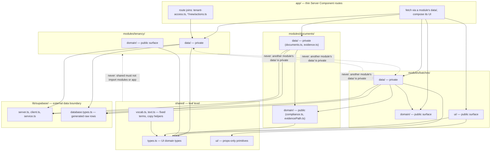
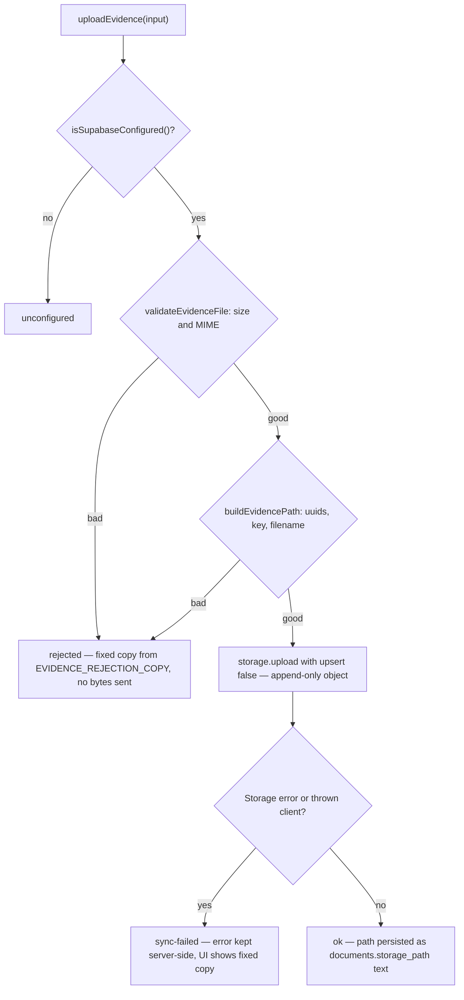
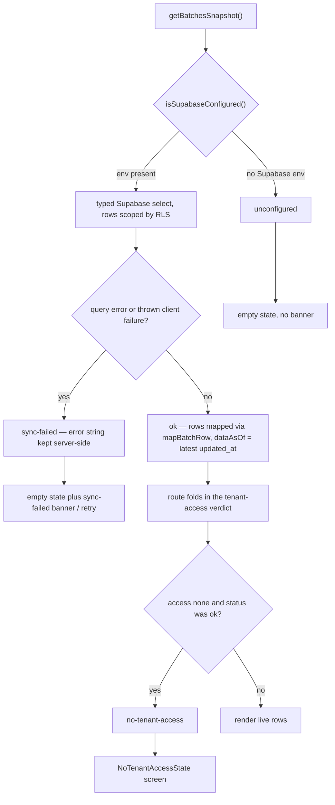
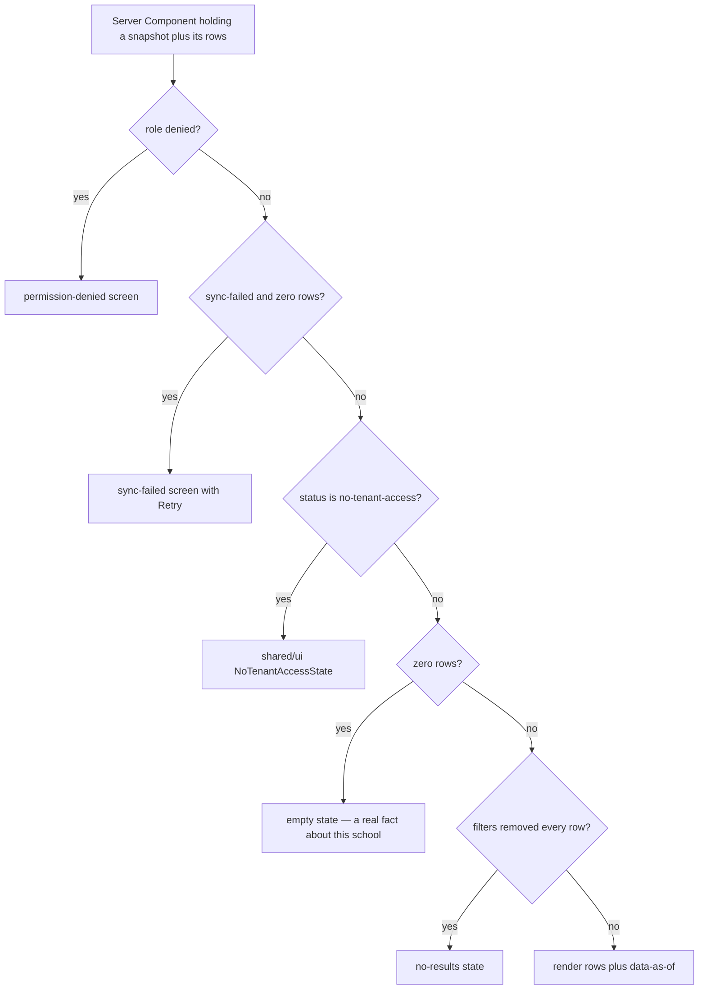

# Module Boundaries and the Data Layer Pattern

Code in this repository is grouped **by domain, not by file type** — a DDD-influenced layout introduced with TES-68. Every feature lives in a `modules/<domain>/` folder split into three sub-layers (`data/`, `domain/`, `ui/`), and everything sits inside a four-layer hierarchy with a strictly one-way import direction: `app → modules → shared → lib/supabase`. [`CLAUDE.md`](/CLAUDE.md) §Architecture explains the *why*; [`RULES.md`](/RULES.md) §2–§3 states the *what* as checklist rules, each tagged with its enforcement level (`[lint]`, `[types]`, `[review]`). Where the two documents disagree, `RULES.md` wins and the drift gets fixed.

The rules that matter most for day-to-day work:

- **No business logic in `app/`.** Routes are thin Server Components: they fetch via a module's `data/` layer and compose module `ui/` + `shared/ui/` primitives (RULES §2.11, `[review]`).
- **A module's `data/` is private to that module.** Another module imports its `domain/` or `ui/` surface instead; only `app/` may fetch from any module's `data/` (RULES §2.8, `[lint]`).
- **`domain/` is pure** — business rules with no I/O (RULES §2.14, `[review]`).
- **`shared/` must never import `modules/` or `app/`** (RULES §2.9, `[lint]`).
- **No index barrels** — deep imports are the convention everywhere, including `shared/` (RULES §2.13, `[review]`; no `index.ts` exists in the tree).
- **Only module `data/` layers may import `lib/supabase/database.types.ts`** (besides `lib/supabase` itself); components import domain types from `shared/types.ts` or a module's `domain/` (RULES §2.10, `[lint]`).
- **Every entity contract returns a discriminated snapshot** — four states, no fabricated data (RULES §3.17–§3.19). See [The four-state snapshot contract](#the-four-state-snapshot-contract).

## Layer model

Solid arrows are allowed import directions; dashed arrows are rejected by `import/no-restricted-paths` in [`eslint.config.mjs`](/eslint.config.mjs). The tenancy/batches/documents trio illustrates the cross-module rule with real modules — `BD1 → DD2` shows batches' private `data/` reaching documents' public `domain/` (compliance) but never its `data/` — and `A2` marks the small set of `app/` files whose whole job is to join two modules' private `data/` layers.

### `app/` — thin routes, plus the joins that can live nowhere else

`app/` holds App Router pages, layouts, and route handlers. `app/(dashboard)/dashboard/page.tsx` shows the shape: it imports `getBatchesSnapshot` / `selectBatchesForDisplay` from `modules/batches/data/batches`, `getActivitySnapshot` from `modules/activity/data/activity`, `getCurrentUser` from `modules/auth/data/auth`, `withTenantAccess` from `modules/tenancy/domain/access`, pure helpers from `modules/batches/domain/metrics` and `modules/billing/domain/readiness`, then composes `modules/*/ui` widgets over `shared/ui` primitives. The route performs fetch + state mapping + composition; the computation lives in module `domain/` functions. New code goes inside its owning module — modules without code yet hold a README naming their FR (e.g. `modules/attendance/README.md`, FR-07, planning `data/attendance.ts`, `domain/eligibility.ts`, `ui/`), and new top-level folders are a rule violation (RULES §2.12).

Three `app/` files are deliberately *not* inside a module, because a module may not import another module's `data/` and these do exactly that:

- `app/(dashboard)/tenant-access.ts` — `resolveTenantAccess()` joins `modules/auth/data/auth`'s `getAuthUserId()` with `modules/tenancy/data/tenancy`'s profile read and returns the verdict. It encodes no rule: the meaning of the verdict lives in `modules/tenancy/domain/access.ts`. It also deliberately uses `getAuthUserId()` (a local read of the session token) rather than `getCurrentUser()` (a Clerk Backend API fetch) because the id is all the join needs.
- `app/(dashboard)/users/new/actions.ts` — the create-user Server Action composes `modules/tenancy`'s Postgres write with `modules/auth`'s Clerk invitation; neither could call the other from inside its own module. Validation is delegated to `modules/tenancy/domain/userAccess`.
- `app/(dashboard)/schools/new/actions.ts` — follows the same convention (it reads `getAuthUserId()` from `modules/auth/data/auth` and writes through `modules/tenancy/data/platform` + `schools`), and stays in `app/` because a Server Action is a route-level entry point: one place to look for "what can this app write".

### `modules/<domain>/` — one module per PRD FR

The 14 domains are: auth (FR-01), tenancy (FR-02), batches (FR-03/04/05), documents (FR-06), attendance (FR-07), lamr (FR-08), billing (FR-09), import-export (FR-10), analytics (FR-11), activity (FR-12), notifications (FR-13), settings (FR-14), reports (FR-15), and `shell` (app chrome, no FR). The `modules/` directory and the lint config's `domains` array match one-for-one. Within a module:

- **`data/`** — the fetch → map → derive contract and the **only** layer allowed to import `lib/supabase/database.types.ts` (plus `lib/supabase` itself). Data files are the module's private surface.
- **`domain/`** — pure business rules, no I/O (e.g. `modules/batches/domain/urgency.ts`, `modules/billing/domain/readiness.ts`, `modules/tenancy/domain/access.ts`), unit-tested with fixed as-of dates. This is public to other modules.
- **`ui/`** — domain-aware components. Also public to other modules, though in practice other modules reach for `domain/` logic, not each other's screens.

A module's `data/` may import its own `domain/` (`modules/tenancy/data/tenancy.ts` takes its `Profile` type from `modules/tenancy/domain/profile`; `modules/documents/data/evidence.ts` takes `buildEvidencePath`/`validateEvidenceFile` from its own `domain/evidencePath`), another module's `domain/` (`modules/batches/data/metrics.ts` imports `docRecordFor`/`isDocTracked` from `modules/documents/domain/compliance`; so does `modules/billing/data/billing.ts`, for `isDocOnFile`), and anything in `shared/`. Since the mock-data retirement, `data/` layers import only types and pure functions from `shared/` — `modules/billing/data/billing.ts`, for example, imports `Batch`/`Tenant`/`DocumentRequirement` from `@/shared/types` and nothing else from `shared/`.

**The documents module's cross-module surface.** `modules/documents/domain/compliance.ts` is the single home (ADR-004 D6) for "what does it mean when a batch has no record for a required document?", and it exports two deliberately opposite families. The **measurement family** — `docRecordFor`, `isDocTracked`, `isDocOnFile`, `summarizeDocCompliance`, `summarizeBatchDocCompliance`, `criticalRequirements` — is what live screens (TableView, DocumentStatusDonut, AlertsPanel, AnalyticsView, DocumentsView) and other modules' `data/` layers already route through: it excludes untracked keys from numerator *and* denominator, so a partial catalog never reads as a cleared checklist or a false alarm, and it yields `null` (unknown), never 0 or 100, when nothing is tracked. The **gate family** — `blockingDocuments`, `blockerCount`, `blockingDocumentNames`, with `DocBlockerReason` of `'untracked' | 'missing' | 'pending'` — implements ADR-004 D4 and answers FR-06 AC-2 ("which documents are holding this batch up, by name?"): it fails closed, so an untracked requirement *blocks*, while `verified`/`submitted` never do. The divergence between the families is the ADR, not a bug — the same batch can measure `onFilePct: 100` and still be blocked — and `tests/unit/doc-blockers.test.ts` pins that the two answers disagree. `DocBlocker.key` is internal: FR-06 AC-1 forbids rendering a raw `document_key`, so a screen renders the display labels from `blockingDocumentNames`, never `.key`. Wiring state, honestly: the gate family is implemented and unit-tested but **not yet consumed by any screen** — no `.tsx` imports it — so treat it as a ready public domain surface, not live screen behavior.

### `shared/` — leaf level

`shared/` is the lowest layer: code here knows no module, page, or data-source context, and it must never import `modules/` or `app/` (lint-enforced), nor `lib/supabase/database.types` (`shared/README.md`). Contents: `shared/types.ts` (UI domain types, still one file — see below), `shared/ui/` (props-only presentational primitives — `Icon`, `StatusBadge`, `EmptyState`, `NoTenantAccessState`, `MetricCard`, …; if one starts reading data or encoding business rules it moves into its owning module, RULES §2.15), `shared/vocab.ts` (closed TESDA vocabulary such as `EMPLOYMENT_STATUSES` and `EGACE_STAGES`, deliberately kept in `shared/` because consumers live in two modules and `shared/` may not import `modules/`), and `shared/text.ts` (pure copy shaping, e.g. `pluralize`).

**`shared/mocks/` no longer exists.** The whole mock dataset was deleted in the mock-data retirement; nothing in the data layer falls back to it, and no `unconfigured` or `sync-failed` render path produces fabricated rows. `shared/vocab.ts` records that the vocabulary tables survive *because* they are closed TESDA terms, not data. Two doc-comment remnants still describe the old world — `shared/README.md` ("the seed dataset backing the `unconfigured` fallback") and `isSupabaseConfigured()`'s comment in `lib/supabase/server.ts` ("`unconfigured` snapshot (silent mock fallback)") — and both are drift: RULES §2.16 and §3.19 and the code are authoritative.

Because `shared/mocks/seed.ts` was the thing that made a per-module split of `shared/types.ts` unsafe, **that guardrail is now resolved rather than blocking**: RULES §2.16 strikes the old prohibition, and CLAUDE.md records the split as *unblocked whenever someone wants to do it* — `shared/` can never import `modules/`, so the split is now purely a design choice, not a boundary hazard. `Batch` is still a hub type referencing shapes from six other domains (`LifecycleStage`, `DocRecord`, `ScholarRow`, `EgaceCounts`, `EmploymentFollowUp`, `Competency`), so a split still needs a deliberate answer for the web it creates.

### `lib/supabase/` — the external data boundary

`lib/supabase/` wraps Supabase behind three factories plus the generated contract:

- `server.ts` — `createSupabaseServerClient()` builds an **anon-key** client and attaches the caller's Clerk session token through the `accessToken` callback (Clerk's native third-party auth; JWT templates were deprecated 1 Apr 2025, and the schema needs no custom claims because RLS reads only `sub`). If no token exists it **throws** (`NO_CLERK_TOKEN_MESSAGE`, exported so callers can tell "not signed in" from "Supabase rejected the token") rather than silently querying as `anon` — RLS would answer an anon query with zero rows and no error, which for a compliance tool is the dangerous outcome. `isSupabaseConfigured()` (checks `NEXT_PUBLIC_SUPABASE_URL` + `NEXT_PUBLIC_SUPABASE_ANON_KEY`) is what data functions probe to decide between live fetch and the `unconfigured` snapshot.
- `client.ts` — the browser-side client.
- `service.ts` — a service-role client that **bypasses RLS entirely**; reserved for trusted server-to-server writes with no Clerk session (the Clerk `user.created` webhook provisioning `profiles` via `modules/auth/data/provisioning.ts`). `SUPABASE_SERVICE_ROLE_KEY` must never be read outside this file — the ordinary write paths (`modules/tenancy/data/users.ts`, `modules/import-export/data/learnerImport.ts`) all go through the anon client so RLS decides.
- `database.types.ts` — the raw-row contract: `Row`/`Insert`/`Update` for 18 tables, seven Postgres enums (`profile_role`, `lifecycle_stage`, `batch_status`, `document_status`, `document_audience`, `assessment_result`, `activity_action`), three RPC signatures, and `Views: Record<string, never>`.

That file is **hand-maintained, not currently regenerated**: its own header says the ADR-006 additions were written by hand from `20260906130000_add_school_registry_and_platform_admin.sql` and checked field-by-field against a generator run, and it stubs every table's `Relationships` as `[]`. That stub is why supabase-js cannot infer embedded joins, which is the root of the `as` casts on join rows in `batches.ts`, `activity.ts`, `tenancy.ts`, and `users.ts`. Adopting the generator's real `Relationships` arrays is a known, deliberately deferred cleanup that would retire all four casts.

## Import direction is lint-enforced

[`eslint.config.mjs`](/eslint.config.mjs) implements the hierarchy with `import/no-restricted-paths` zones over `app/**`, `modules/**`, `shared/**`, and `lib/**`:

| Forbidden direction | Lint message (abridged) |
|---|---|
| `app/`, `shared/`, `modules/*/ui/`, `modules/*/domain/` ← `lib/supabase/database.types.ts` | "Raw DB row types are data-layer only. Import domain types (shared/types or a module's domain/) instead." |
| `shared/` ← `modules/` | "shared/ is the leaf level and must not import modules/." |
| `shared/` ← `app/` | "shared/ must not import app/." |
| `modules/` ← `app/` | "modules/ must not import app/." |
| `modules/!(d)/**` ← `modules/d/data/**`, for each of the 14 domains | "modules/d/data is private to that module; import its domain/ or ui/ surface, or fetch in app/." |

The per-module privacy zones are **generated from the `domains` array** at the top of the config, which lists exactly the 14 module folders — so a new module must be added there or its `data/` will not be made private. Two things to note about what lint does *not* do:

- The rules that are `[review]`-level (no business logic in `app/`, `domain/` purity, no barrels, code placement, snapshot discipline, guard ordering) have no automated check — a human or agent must catch them.
- A separate `complexity: ["warn", 15]` rule is a maintainability signal only (warn, not error), and `globalIgnores` excludes the do-not-edit design directories (`assets/`, `preview/`, `screenshots/`, `ui_kits/`, `uploads/`) and vendored agent tooling from lint/build.

## A module's `data/` is private

The public surface of a module is `domain/` + `ui/`. Its `data/` holds the live-query coupling to Supabase, and importing it across a module boundary would smuggle that coupling in — so the rule is lint-enforced per domain, with one carve-out: **`app/` Server Components may fetch from any module's `data/`** (and `app/` is exactly where cross-module `data/` imports appear, e.g. the billing page calling `modules/batches/data/batches`, `modules/auth/data/auth`, `modules/auth/data/role`, and `modules/tenancy/data/tenancy`).

Two real examples of how the boundary is respected instead of crossed:

- **Pass-by-parameter.** `profiles` RLS allows "own or same-tenant" reads, so fetching "my profile" needs the caller's Clerk user id as an explicit filter. Resolving that id is `modules/auth/data`'s job, but its `data/` is private — so `getProfileSnapshot(clerkUserId)` in [`modules/tenancy/data/tenancy.ts`](/modules/tenancy/data/tenancy.ts) takes the id as a parameter, and `app/` (which may call both `data/` layers) wires them together.
- **Import the public surface.** `modules/batches/data/metrics.ts` and `modules/billing/data/billing.ts` both need the document-compliance rules, so they import `modules/documents/domain/compliance` — `domain/` is public, `data/` is not. Note the same shape at the screen level: tenant access is a `modules/tenancy` fact, so it is exposed as `modules/tenancy/domain/access.ts` precisely so other modules' contracts can *consume the verdict type* without consuming the profile read.

### Hand-duplicated mappers are the price of privacy

Because `batches.ts` cannot import `documents.ts` (both are `data/` layers of different modules), it **hand-duplicates** the document-mapping logic: `MISSING_DOC`, `mapDocumentRow`, and the catalog backfill in `mapDocumentsMap` are copies of their `modules/documents/data/documents.ts` counterparts, kept in sync by hand. The file's own comment says this duplication exists *because* a module's `data/` is private, and notes it closes the `TODO(join)` gap by backfilling against the batch's embedded requirement catalog. The same deliberate duplication appears in smaller form: `toRelativeWhen` in `modules/activity/data/activity.ts` mirrors `toDisplayDate` in `batches.ts` (same unparseable-date → empty-string convention). When fixing one, fix all copies — the lint rule is what makes the copies a design consequence, not a mistake to deduplicate.

## The data contract: fetch → map → derive

`modules/batches/data/batches.ts` is the **reference implementation every entity contract must follow** (RULES §3.17). Its header names the three intentionally separated layers:

1. **fetch** — `getBatchesSnapshot()`: a typed Supabase query (`batches` with embedded `scholarship_programs(code, program_document_requirements(*))` and `documents(*)` selects, ordered by `end_date`). RLS scopes rows to the caller — **never manually filter by tenant in JS** (RULES §1.2: a JS-side tenant filter is a bug even when it returns the right answer). Same discipline in `documents.ts`: trainer-scoped omissions are RLS policy, not a JS role check.
2. **map** — `mapBatchRow(row)`: a pure DB-row → UI-domain (`Batch`) translation, no I/O, **exported for unit tests**. Contract gaps are marked `TODO(contract)` and defaulted so the shape stays valid (`billingDeadline`/`daysToBilling` currently stand in on `end_date` because no `billing_deadline` column exists; `trainingDays`, `notes`, `duration`, … are empty defaults; `orEmpty`/`orZero` keep a runtime null from feeding `NaN` into totals).
3. **derive** — lifecycle and date helpers computed from the row: `deriveLifecycle(currentStage)` builds the full UI pipeline from the single `current_stage` enum; `daysUntil` returns the no-deadline sentinel (below); `toDisplayDate` converts ISO to the UI's "Jun 18, 2026" convention and returns `''` for null/unparseable.

The snapshot also carries `dataAsOf`, computed by `latestUpdatedAt` as the freshest `updated_at` across loaded rows, which drives the dashboard's "Data as of" stamp and the 24-hour stale threshold (`DATA_STALE_AFTER_MS`). `getBatchesSnapshot` is the contract; the throwing `getBatches()` wrapper exists for callers that want raw-or-throw, mapping every non-`ok` state to an exception.

Variants within the convention:

- **No derive layer** — `modules/documents/data/documents.ts` and `modules/batches/data/learners.ts` have nothing time-based to compute; fetch + map is the whole contract. `learners.ts` still owns one derived display decision: `seq` is the row's position in an explicitly ordered fetch (`last_name`, `first_name`, `id`) because the contract has no ordinal column.
- **Derive-only data file** — `modules/batches/data/metrics.ts` has no I/O: `getDashboardMetrics(batches, criticalDocumentKeys)` is a pure function over a `Batch[]` the caller already loaded. It is currently **unwired** — the live dashboard and shell metrics strip use `deriveDashboardMetrics` from `modules/batches/domain/metrics.ts` instead, which takes the requirement catalog as a parameter and routes compliance through `modules/documents/domain/compliance`. Both share the same guarantee: every number is computed from the inputs, never hardcoded.
- **Write paths** — `modules/import-export/data/learnerImport.ts`'s `importLearnersCsv` extends the shaping for mutations: parse and validate the CSV *before creating a Supabase client*, read the target batch's `tenant_id` back through an RLS-scoped SELECT (so a write can never target a tenant the caller couldn't already read), reconcile by ULI (no unique index on `uli`, so matching is application-level, not `ON CONFLICT`), then insert/update. Its header notes the one degree of deviation from the read contract: on `unconfigured` the caller must *disable the importer*, not pretend the import ran.
- **Evidence storage (write path)** — `modules/documents/data/evidence.ts` is the documents module's storage surface for the private `compliance-evidence` bucket, and it keeps the same split as `documents.ts`: the pure half — path construction (`buildEvidencePath`), file validation (`validateEvidenceFile`), and the fixed user-facing copy per rejection (`EVIDENCE_REJECTION_COPY`) — lives in `modules/documents/domain/evidencePath.ts`, while this file is only the Supabase Storage calls wrapped around it. Both entry points return **four-state result unions instead of throwing** — `EvidenceUploadResult` and `SignedUrlResult` are each `ok | rejected | sync-failed | unconfigured`, mirroring the four-state snapshot discipline; FR-06 needs the UI to tell *invalid type*, *upload rejected*, and *upload failed* apart, and each `rejected` reason maps to exactly one fixed sentence in `EVIDENCE_REJECTION_COPY`. The path shape `{tenant_id}/{batch_id}/{document_key}/{filename}` is a security boundary, not string formatting: the bucket's RLS policies authorize every operation with `app_private.can_access_tenant((storage.foldername(name))[1]::uuid)` — the first segment is the tenant check — so ids, key, and filename are validated rather than merely interpolated, and `uploadEvidence` validates **before sending** so an invalid request costs no network round-trip. Upload runs with `upsert: false` — append-only: re-submitting evidence creates a new object and never overwrites one an auditor may already have referenced. `getSignedEvidenceUrl` **re-validates the persisted `documents.storage_path` text** (a plain, unconstrained column) before minting a time-limited signed URL (300-second default TTL); the bucket is private, so there is no public-URL path and one must not be added. There is no `deleteEvidence`, because `storage.objects` carries select/insert/update policies for this bucket but **no DELETE policy** — deletion is refused for admins and coordinators alike, and the fix is a `can_manage_tenant`-gated policy deferred to a Phase 0.1 migration (#36). ⚠ **Unverified as of 2026-09-10** (the file's own header, issue #122): with two dashboard toggles unset, `createSupabaseServerClient` sends a token Postgres will not accept, so every call here fails with an RLS denial indistinguishable from a code defect — do not debug this file against a live project until #122 is closed. Like the gate family above, it is unit-tested (through its `domain/` half) but not yet consumed by any screen.
- **Pagination in the contract** — `getActivitySnapshot(limit, offset)` fetches `limit + 1` rows to derive `hasMore` without a separate count query, rather than fetching the whole feed and slicing in the page.

The evidence write path's decision flow — the snapshot discipline applied to a storage surface:

Validation runs before any network round-trip, `rejected` and `unconfigured` cost nothing, and the `sync-failed` error string — like snapshot errors — stays server-side; the UI only ever sees fixed copy in the style of `UPLOAD_FAILED_MESSAGE` (RULES §1.6).

## The four-state snapshot contract

Data functions return **discriminated snapshot unions** so Server Components map states straight to UI (RULES §3.19). The contract is four states — `ok`, `no-tenant-access`, `sync-failed`, `unconfigured` — as spelled out in `BatchesSnapshot`, `ActivitySnapshot`, `LearnersSnapshot`, and `BatchDocumentsSnapshot`:

| Status | Who produces it | Required UI treatment |
|---|---|---|
| `ok` | the query (RLS-scoped rows, mapped) | render data; show real "Data as of" from `dataAsOf` |
| `no-tenant-access` | **the route**, folding `modules/tenancy/domain/access`'s verdict in | render `shared/ui/NoTenantAccessState`, never the ordinary empty state |
| `sync-failed` | the query erroring, or the client construction throwing (incl. a missing Clerk token) | honest empty state **plus** the sync-failed banner / retry screen |
| `unconfigured` | `isSupabaseConfigured()` is false | honest empty state, silently — **no banner**, and no mock data |

Nothing substitutes fabricated data on a non-`ok` state (RULES §3.19). `selectBatchesForDisplay(snapshot)` returns `snapshot.batches` for `ok` and `[]` for **every other state**, and `tests/unit/batches.test.ts` pins that ("renders empty — never mock data — when the snapshot is unconfigured / sync-failed"). The dashboard's `selectRecentActivity` does the same for the activity feed.

The `getBatchesSnapshot` decision flow and the route-level fold that adds the fourth state.

`no-tenant-access` is the subtle one. **No query can produce it**: a profile with zero `profile_tenant_memberships` reads zero batches, zero documents, zero activity through `app_private.can_access_tenant()` — a *successful, empty* read. Only the membership fact distinguishes "your school has no batches" from "you belong to no school, so nothing will ever load", and membership is `modules/tenancy`'s fact whose `data/` is private. So the route composes both reads and calls `withTenantAccess(snapshot, access)`:

- The fold replaces **only** an `ok` snapshot. A `sync-failed` or `unconfigured` snapshot passes through untouched, because "you belong to no school" is a tidier story than "the fetch broke" and substituting it would hide a real error behind a plausible explanation.
- `deriveTenantAccess` maps `not-found` to `none` (a signed-in user with no profile row has no membership either) but maps `sync-failed`/`unconfigured` to **`unknown`**, and `unknown` never rewrites anything: "we could not check" must not be rendered as "you have no school". `tests/unit/tenant-access.test.ts` exists specifically to pin these two rules.
- Routes that already hold a profile snapshot (`billing`, `report`) call `deriveTenantAccess(profileSnapshot)` directly instead of going through `resolveTenantAccess()`; `app/(dashboard)/tenant-access.ts` is the entry point for routes that don't.

Eight dashboard routes now branch on `no-tenant-access` to `shared/ui/NoTenantAccessState` (dashboard, batch-cards, table-view, documents, billing, report, analytics, activity-log).

**The fourth state is applied selectively, not blindly.** `DocumentRequirementsSnapshot` in `modules/documents/data/documents.ts` deliberately has **no** `no-tenant-access` member: the requirement catalog is per-scholarship-program reference data, not tenant data, so an empty catalog means "genuinely unseeded", and conflating that with "you have no access" would mislabel a seeding gap as a permissions problem. `PlatformAdminSnapshot` (`modules/tenancy/data/platform.ts`) omits it for the same kind of reason — the answer comes from a `security definer` RPC about the caller, not from a tenant-scoped table.

Modules also extend the union with states that are genuinely different in kind, rather than reusing `sync-failed`:

- `ProfileSnapshot` adds **`not-found`**: authenticated with Clerk but no `profiles` row yet — the webhook raced or failed. "No access yet" is not an error.
- `LearnerImportSnapshot` adds **`validation-failed`** (`errors: string[]`) for a structurally bad CSV, checked before any Supabase client exists; partially valid files return `ok` with a `skipped` row list.
- `ActivitySnapshot`'s `ok` arm carries `hasMore`, `BatchesSnapshot`'s carries `dataAsOf`, `BatchDocumentsSnapshot`'s carries a backfilled status map — the union discriminates state; the payload varies per contract.

### Request-level de-duplication

`getBatchesSnapshot`, `getProfileSnapshot`, and `getPlatformAdminSnapshot` are wrapped in React's `cache()`, not because they are slow but because **`app/(dashboard)/layout.tsx` and every page in the route group call them independently in the same request**. The layout reads the profile snapshot (for the admin nav row and the shell metrics strip) and the batches snapshot (for `MetricsRow`), and the page repeats both reads for its own body; without `cache()` each call would be its own Supabase round-trip. `cache()` scopes the sharing to one request, so a second navigation still re-queries. Route helpers that need a profile *and* an identity read (`resolveTenantAccess`, the create-user action) rely on the same property: calling them from several places in one render costs one query.

### Guard ordering is an invariant, not a style choice

RULES §3.19 calls out the trap explicitly: a guard clause that checks "empty" before "sync-failed" **silently swallows the banner**, because a failed fetch yields zero rows. `no-tenant-access` also yields zero rows and must be checked before the empty state too, or the screen tells someone with no school to "import a batch" — an action they cannot perform. So the cascade is fixed:

The order the dashboard, billing, and batch-cards routes implement. `app/(dashboard)/dashboard/page.tsx` runs `isDenied` → `syncFailed && batches.length === 0` → `hasNoTenantAccess` → `isEmpty`; `app/(dashboard)/billing/page.tsx` runs denied → sync-failed-with-zero-rows → then branches on `snapshot.status === 'no-tenant-access'` *inside* its zero-packets view so the two zero-row explanations stay separate; `app/(dashboard)/batch-cards/page.tsx` makes the same choice explicit by testing `syncFailed` before `noTenantAccess` before the plain `EmptyState`. The no-results state is last and lives in the client island (`modules/batches/ui/CardsView.tsx` "No batches match"), because it is a fact about filters, not about the snapshot.

## Error shaping: state in the union, detail server-side

Raw error strings never reach the UI (RULES §1.6 — no raw Supabase/SQL errors, table names, or internal IDs). The snapshot keeps `error: string` server-side and every screen renders fixed copy:

- A real failure with no rows renders `SyncFailedView`: heading "Couldn't reach Supabase", body "Batch data isn't available right now" plus an optional " from <stamp>" fragment, then "Try again in a moment." and a Retry link. That fragment is `syncFailedMessageFor(dataAsOfLabel)` — ` from <timestamp>` or the empty string — never the error message.
- The inline `SyncFailedCallout` in `modules/batches/ui/dashboard/DashboardCallouts.tsx` reads "Sync with Supabase failed — showing the last cached snapshot …" only when `isShowingCachedFallback` (`snapshot.status !== 'ok'`), otherwise "showing the currently loaded data". With mocks retired there is no cached fallback, so the "last cached snapshot" wording is a remnant of the mock era and is unreachable for a real failure (a real `sync-failed` always yields zero rows and is caught by the full-page guard above) — it now appears only under a `?state=sync-failed` preview override, which prints "the currently loaded data".
- Screens that must degrade on a missing catalog do so without inventing a passing number: an empty `DocumentRequirement[]` makes `deriveDashboardMetrics` return `docCompliancePct: null` ("unknown", rendered "—"), and `billingGate` refuses to open because `requiredTotal > 0` fails. **This is the reason the requirement catalog is a parameter everywhere**, from `getDashboardMetrics`'s `criticalDocumentKeys` down to `buildBillingCards(batches, requirements)`: the live catalog is `program_document_requirements`, scoped per scholarship program, and `Batch` does not currently carry a resolvable program id (the TES-34-adjacent gap), so no data function may hardcode one catalog — doing so would be correct for exactly one program.

## Two deliberately separate type families

| Family | File | What it models | Who may import it |
|---|---|---|---|
| Raw rows | `lib/supabase/database.types.ts` (generated-shape, hand-maintained) | 18 tables' `Row`/`Insert`/`Update`, seven Postgres enums, RPC args/returns | Module `data/` layers and `lib/supabase/` only — everything else is lint-blocked |
| UI domain | `shared/types.ts` (hand-written, one file) | What screens render: `Batch`, `Tenant`, `DocRecord`, `DocumentRequirement`, `ActivityEvent`, `DashboardMetrics`, … | Everyone below `data/` — `app/`, `modules/*/domain/`, `modules/*/ui/`, `shared/` |

The mappers in each module's `data/` are the **only seam** between the families: they take generated row types in and return domain types out, so components never see a snake_case column name or a raw enum value. Module-owned types that are *not* cross-domain (e.g. `Profile` in `modules/tenancy/domain/profile.ts`) live in that module's `domain/`, reusing `shared/types.ts` shapes (`Tenant`, `UserRole`) rather than inventing a second vocabulary. The practical consequence of keeping the families separate: after a migration you update `database.types.ts` and fix whatever mappers break — a total enum map turns schema drift into a compile error — while `shared/types.ts` changes only when the UI contract changes.

## Enum bridges: total maps in the mapper, never in components

The DB and the UI use different spellings for the lifecycle pipeline, and the translation lives in the mapper (RULES §3.18, `[types]`):

| DB `lifecycle_stage` | UI `LifecycleStageKey` |
|---|---|
| `aou` / `ntp` / `tip` | `aou` / `ntp` / `tip` |
| `training` | `train` |
| `assessment` | `assess` |
| `billing` | `bill` |
| — (no DB column) | `entre` (UI-only) |
| `completed` / `blocked` | `null` (special-cased) |

`DB_TO_UI_STAGE` in `modules/batches/data/batches.ts` is a **total (non-`Partial`) map**: every `DbLifecycleStage` must appear, so adding a DB enum variant is a compile error there until its UI treatment is deliberately chosen. The `null` entries are not omissions — `deriveLifecycle` gives them their own treatment (`completed` → every pipeline stage `done`; `blocked` → nothing `active`) — and `normalizeStatus` surfaces DB `blocked` as UI `pending` until the UI gains a blocked tier. The same total-map discipline repeats across the data layer:

- `STAGE_TO_UI` (`documents.ts`) — every DB stage to a UI stage string, with `completed`/`blocked` as `''`.
- `ACTION_TO_TONE` (`activity.ts`) — the generic CRUD `activity_action` enum to badge tones; a documented coarse default, not a reproduction of per-event judgment.
- `DB_TO_UI_ROLE` (`tenancy.ts`) — DB `profile_role` is a **strict subset** of the UI's `UserRole` (`owner` has no DB equivalent yet), which is exactly why the map must be total in the direction it is written.
- `UI_TO_DB_ROLE` (`modules/tenancy/data/users.ts`) — the reverse bridge for writes: a total map over assignable roles, so a new `AssignableRole` variant fails compilation instead of failing at runtime.
- `ASSESSMENT_RESULT_TO_UI` (`learners.ts`) — `pending` maps to `''`, "not yet assessed".

The deliberate exception proves the rule: `DOCUMENT_ICONS` in `documents.ts` is a `Partial` map because `document_key` is per-program **configured data**, not a closed enum — an unknown key falls back to `DEFAULT_DOCUMENT_ICON` rather than failing compilation.

Two derive-layer sentinels guard the same kind of silent corruption: `daysUntil` returns `Number.POSITIVE_INFINITY` for a missing *or unparseable* date (the "no known deadline" sentinel that sorts last and never trips `urgencyTier`, since a `NaN` `daysToBilling` would quietly poison sorting and urgency math), and `toDisplayDate`/`toRelativeWhen` return `''` rather than "Invalid Date". The sentinel is sound for arithmetic but not printable, so `modules/batches/ui/dashboard/DashboardKpiGrid.tsx` checks `Number.isFinite` and renders "no deadline set" instead of "Infinity days left".

## Testing the pattern

`pnpm test` runs Vitest over `tests/unit/` (Node 22+ required); mappers and module `domain/` layers are unit-tested with **fixed as-of dates**, and real-Supabase RLS/tenant-isolation integration tests are still outstanding and must run against the real project with no mocks. Two conventions worth copying:

- Fixture rows are typed against the real generated contract — `tests/unit/batches.test.ts` derives the module-private join-row shape with `Parameters<typeof mapBatchRow>[0]` instead of hand-duplicating it, and `tests/unit/documents.test.ts` imports `Database` directly. The `tests/` directory sits outside the lint zones, so test files may touch raw row types even though app code may not; fixture drift becomes a compile error.
- Behavior is pinned at the boundary, including the failure modes that are silent: `tenant-access.test.ts` asserts `unknown` never behaves like `none` and that the fold replaces only `ok`; `batches.test.ts` asserts `selectBatchesForDisplay` returns `[]` for `unconfigured` and `sync-failed`.
- **Domain rules get executable assertions of their own.** `tests/unit/doc-compliance.test.ts` pins the ADR-004 measurement rules — untracked out of numerator *and* denominator, `null` (never 0 or 100) when nothing is tracked, `submitted` on file but not verified — including inside `deriveDashboardMetrics`; `tests/unit/doc-blockers.test.ts` pins the D4 gate — untracked blocks, missing/pending block, critical blockers first, `blockerCount` agreeing with `blockingDocuments().count` — and asserts FR-06 AC-1 at the boundary: `blockingDocumentNames` returns display labels and leaks no catalog `document_key`. Its closing test exists to keep the two families honest: gate and measurement **deliberately disagree**, with the same batch reading `onFilePct: 100` measured yet `blockerCount: 1`.
- **`tests/unit/evidence-path.test.ts` is a security test, not a formatting test.** Because the bucket's RLS policy reads the *first* path segment as the tenant, most of the file is separator-injection coverage — forward and backslash, `.` and `..`, percent-encoded `%2f`/`%5c`/`%2e%2e`, control characters, over-long names — each surface rejecting with its own reason (`invalid-filename`, `invalid-document-key`, `invalid-tenant-id`, `invalid-batch-id`), and the tenant id checked first so the reason is never misleading. It also pins `EVIDENCE_MAX_BYTES` to the bucket's `file_size_limit` in the canonical migration (a client that believes in a larger limit produces uploads the bucket silently rejects) and asserts `EVIDENCE_REJECTION_COPY` covers every rejection reason without identifiers, table names, or emoji.

## Extending the layout safely

- **New entity contract** — mirror `modules/batches/data/batches.ts`: the four-state snapshot (extend it only with genuinely distinct states like `not-found` or `validation-failed`, omit `no-tenant-access` where the data is not tenant-scoped, and for a write/storage surface return the same states as a result union instead of throwing — the `evidence.ts` variant), a pure exported mapper, total enum-bridge maps (`Partial` only for configured keys), `TODO(contract)` defaults for schema gaps, no tenant filtering in JS, `cache()` if the layout and the page both read it, and rows returned only on `ok`.
- **New screen** — order the guards denied → sync-failed-with-zero-rows → no-tenant-access → empty → no-results, and reuse `shared/ui/EmptyState` / `NoTenantAccessState` / `InfoCallout` rather than writing new ones (RULES §4.24, §4.25).
- **New module** — create `modules/<name>/{data,domain,ui}` and **add the name to the `domains` array in `eslint.config.mjs`** — that array is what generates the `data/`-privacy zones, so a missing entry silently leaves the module's `data/` importable by other modules. Empty modules get a README naming their FR.
- **Cross-module need** — pass the value as a parameter, import the other module's `domain/`, or (only in `app/`) call both `data/` layers. Never add a `shared/` re-export of module code, and never reach for `lib/supabase/database.types.ts` outside a `data/` layer.
- **After any migration** — regenerate `lib/supabase/database.types.ts`, then update affected mappers and domain types (RULES §3.20). Migrations are additive on the canonical `supabase/migrations/20260528160300_create_tenant_scoped_schema.sql` (schema + RLS, which also seeds the tenants, TWSP/CFSP programs, and the 8-key requirement catalog idempotently). The full ledger in `supabase/migrations/` today:
  1. `20260705070510_add_trainer_credentials.sql` — the `trainer_credentials` table + RLS.
  2. `20260717054607_migrate_akb_tenant_and_drop_rogue_table.sql` — a guarded corrective: it copies the lone AKB record out of the hand-made, non-conforming `public.tenant` (singular) table into the canonical `tenants`, then drops the rogue table; the guard short-circuits on databases rebuilt from this history, where the table never existed.
  3. `20260831120000_seed_dev_operational_data.sql` — dev fixture batches/learners/documents ported from the then-present `shared/mocks/seed.ts`, with `DEV-`-prefixed batch codes and NULL `official_system_reference` so the seed can never look like authoritative TESDA data; it also adds the unique `documents (batch_id, document_key)` index that makes re-runs idempotent.
  4. `20260904120000_add_user_admin_write_policies.sql` — the user-admin write policies on `profiles` / `profile_tenant_memberships` behind `modules/tenancy/data/users.ts`.
  5. `20260906120000_ensure_invitation_membership_atomic.sql` — the `ensure_profile_tenant_membership` function that applies an invitation's membership atomically (only while the profile holds none).
  6. `20260906130000_add_school_registry_and_platform_admin.sql` — the school registry (tenants' TESDA columns, `qualifications`, `tenant_qualifications`, `platform_admins`) and platform-admin RLS + RPCs (ADR-006).

## Related pages

- [Quickstart](/openwiki/quickstart.md) — running the app against a Supabase project, including the env vars that decide `ok` versus `unconfigured`.
- [Supabase Data Model and RLS Policies](/openwiki/architecture/data-model-and-rls.md) — the schema and the `compliance-evidence` bucket policies whose first-segment tenant check the evidence path validates against; why RLS — not this layering — is the boundary that matters.
- [Design System and UI invariants](/openwiki/architecture/design-system.md) — the `shared/ui/` primitives and the required screen states that snapshots (and the evidence result unions) map onto.
