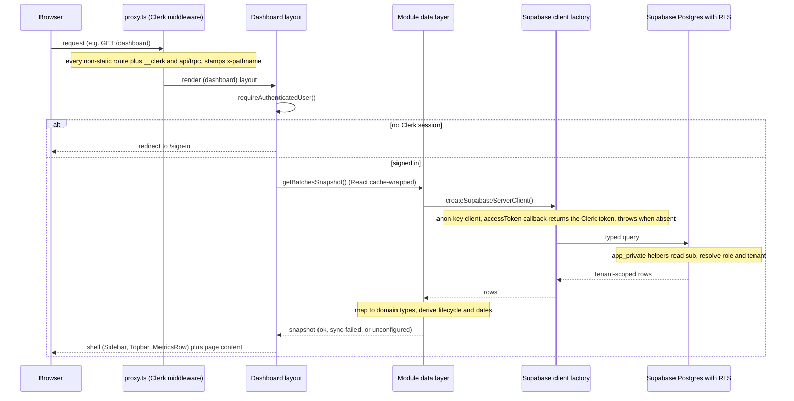
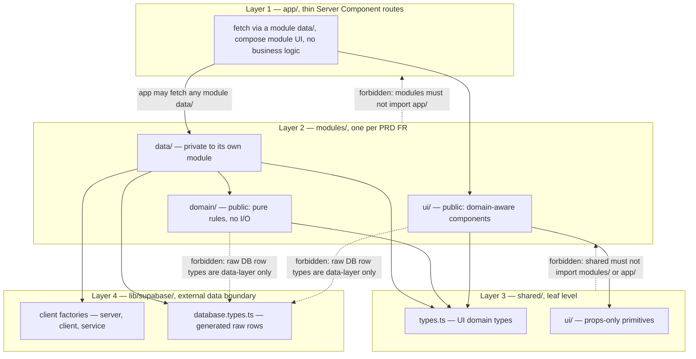

# Architecture Overview

TVI-CAMS is an internal multi-tenant compliance working layer for TVI schools running TESDA scholarship batches (TWSP/CFSP). It tracks batch lifecycle, documents, attendance, and LAMR evidence, and generates the school's official TESDA billing documents as populated `.docx` files. It is an **internal working layer only**: TESDA SIS/T2MIS/BSRS remain the authoritative systems, and UI copy must never imply official approval or submission ([`CONTEXT.md`](/CONTEXT.md), RULES rule 27).

This page is the map: the stack, the request path, the auth chain in one breath, the four-layer import model, a one-line-per-module catalog, docs precedence and the ADR chain, the do-not-edit design bundles, and build/run/test. All depth is delegated to the three neighbour pages it links.

## Stack at a glance

| Concern | Choice | Notes |
| --- | --- | --- |
| Framework | Next.js 16 (App Router) | `next ^16.3.4`; dev runs `next dev --webpack`. Server-Component-first; client islands only for interactivity (RULES rule 26) |
| UI runtime | React 19 | `react` / `react-dom` pinned at `19.2.4` |
| Language | TypeScript, `strict: true` | Typecheck via `pnpm exec tsc --noEmit` (no dedicated script) |
| Styling | Tailwind v4 | `@tailwindcss/postcss` + `tailwindcss ^4`; semantic color tokens only (RULES rule 22) |
| Identity | Clerk | `@clerk/nextjs ^7.4.1`; root layout wraps the app in `ClerkProvider` with custom localization and IBM Plex fonts |
| Data | One hosted Supabase project (Postgres + Storage) | The app talks directly to Supabase — **no separate backend, and no staging environment** |
| Backend direction | None today | Express.js (Node/TypeScript) is documented as the **future-only** backend direction — do not build it or treat it as present ([`CLAUDE.md`](/CLAUDE.md)) |
| Package manager / runtime | pnpm (`packageManager: pnpm@9.15.4`), Node ≥ 22 | `pnpm-lock.yaml` is the committed lockfile. Node 22+ is hard-required: Vitest 4's rolldown calls `util.styleText` with an array argument that throws `ERR_INVALID_ARG_VALUE` on Node 21 or older, before any test loads |

## Request path

A request flows top to bottom:

- **`proxy.ts`** (repo root) is the Clerk middleware. Its matcher covers every route except static assets, plus `__clerk` and `api`/`trpc`, and it stamps `x-pathname` so Server Components can read the full request path. The middleware itself does **not** force authentication.
- **Route protection happens in the layout.** `app/(dashboard)/layout.tsx` calls `requireAuthenticatedUser()` from `modules/auth/data/auth.ts`; anonymous visitors are redirected to `/sign-in` (the sign-in/sign-up pages are the only public entry points). The root `app/page.tsx` is a bare 307 redirect to `/dashboard`.
- **The layout resolves identity before rendering** — one profile snapshot feeds the trusted role (`resolveTrustedRole`, never the `?role=` preview override, which any caller could use to conjure admin-only nav rows), the ADR-006 platform-admin axis, and the tenant-access fold over the batch snapshot.
- **Pages are thin.** Each `app/(dashboard)/<route>/page.tsx` Server Component fetches through the owning module's `data/` layer and composes `modules/*/ui` screens over `shared/ui` primitives; no business logic lives in `app/` (RULES rule 11). The dashboard layout pre-loads `getBatchesSnapshot` (wrapped in React's `cache()` so the layout and its nested page share one Supabase query per request) and derives the `MetricsRow` KPIs, suppressing them rather than rendering zeros for someone attached to no school.
- **Data flows through module `data/` layers** — fetch typed rows, map them to domain types, derive display state — and returns a discriminated snapshot to the page (full contract on [Module Boundaries and the Data Layer Pattern](/openwiki/architecture/module-boundaries-and-data-pattern.md)).

## The auth chain in one breath

`proxy.ts` (Clerk middleware, context only) → `requireAuthenticatedUser()` in the dashboard layout (sign-in redirect) → module `data/` builds an **anon-key** Supabase client whose `accessToken` callback returns the Clerk session token (Clerk's native third-party auth integration — JWT templates were deprecated 1 Apr 2025, and this schema needs no custom claims because RLS reads only `sub`) → **Postgres RLS** (`app_private.*` helpers from the canonical migration) makes every authorization decision. RLS is the security boundary; UI hiding is usability only (RULES rule 1), and a missing token must **throw** — silently querying as `anon` returns zero rows with no error, the dangerous outcome for a compliance tool. The service-role client bypasses RLS and is confined to the Clerk webhook provisioning path: `lib/supabase/service.ts` → `modules/auth/data/provisioning.ts` → `app/api/webhooks/clerk/route.ts` (creates `profiles` on `user.created`, deactivates on `user.deleted`; `SUPABASE_SERVICE_ROLE_KEY` must never be `NEXT_PUBLIC_`-prefixed or read outside that file). The RLS helper chain and policy behavior in depth are on [Supabase Data Model and RLS Policies](/openwiki/architecture/data-model-and-rls.md).

## The four-layer import model

Code is grouped by domain, not by file type (DDD-influenced, introduced with TES-68). Everything sits in a one-way hierarchy — `app → modules → shared → lib/supabase` — enforced at lint time by `import/no-restricted-paths` in [`eslint.config.mjs`](/eslint.config.mjs) (RULES rule 7):

The load-bearing zones:

- **Raw DB types are data-layer only.** `lib/supabase/database.types.ts` may be imported from module `data/` layers (and `lib/supabase` itself) — not from `app/`, `shared/`, or any module `domain/`/`ui/` code. Components import domain types from `shared/types.ts` only (RULES rule 10).
- **`shared/` is the leaf** — it must never import `modules/` or `app/` (RULES rule 9).
- **`modules/` must never import `app/`** (RULES rule 9).
- **Another module's `data/` is private.** Each of the 14 domains gets a zone (generated from the ESLint `domains` array) making its `data/**` forbidden to every other module — import its `domain/` or `ui/` surface instead; only `app/` may fetch from any module's `data/` (RULES rule 8).
- **No index barrels** — deep imports are the convention (RULES rule 13).

Solid arrows are allowed import directions; dashed arrows are lint failures. Two type families stay deliberately separate across the model — generated raw rows (`database.types.ts`) and UI domain types (`shared/types.ts`) — and the `data/` mapper is the only translation point (RULES rule 17). The full contract, cross-module imports included, is on [Module Boundaries and the Data Layer Pattern](/openwiki/architecture/module-boundaries-and-data-pattern.md).

## Module catalog

There is **one module per PRD FR** under `modules/`, plus `shell` for app chrome — **14 modules total**, the same set as the ESLint `domains` array. Sub-layers below are verified against the tree, not just the READMEs' promises. New code goes inside its owning module, never in a new top-level folder (RULES rule 12).

| Module | FR | Sub-layers (verified) | One line |
| --- | --- | --- | --- |
| [`auth`](/modules/auth/README.md) | FR-01 | `data/`, `domain/`, `ui/` | Clerk session reads; service-role profile provisioning from the Clerk webhook; invitations; widget theming |
| [`tenancy`](/modules/tenancy/README.md) | FR-02 | `data/`, `domain/`, `ui/` | profile/membership reads and tenant-access folding; user administration (role + membership writes via the Clerk-scoped anon client) and the ADR-006 school registry, with `CreateUserForm` / `CreateSchoolForm` |
| [`batches`](/modules/batches/README.md) | FR-03/04/05 | `data/`, `domain/`, `ui/` | **reference implementation** of fetch → map → derive; urgency engine + dashboard metrics; dashboard widgets (incl. `AlertsPanel`) |
| [`documents`](/modules/documents/README.md) | FR-06 | `data/`, `domain/`, `ui/` | requirement catalog + per-batch records; `domain/compliance.ts` is the single home for untracked-document semantics (ADR-004) |
| [`attendance`](/modules/attendance/README.md) | FR-07 | — (README only) | placeholder: plans `data/attendance.ts` + `domain/eligibility.ts` (the ≥5-absences rule) against the planned `attendance_records` table |
| [`lamr`](/modules/lamr/README.md) | FR-08 | — (README only) | placeholder: plans LAMR report fetch/map and evidence UI |
| [`billing`](/modules/billing/README.md) | FR-09 | `data/`, `domain/`, `ui/` | document-generating engine (ADR-001): rates, three tracks, statement builder, readiness gate, ADR-003 packet-queue projection; real `.docx` population and `billing_records` still planned |
| [`import-export`](/modules/import-export/README.md) | FR-10 | `data/`, `domain/`, `ui/` | RFC 4180 CSV parser, ULI-keyed learner reconciliation, `importLearnersCsv` write path (typechecked, never run live); the modal is still a canned-sample picker |
| [`analytics`](/modules/analytics/README.md) | FR-11 | `ui/` only | the page fetches the live batches snapshot itself and composes props-only chart primitives |
| [`activity`](/modules/activity/README.md) | FR-12 | `data/`, `ui/` | activity-log snapshot feeding the dashboard panel and the full feed |
| [`notifications`](/modules/notifications/README.md) | FR-13 | — (README only) | placeholder: alerts are computed on read (no cron/email) |
| [`settings`](/modules/settings/README.md) | FR-14 | `ui/` only | design-sync Settings overlay; no `tenant_settings` table yet, so "Save changes" is a toast, not a write |
| [`reports`](/modules/reports/README.md) | FR-15 | `domain/`, `ui/` | pure EGACE/employment helpers + XLSX export; the report page fetches the full batches snapshot itself |
| [`shell`](/modules/shell/README.md) | (none) | `ui/` only | app chrome — `NavDrawerProvider`, `Sidebar`, `Topbar`, `MobileHeader`, `MetricsRow`, `AuthHeader` — kept a module (not `shared/`) because it carries tenant and data context |

So the split is: **seven modules have a `data/` layer** (`activity`, `auth`, `batches`, `billing`, `documents`, `import-export`, `tenancy`), **three are README-only placeholders** (`attendance`, `lamr`, `notifications`), and the remaining four have `domain/` and/or `ui/` code but no `data/` layer yet.

## Docs precedence and the ADR chain

`RULES.md` is the checklist of non-negotiable *what*, each rule tagged with its enforcement level; `CLAUDE.md` explains the *why*. **Where the two appear to disagree, `RULES.md` wins** and the drift should be fixed — one known drift: rule 34 ("no test runner yet — `pnpm test` is a placeholder") predates the Vitest stand-up; `tests/unit/` now holds 21 spec files.

<!-- openwiki: broken internal link [/docs/adr] file "/docs/adr" does not exist. Fix the href or restore the target, then delete this comment. -->
Below the rules, precedence is `docs/MASTER_PRD_SRS.md` (product source of truth) → `docs/TRD.md` (engineering companion) → `docs/IMPLEMENTATION_PLAN.md` (phased plan); the ADRs in [`docs/adr/`](/docs/adr) override or amend those documents (RULES rule 31), and you should **consult the ADRs before changing schema or billing math** (RULES rule 30). The operative chain is:

| ADR | What it fixes |
| --- | --- |
| [ADR-001 — Billing Engine & Domain Model](/docs/adr/ADR-001-billing-and-domain-model.md) | **Supersedes any "billing = preparation signal only" wording.** Billing is a document-generating engine (TSF/Allowance, Training Cost, Entrepreneurship as populated `.docx`; Assessment Fee out of scope); locks progress = `sessions_held ÷ total_sessions`, the ≥5-absences rule, one RQM = one batch, NoLedger append-only `billing_records` |
| [ADR-003 — Billing Packet Queue](/docs/adr/ADR-003-billing-packet-queue.md) | **Amends ADR-001 §4**: the billing screen's queue is a *projection* of `(batch, billing_type, tranche)` — derived identity, `draft → ready → generated → submitted → settled` lifecycle, derived due dates, user-asserted submitted/settled marks — while upholding NoLedger and computed-on-read alerts |
| [ADR-006 — Platform Admin & School Registry](/docs/adr/ADR-006-platform-admin-and-school-registry.md) | **Supersedes PRD FR-02's "Super Admin is not implemented."** A platform admin exists and provisions the school registry only (`tenants`, `qualifications`, `tenant_qualifications`, seating a tenant's first member); granting it any compliance table — or letting it seat itself into a tenant — is a boundary change that needs its own ADR |

Locked domain facts that code must not contradict (RULES.md "Locked domain facts", `CONTEXT.md`): progress = `sessions_held / total_sessions` (nominal hours ÷ 8, snapshotted on the batch); a scholar with **≥5 absences is ineligible** (stored as `max_absences = 4`; this rule remains locked — no ADR supersedes it); **one RQM code = one batch** (NTP authorization lives on the batch); **ULI is the permanent learner key**; tenant context lives in the **URL path segment**; alerts are **computed on read** (no cron, no email); billing is a **document-generating engine**; packet lifecycle `draft → ready → generated → submitted → settled` (ADR-003).

Schema state, in one breath: `supabase/migrations/` holds seven SQL files — `20260528160300_create_tenant_scoped_schema.sql` is canonical and the latest, `20260910120000_add_adr001_billing_domain.sql` (the ADR-001 billing domain), is pending; dev seed data now lives in `supabase/seeds/`, not `migrations/`. The live schema is 18 tables / 36 foreign keys / seven database enums — the full ledger, including which migrations are applied-but-unrecorded, is on [Supabase Data Model and RLS Policies](/openwiki/architecture/data-model-and-rls.md).

## Design bundles — do-not-edit directories

Two rings of static design material sit in the repo:

- **`assets/`, `preview/`, `screenshots/`, `ui_kits/`, `uploads/`** are ported verbatim from the design bundle: excluded from lint via `globalIgnores` in [`eslint.config.mjs`](/eslint.config.mjs), and a PreToolUse hook (`.claude/hooks/protect-static-dirs.sh`, RULES rule 28, `[hook]`) blocks edits there with a non-zero exit — the hook explicitly carves out `public/assets/`, the app's real runtime static directory. `pnpm preview` serves the static `preview/` bundle on `:5000`.
- **`FIGMA FILES/`, `diagrams/`, `.design-sync/`** are likewise design artifacts, not app code (RULES rule 29, `[review]` level — human-checked, not hook-blocked). `FIGMA FILES/` is not currently materialized in the tree; Figma pages are referenced by node ID in code comments instead (e.g. `840:5128` for the billing screen).

Edit the source design files instead of these directories, or confirm with the user first. The design rules themselves (no emoji, IBM Plex, semantic tokens, six required states) are [RULES.md §4](/RULES.md).

## Build, run, and test

| Command | What it does |
| --- | --- |
| `pnpm dev` | Next.js dev server (`next dev --webpack`) |
| `pnpm build` / `pnpm start` | Production build / serve |
| `pnpm lint` | ESLint flat config, including the import-boundary zones |
| `pnpm exec tsc --noEmit` | Strict typecheck (no dedicated script) |
| `pnpm test` | Vitest unit suite — 21 spec files in `tests/unit/` |
| `pnpm test:e2e` | Playwright e2e (`e2e/auth.spec.ts`, dev server on `:3000`) |
| `pnpm preview` | Static design preview bundle on `:5000` |

Unit tests cover mappers and pure module `domain/` layers with **fixed as-of dates**. The Playwright spec exercises unauthenticated access to a dashboard route being redirected to `/sign-in` — the layout gate, not `proxy.ts`. Real-Supabase RLS/tenant-isolation integration tests are **still outstanding** and must run against the real hosted project with no mocks (RULES rule 35). A first-run walkthrough is on [Quickstart](/openwiki/quickstart.md).

## Related pages

- [Supabase Data Model and RLS Policies](/openwiki/architecture/data-model-and-rls.md) — tables, enums, the `app_private.*` RLS helper chain, and migration state
- [Module Boundaries and the Data Layer Pattern](/openwiki/architecture/module-boundaries-and-data-pattern.md) — the import model and data-layer contract in depth
- [Quickstart](/openwiki/quickstart.md) — getting the app running
