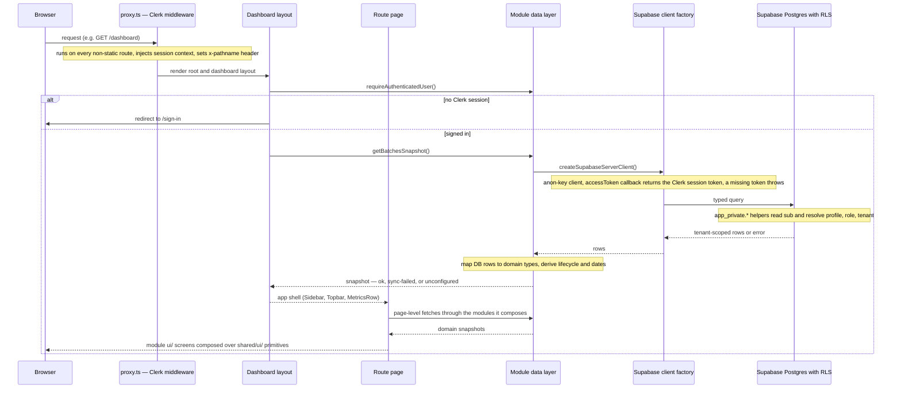
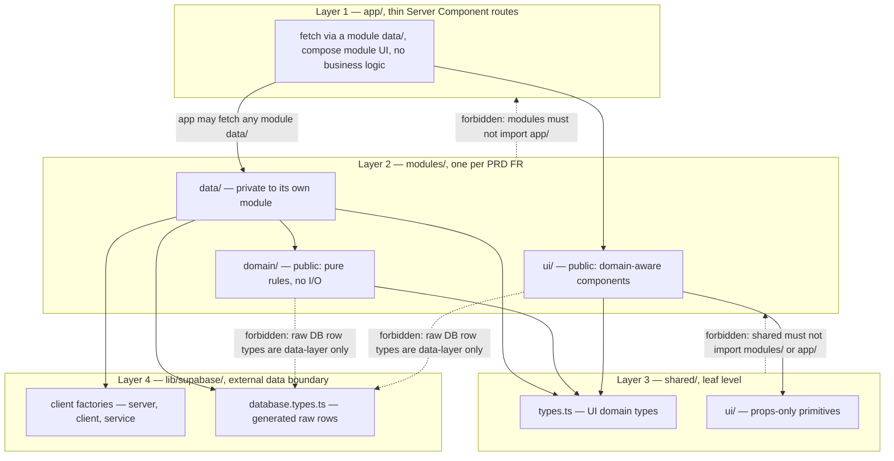

# Architecture Overview

TVI-CAMS is an internal multi-tenant compliance working layer for TVI schools running TESDA scholarship batches (TWSP/CFSP). It tracks batch lifecycle, documents, attendance, and LAMR evidence, and generates the school's official TESDA billing documents as populated `.docx` files. It is an **internal working layer only**: TESDA SIS/T2MIS/BSRS remain the authoritative systems, and UI copy must never imply official approval or submission ([`CONTEXT.md`](/CONTEXT.md), [`RULES.md`](/RULES.md) §5).

This page is the map. It covers the stack, the request path, the auth chain in one breath, the four-layer import model, the domain-module catalog (verified against the actual tree), docs precedence and the ADR set, the do-not-edit design-bundle directories, and how the app is built, run, and tested. Everything deeper is delegated to the pages linked from each section.

## Stack at a glance

| Concern | Choice | Notes |
| --- | --- | --- |
| Framework | Next.js 16 (App Router) | `next ^16.2.12`; dev runs with `--webpack`. App code is Server-Component-first; client islands only for interactivity |
| UI runtime | React 19 | `react` / `react-dom` pinned at `19.2.4` |
| Language | TypeScript, `strict: true` | Typecheck via `pnpm exec tsc --noEmit` (no dedicated script) |
| Styling | Tailwind v4 | `@tailwindcss/postcss` + `tailwindcss ^4`; semantic color tokens only |
| Identity | Clerk (`@clerk/nextjs ^7.4.1`) | Root layout wraps the app in `ClerkProvider` with custom localization and IBM Plex fonts |
| Data | One hosted Supabase project (Postgres + Storage) | The app talks directly to Supabase — **no separate backend, and no staging environment** |
| Backend direction | None today | Express.js (Node/TypeScript) is documented as the **future-only** backend direction — do not build it or treat it as present ([`CLAUDE.md`](/CLAUDE.md)) |
| Package manager / runtime | pnpm (`packageManager: pnpm@9.15.4`), Node ≥ 22 | `pnpm-lock.yaml` is the committed lockfile. Node 22+ is hard-required: Vitest 4's rolldown calls `util.styleText` with an array argument that throws `ERR_INVALID_ARG_VALUE` on Node 21 or older, before any test loads |

## Request path overview

The request path, top to bottom:

- **`proxy.ts`** (repo root) is the Clerk middleware. Its matcher covers every route except static assets and Clerk's own `__clerk` paths, and it also covers `api`/`trpc`. It injects the session context and adds an `x-pathname` header so Server Components can read the full request path. The middleware itself does **not** force authentication.
- **Route protection happens in the layout.** `app/(dashboard)/layout.tsx` calls `requireAuthenticatedUser()` from `modules/auth/data/auth.ts`; anonymous visitors are redirected to `/sign-in` (the sign-in/sign-up pages are the only public entry points). The root page `app/page.tsx` is a bare 307 redirect to `/dashboard`.
- **Pages are thin.** Each `app/(dashboard)/<route>/page.tsx` Server Component fetches through the owning module's `data/` layer and composes `modules/*/ui` screens over `shared/ui` primitives. No business logic lives in `app/`.
- **The dashboard layout pre-loads the batch snapshot** (`getBatchesSnapshot`, wrapped in Next's `cache()` so the layout and its nested page share one Supabase query per request) and derives KPI metrics for the `MetricsRow` shell.
- **Data flows through module `data/` layers** — fetch typed rows, map them to domain types, derive display state — and returns a discriminated snapshot to the page (see [Data layer contract](#data-layer-contract)).

## The auth chain in one breath

`proxy.ts` (Clerk middleware) → `requireAuthenticatedUser()` in the dashboard layout (sign-in redirect) → module `data/` builds an **anon-key** Supabase client whose `accessToken` callback returns the Clerk session token (Clerk's native third-party auth integration — JWT templates were deprecated 1 Apr 2025, and this schema needs no custom claims because RLS reads only `sub`) → **Postgres RLS** (`app_private.*` helper functions from the canonical migration) makes every authorization decision. **RLS is the security boundary; UI hiding is usability only**, and a missing token must throw, never silently query as `anon` (an anon query returns zero rows with no error — the dangerous outcome for a compliance tool). The service-role key bypasses RLS and is confined to `lib/supabase/service.ts`, used only by the Clerk webhook that provisions `profiles` rows. The full sequence — webhook provisioning, profile/role/tenant resolution, the demo-account stopgap, and role policy behavior — is covered in [Authentication and Authorization](/openwiki/workflows/authentication-and-authorization.md).

## The four-layer import model

Code is grouped by domain, not by file type (DDD-influenced, introduced with TES-68). Everything sits in a one-way hierarchy — `app → modules → shared → lib/supabase` — enforced at lint time by `import/no-restricted-paths` in [`eslint.config.mjs`](/eslint.config.mjs) (RULES §2, each rule tagged with its enforcement level):

The load-bearing zones in the ESLint config:

- **Raw DB types are data-layer only.** `lib/supabase/database.types.ts` may be imported from module `data/` layers (and `lib/supabase` itself) — not from `app/`, `shared/`, or any module `domain/`/`ui/` code. Components import domain types from `shared/types.ts` only.
- **`shared/` is the leaf.** It must never import `modules/` or `app/`.
- **`modules/` must never import `app/`.**
- **Another module's `data/` is private.** Each of the 14 domains gets a zone making its `data/**` forbidden to every other module — import its `domain/` or `ui/` surface instead; only `app/` may fetch from any module's `data/`.
- **No index barrels** — deep imports are the convention (RULES §2.13).

Solid arrows are allowed import directions; dashed arrows are lint failures. Two type families stay deliberately separate across the model: generated raw rows (`database.types.ts`) and UI domain types (`shared/types.ts`); the mapper in `data/` is the only translation point. The full contract, with the `shared/mocks` retirement and per-module details, is on [Module Boundaries and the Data Layer Pattern](/openwiki/architecture/module-boundaries-and-data-pattern.md).

## Domain module catalog

There is **one module per PRD FR** under `modules/`, plus `shell` for app chrome. The tree contains **14 modules** — verified against `modules/*/data`, `modules/*/domain`, and `modules/*/README.md`, not just the READMEs' promises. New code goes inside its owning module, never in a new top-level folder (RULES §2.12).

| Module | PRD FR | Sub-layers present (verified) | Current state |
| --- | --- | --- | --- |
| [`auth`](/modules/auth/README.md) | FR-01 | `data/`, `domain/`, `ui/` | Clerk session reads; profile provisioning from the Clerk webhook (service-role); Clerk widget theming |
| [`tenancy`](/modules/tenancy/README.md) | FR-02 | `data/`, `domain/` | `Profile`/membership reads and `hasTenantMembership`; no `ui/` |
| [`batches`](/modules/batches/README.md) | FR-03/04/05 | `data/`, `domain/`, `ui/` | **Reference implementation** of the data pattern; urgency engine and dashboard metrics; dashboard widgets |
| [`documents`](/modules/documents/README.md) | FR-06 | `data/`, `domain/`, `ui/` | Requirement catalog + per-batch records; `domain/compliance.ts` is the single home for document-compliance rules (ADR-004) |
| [`attendance`](/modules/attendance/README.md) | FR-07 | — (README only) | Placeholder: plans `data/attendance.ts`, `domain/eligibility.ts` (≥5 absences rule) against the planned `attendance_records` table |
| [`lamr`](/modules/lamr/README.md) | FR-08 | — (README only) | Placeholder: plans LAMR report fetch/map and evidence UI |
| [`billing`](/modules/billing/README.md) | FR-09 | `data/`, `domain/`, `ui/` | Document-generating engine (ADR-001): rates, three tracks, statement builder, readiness gate, ADR-003 packet-queue projection; real `.docx` population and `billing_records` are still planned |
| [`import-export`](/modules/import-export/README.md) | FR-10 | `data/`, `domain/`, `ui/` | RFC 4180 CSV parser, ULI-keyed learner reconciliation, `importLearnersCsv` write path (typechecked, never yet run live); the modal is still a canned-sample picker; export half unplanned |
| [`analytics`](/modules/analytics/README.md) | FR-11 | `ui/` only | No `data/`/`domain/` — the analytics page fetches the live batches snapshot itself and composes props-only chart primitives |
| [`activity`](/modules/activity/README.md) | FR-12 | `data/`, `ui/` | Activity-log snapshot feeding the dashboard panel and the full feed |
| [`notifications`](/modules/notifications/README.md) | FR-13 | — (README only) | Placeholder: alerts are computed on read (no cron/email); the dashboard `AlertsPanel` currently lives in `modules/batches/ui/dashboard/` |
| [`settings`](/modules/settings/README.md) | FR-14 | `ui/` only | Design-sync overlay port; no `tenant_settings` table yet, so "Save changes" is a toast, not a write |
| [`reports`](/modules/reports/README.md) | FR-15 | `domain/`, `ui/` | Pure EGACE/employment helpers and XLSX export; the report page fetches the full batch snapshot itself, no `data/` of its own |
| [`shell`](/modules/shell/README.md) | (none) | `ui/` only | App chrome — Sidebar, Topbar, MetricsRow, MobileHeader — kept as a module (not `shared/`) because it carries tenant and data context |

So the split is: **seven modules have real data-layer code** (`activity`, `auth`, `batches`, `billing`, `documents`, `import-export`, `tenancy`), **three are README-only placeholders** (`attendance`, `lamr`, `notifications`), and the remaining four (`analytics`, `reports`, `settings`, `shell`) have `domain/` and/or `ui/` code but no `data/` layer yet. The ESLint `domains` array in [`eslint.config.mjs`](/eslint.config.mjs) names the same 14.

## Data layer contract

Every entity contract follows **fetch → map → derive**, per the reference implementation `modules/batches/data/batches.ts`:

1. **fetch** — typed Supabase query; RLS scopes rows (never manually filter by tenant in JS).
2. **map** — pure DB-row → domain translation (`mapBatchRow`), unit-testable, no I/O.
3. **derive** — lifecycle/date helpers computed from the row.

Data functions return **discriminated snapshots** (`ok` / `sync-failed` / `unconfigured`) so Server Components map states straight to UI. Neither `unconfigured` (no Supabase env) nor `sync-failed` (configured but errored) may substitute mock or fabricated data — the `shared/mocks` seed dataset was retired entirely, so both render an honest empty state; `sync-failed` must additionally surface the sync-failed banner, and raw Supabase/SQL errors, table names, or internal IDs never leak to the UI. The **enum bridge lives in the mapper**: `DB_TO_UI_STAGE` is a total map, so a new DB enum variant fails compilation until its UI treatment is chosen. The complete pattern — cross-module imports, snapshot guard-clause ordering, and per-module notes — is on [Module Boundaries and the Data Layer Pattern](/openwiki/architecture/module-boundaries-and-data-pattern.md).

The schema side — the 15 tables, seven enums, the `app_private.*` RLS helper chain, the four checked-in migrations, and the `database.types.ts` regeneration contract — is documented on [Supabase Data Model and RLS Policies](/openwiki/architecture/data-model-and-rls.md). The canonical migration is `supabase/migrations/20260528160300_create_tenant_scoped_schema.sql`; new migrations are additive, and after any migration you regenerate `database.types.ts`, then update affected mappers and domain types (RULES §3.20).

## Docs precedence and the ADR set

`RULES.md` is the checklist of non-negotiable *what*, each rule tagged with its enforcement level (`[hook]`, `[deny]`, `[lint]`, `[types]`, `[rls]`, `[review]`); `CLAUDE.md` explains the *why*. **Where the two appear to disagree, `RULES.md` wins** and the drift should be fixed. Known drift: RULES §9.34 ("no test runner yet — `pnpm test` is a placeholder") predates the Vitest stand-up — `package.json` now runs `vitest run` with 15 specs in `tests/unit/` — and `shared/README.md` still lists the deleted `shared/mocks/`.

Below the rules, precedence is: `docs/MASTER_PRD_SRS.md` (product source of truth) → `docs/TRD.md` (engineering companion) → `docs/IMPLEMENTATION_PLAN.md` (phased plan). The ADR set in [`docs/adr/`](/docs/adr) overrides or amends those documents, and you should **consult the ADRs before changing schema or billing math**:

| ADR | Status | What it fixes |
| --- | --- | --- |
| [ADR-001 — Billing Engine & Domain Model](/docs/adr/ADR-001-billing-and-domain-model.md) | Accepted | **Supersedes any "billing = preparation signal only" wording.** Billing is a document-generating engine (TSF/Allowance, Training Cost, Entrepreneurship as populated `.docx`; Assessment Fee out of scope); locks progress = `sessions_held ÷ total_sessions`, the ≥5-absences rule, one RQM = one batch, NoLedger append-only `billing_records` |
| [ADR-002 — Design prototype portrays the ADR-001 target](/docs/adr/ADR-002-design-prototype-portrays-adr-001-target.md) | Accepted | The Figma/HTML prototype deliberately shows the target system including not-yet-migrated tables; honesty is carried by copy discipline, never per-screen badges |
| [ADR-003 — Billing Packet Queue](/docs/adr/ADR-003-billing-packet-queue.md) | Accepted | **Amends ADR-001 §4**: the billing screen's queue is a *projection* of `(batch, billing_type, tranche)` — derived identity, `draft → ready → generated → submitted → settled` lifecycle, derived due dates, user-asserted submitted/settled marks — while upholding NoLedger and computed-on-read alerts |
| [ADR-004 — Untracked document semantics](/docs/adr/ADR-004-untracked-document-semantics.md) | Accepted | A required document with no record is **untracked** — a third state, excluded from every compliance percentage (numerator and denominator), never satisfying a readiness gate; the rule lives in one place, `modules/documents/domain/compliance.ts` |
| [ADR-005 — Demo account tenant scoping](/docs/adr/ADR-005-demo-account-tenant-scoping.md) | Accepted | One tenant membership per profile; `demo@tvicams.app` is a viewer scoped to AKB; the dev membership seed is a seed (not a migration) because it hardcodes Clerk user IDs |

Locked domain facts that code must not contradict (RULES.md): progress = `sessions_held / total_sessions` (nominal hours ÷ 8, snapshotted on the batch); a scholar with ≥5 absences is ineligible; one RQM code = one batch (NTP authorization lives on the batch); ULI is the permanent learner key; tenant context lives in the URL path segment; alerts are computed on read (no cron, no email); billing is the document-generating engine; the packet lifecycle is `draft → ready → generated → submitted → settled`.

## Design bundles — do-not-edit directories

Two rings of static design material sit in the repo:

- **`assets/`, `preview/`, `screenshots/`, `ui_kits/`, `uploads/`** are ported verbatim from the design bundle. They are excluded from lint/build via `globalIgnores` in [`eslint.config.mjs`](/eslint.config.mjs), and a **PreToolUse hook** (`.claude/hooks/protect-static-dirs.sh`, matched on `Edit|Write` in [`.claude/settings.json`](/.claude/settings.json)) blocks edits there with a non-zero exit — the hook explicitly carves out `public/assets/`, which is the app's real runtime static directory. `pnpm preview` serves the static `preview/` bundle on `:5000`.
- **`FIGMA FILES/`, `diagrams/`, `.design-sync/`** are likewise design artifacts, not app code (RULES §6.29, `[review]` level — human-checked, not hook-blocked). `FIGMA FILES/` is not currently materialized in the tree; Figma pages are referenced by node ID in code comments instead (e.g. `840:5128` for the billing screen).

Edit the source design files instead of these directories, or confirm with the user first. The design rules themselves (no emoji, IBM Plex, semantic tokens, six required states) are on [Design System](/openwiki/architecture/design-system.md).

## Build, run, and test

| Command | What it does |
| --- | --- |
| `pnpm dev` | Next.js dev server (`next dev --webpack`) |
| `pnpm build` / `pnpm start` | Production build / serve |
| `pnpm lint` | ESLint flat config, including the import-boundary zones |
| `pnpm exec tsc --noEmit` | Strict typecheck (no dedicated script) |
| `pnpm test` | Vitest unit suite — specs in `tests/unit/` |
| `pnpm test:e2e` | Playwright e2e (`e2e/auth.spec.ts`) |
| `pnpm preview` | Static design preview bundle on `:5000` |

Unit tests cover mappers and pure module `domain/` layers with **fixed as-of dates** (the 15 specs in [`tests/unit/`](/tests/unit) span batches, billing readiness, doc compliance, urgency, learner import, reports, auth, and the Supabase server client). Real-Supabase RLS/tenant-isolation integration tests are **still outstanding** and must run against the real hosted project with no mocks. Operational details — the single-hosted-project constraint, the deny-listed live-DB statements, debug routes, and the Linear/GitHub workflow — are on [Runtime and Debugging](/openwiki/operations/runtime-and-debugging.md); a first-run walkthrough is on [Quickstart](/openwiki/quickstart.md).

## Related pages

- [Supabase Data Model and RLS Policies](/openwiki/architecture/data-model-and-rls.md) — tables, enums, RLS helper chain, migrations
- [Module Boundaries and the Data Layer Pattern](/openwiki/architecture/module-boundaries-and-data-pattern.md) — the import model and data contract in depth
- [Design System](/openwiki/architecture/design-system.md) — the spec-mandated UI rules
- [Authentication and Authorization](/openwiki/workflows/authentication-and-authorization.md) — the full auth chain and role policies
- [Runtime and Debugging](/openwiki/operations/runtime-and-debugging.md) — environment, live-DB guardrails, debug routes
- [Quickstart](/openwiki/quickstart.md) — getting the app running
