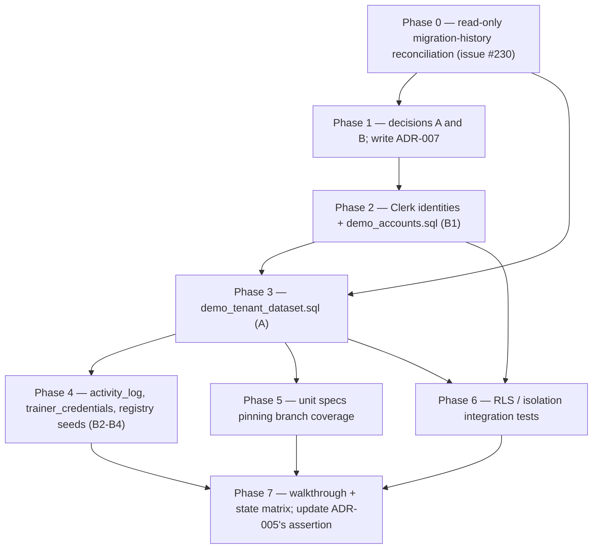

# Demo Data and the Six-State Validation Plan

This page documents [`docs/DEMO_DATA_VALIDATION_PLAN.md`](/docs/DEMO_DATA_VALIDATION_PLAN.md) — the plan for giving the demo account enough demo data and seeds that **every function, screen, and state of the app as it works today can be validated**.

**Status, stated honestly: the plan is a DRAFT, dated 2026-09-10, blocked on two decisions before any SQL is written (§2).** Nothing below describes approved or started work: workstreams A–D are proposals, Phase 0 is a list of read-only checks, and the two gating decisions (Decision A — internal-only audience vs external reviewers; Decision B — one demo account vs one per role) are open.

The plan's short answer (§1): the stated goal is **not reachable with the demo account as it exists today**, and not because the seed is too small. Three independent blockers, each needing a different fix:

1. **One account cannot show role behaviour** — see [Why one demo account cannot show role behaviour](#why-one-demo-account-cannot-show-role-behaviour).
2. **Two datasets are wanted, not one.** The current seed deliberately spreads five batches across three schools *to prove tenant isolation*, so AKB — the demo's school — holds exactly one batch. Demo breadth wants many batches **inside one school**. Those two shapes fight each other in one file, which is why Workstream A specifies a separate seed file.
3. **Seeding reaches only two of the six required states.** RULES rule 24 requires loading, empty, no-results, error/sync-failed, permission-denied and stale-data on every data screen; only *empty* and *no-results* come from data. The rest need env changes, a denied account, latency, or the "Data as of" path (Workstream C).

<!-- openwiki: broken internal link [#deliberately-out-of-scope] heading anchor "deliberately-out-of-scope" does not exist in /openwiki/testing/demo-data-and-validation.md. Fix the href or restore the target, then delete this comment. -->
Three areas are excluded outright, with reasons in [Deliberately out of scope](#deliberately-out-of-scope): attendance (FR-07), LAMR (FR-08), and document preview/download — none of them can be validated by seeding at all.

## Baseline: the demo account as it exists today

- `demo@tvicams.app` is a single **viewer** scoped to **AKB** ([ADR-005](/docs/adr/ADR-005-demo-account-tenant-scoping.md) decision 2), and the account is **internal-only** by decision 3 — developer use and tenant-isolation testing, not a panel, evaluator, or TESDA reviewer.
- The identity rows come from [`supabase/seeds/dev_profile_memberships.sql`](/supabase/seeds/dev_profile_memberships.sql), a **DRAFT — NOT APPLIED** stopgap *seed* (not a migration) that gives three real Clerk users a `profiles` row and one membership each so RLS has something to match. It stays a seed because Clerk dev and prod instances issue different user IDs for the same person, and a migration carrying them would insert dead identities into the table RLS trusts most. The file also carries a standing **warning block**: it no longer matches the dev database (converged to decision 2 only), and running it as written would drop the developer's retained J3ED and NEN grants.
- The operational rows come from the migration [`20260831120000_seed_dev_operational_data.sql`](/supabase/migrations/20260831120000_seed_dev_operational_data.sql): five `DEV-`-prefixed batches (one AKB, two J3ED, two NEN), placeholder learner rosters (89 rows), per-batch document rows (40 rows), and the `documents_batch_id_document_key_key` unique index. On the live project this migration is **untracked** — its data is present while its version is not recorded (issue #230, below).
- The isolation assertion the demo account exists to prove today (ADR-005 §The isolation assertion): signed in as demo on `/dashboard`, exactly one batch — `DEV-AKB-001` — is visible and the other four are not; a scoping regression shows five. It must be verified in the app, signed in, not in SQL (the seed's own verification query joins through memberships, so a tenant nobody belongs to — J3ED by design — never appears in its output). Workstream A **replaces** this assertion; see [The isolation assertion, restated](#the-isolation-assertion-restated).

## Two decisions gate the whole plan

These change the whole plan, so the plan puts them before any SQL (§2).

### Decision A — who is the demo account for?

ADR-005 decision 3 scopes the account **internal only**. The plan calls that boundary *load-bearing rather than cautious*, on the strength of two facts:

- `NEXT_PUBLIC_DEMO_EMAIL` and `NEXT_PUBLIC_DEMO_PASSWORD` are read at module scope by the sign-in page — i.e. **compiled into the client bundle** and served to every browser that loads `/sign-in`, where the "Use a demo account" button pre-fills both.
- `?role=` **outranks the database role** (`resolveRouteRole` checks the query parameter first, ahead of the profile's `role` column), so the demo's `viewer` restriction is not enforced against anyone willing to edit the URL.

If the audience is internal (a developer, a reviewer with repo access), both are tolerable and the plan proceeds as written. If the audience is a **panel, evaluator, or TESDA reviewer**, both are disqualifying and must be fixed before any demo data matters at all.

### Decision B — one demo account, or one per role?

Validating role behaviour needs real accounts. The proposal:

| Clerk identity | `profiles.role` | Membership | Exists to prove |
| --- | --- | --- | --- |
| `demo-admin@…` | `admin` | AKB | full read/write, user + school admin screens |
| `demo-coordinator@…` | `coordinator` | AKB | the same policies as admin today — records the distinction |
| `demo-trainer@…` | `trainer` | AKB | server-side omission of billing / NTP lag / BSRS fields |
| `demo-viewer@…` (today's `demo`) | `viewer` | AKB | read-only; writes denied by the server |
| *(existing platform admin)* | `admin` + `platform_admins` row | none | school registry reach, and that it stops there |

A trainer account is also the only way `batches.trainer_profile_id` becomes fillable — the current seed leaves it NULL on purpose (seeding placeholder profiles would create identities that no Clerk user can ever authenticate as) and carries the trainer as loose `trainer_name` text, which the trainer screens will eventually need.

**This reverses ADR-005 decisions 2 and 3.** It needs an **ADR-007** (or an amendment to ADR-005), not a quiet `update profiles set role = …` — and writing that ADR is itself a task in the plan's Phase 1, not a side effect of seeding.

### Why one demo account cannot show role behaviour

Trainer field omission (RULES rule 5 — billing deadline, billing preparation, NTP lag, BSRS and financial fields are stripped server-side from trainer-facing DTOs, not CSS-hidden) and viewer write-denial (RULES rule 4 — read-only, denied on the server, not merely hidden) are both enforced **server-side**, so they can only be observed by signing in *as* those roles. A single account playing both roles has nothing to observe. And `?role=` is no substitute: it is a preview override that `resolveRouteRole` reads **before** the database role, so a demo session with `?role=trainer` in the URL exercises the override path, not the real one. This is the same reason `NEXT_PUBLIC_DEMO_PASSWORD` being inlined in the client bundle makes the internal-only boundary load-bearing — the demo credentials are visible to anyone who loads the page, and the role they unlock is overridable from the URL.

## Phase 0 — reconcile the migration history before adding data

All data work is gated on a read-only reconciliation of the live project's migration history, which returns exactly **four versions**:

```
20260528160300  create_tenant_scoped_schema
20260705070510  add_trainer_credentials
20260717054607  migrate_akb_tenant_and_drop_rogue_table
20260906114735  add_school_registry_and_platform_admin
```

So three checked-in migrations are **not tracked**:

- [`20260831120000_seed_dev_operational_data`](/supabase/migrations/20260831120000_seed_dev_operational_data.sql) — its data is present (live row counts of 5 / 89 / 40 for `batches` / `learners` / `documents` match its content exactly) while its version is not recorded. Its `documents_batch_id_document_key_key` unique index is therefore of **unknown existence**, and **any new seed using `on conflict (batch_id, document_key)` fails without it** — the idempotency pattern everything downstream in the plan relies on.
- [`20260904120000_add_user_admin_write_policies`](/supabase/migrations/20260904120000_add_user_admin_write_policies.sql)
- [`20260906120000_ensure_invitation_membership_atomic`](/supabase/migrations/20260906120000_ensure_invitation_membership_atomic.sql)

And the school registry landed as `20260906114735` while its filename says `20260906130000` — the same migration under two versions.

The full drift record is **issue #230**, documented in [data-model-and-rls, Migration history](/openwiki/architecture/data-model-and-rls.md#migration-history) and [Issue #230: the repo and the database have drifted](/openwiki/architecture/data-model-and-rls.md#issue-230-the-repo-and-the-database-have-drifted): the database is *ahead* of its own records rather than behind them (those objects exist, applied by hand), the one real gap is the missing `public.ensure_profile_tenant_membership` function, and the eighth migration, [`20260910120000_add_adr001_billing_domain`](/supabase/migrations/20260910120000_add_adr001_billing_domain.sql), is checked in but unapplied — its own header directs that #230 be reconciled before assuming a clean `db push`.

**Phase 0 tasks** (all read-only checks first; **nothing is applied without an explicit yes**, per [RULES rule 36](/RULES.md#10-agent-conduct)):

1. Confirm actual row counts with `select count(*)` — the figures above are `reltuples` planner estimates, and some are visibly stale (`scholarship_programs` reads 0 next to 40 documents that reference it; `tenants` reads 1 next to batches spanning three school codes).
2. Confirm whether `documents_batch_id_document_key_key` exists.
3. Confirm `demo`'s membership is still AKB-only.
4. Decide per untracked migration: repair the history table, or re-apply idempotently.
5. Decide what to do about the duplicated school-registry version.

Until step 1 lands, every size figure in the rest of the plan is provisional.

## Workstream A — demo breadth dataset inside AKB

New file: `supabase/seeds/demo_tenant_dataset.sql` — deliberately **separate** from the existing seed migration so the isolation shape (five batches across three schools) stays intact. Target **~12–14 AKB batches**, chosen so each is the *only* row exercising something:

| Dimension | Values to cover |
| --- | --- |
| `current_stage` | aou, ntp, tip, training, assessment, billing, completed, blocked (all 8 `lifecycle_stage` values) |
| `status` | pending, ongoing, completed, blocked (all 4 `batch_status` values) |
| `progress_percent` | 0, below the 80% billing threshold, exactly 80, above, 100 |
| Urgency tiers | every branch of `modules/batches/domain/urgency.ts`, driven by `end_date` relative to a fixed as-of date |
| Document mix | all-verified, all-missing, partial, and one batch with untracked requirements (ADR-004 — `docCompliancePct` must be `null`, not 0) |
| Billing readiness | not-ready, ready, and each packet state `draft → ready → generated → submitted → settled` from `modules/billing/domain/packets.ts` |
| Assessment results | competent, not_yet_competent, pending across learners |
| Programs | both TWSP and CFSP |
| Roster size | one small (≤5) and one large (≥30), for pagination and table density |

Two mechanics shape the SQL before it is written:

- **Urgency is time-relative at read time.** The batches mapper computes `daysToBilling` as whole days from `Date.now()` to `end_date` (a missing or unparseable date becomes the `+Infinity` "no known deadline" sentinel, which sorts last and never triggers a tier). `urgencyTier` then maps `≤6` → `critical`, `≤21` → `warning`, else `on-track`. The seed therefore places `end_date` values around a **fixed as-of date** so they straddle the 6/21-day boundaries, and the unit layer (Workstream D) pins the branches.
- **Billing packet state is derived, not stored** (ADR-003). `buildPacket` in [`modules/billing/domain/packets.ts`](/modules/billing/domain/packets.ts) derives `draft`/`ready` from the inputs — `progressPct` versus `PACKET_READY_THRESHOLD` (80), pre-billing-stage documents on file, and a non-empty requirement catalog — and maps `completed` batches to `settled` as a stand-in; `generated`/`submitted` depend on the `billing_records` store that the unapplied eighth migration adds. Reaching each state means setting the *inputs* that derive it — read `packets.ts` and `readiness.ts` and work backwards. **Don't add a status column.**

### The isolation assertion, restated

ADR-005's "demo sees exactly one batch" **stops being the test**. It becomes: **signed in as a demo account, `/dashboard` shows the N AKB batches and zero J3ED or NEN batches.** The plan requires that ADR-005's assertion section be **updated when this lands** — otherwise the next reader treats five-vs-one as the regression signal and misdiagnoses a healthy breadth dataset as a scoping failure.

## Workstream B — accounts, activity, and the empty tables

**B1 — role accounts.** Create the Clerk identities from Decision B, then extend [`supabase/seeds/dev_profile_memberships.sql`](/supabase/seeds/dev_profile_memberships.sql) (or a sibling `demo_accounts.sql`) with their profiles and one membership each. Keep it a **seed, not a migration** — ADR-005's reasoning holds: Clerk issues different IDs per instance, and a migration would insert dead identities into the table RLS trusts most. While editing that file, resolve the warning block already in it: it no longer matches the dev database, and running it as written would drop the developer's J3ED and NEN grants.

**B2 — `activity_log` (0 rows).** `RecentActivityPanel` and `/activity-log` render an empty state on every screen today, and `/activity-log` is paginated with nothing to page. Seed ~40–60 entries across the AKB batches covering **all seven `activity_action` values** (`created`, `updated`, `uploaded`, `verified`, `submitted`, `deleted`, `system_note`), spread over dates so relative timestamps and the "Data as of" line have something to say. `profile_id` should point at the new demo profiles so attribution renders.

**B3 — `trainer_credentials` (0 rows).** One row per demo trainer, so the profile screen and any trainer-credential surface has content. Expiry dates: one comfortably valid, one near expiry.

**B4 — school registry (`tenant_qualifications`, 1 row).** Add several qualifications to AKB with COPR numbers, delivery modes and validity dates so `/schools/new` and the qualification pickers show a realistic registry.

## Workstream C — the six states, one mechanism per cell

RULES rule 24 mandates **all six states** on every data screen — loading, empty, no-results, error/sync-failed, permission-denied, stale-data — with an exact "Data as of" timestamp on screens showing relative dates; the mandated treatment of each state is documented in [design-system, The six mandatory screen states](/openwiki/architecture/design-system.md#the-six-mandatory-screen-states). **Seeding is one of five mechanisms** — this matrix is the part a seed-only plan silently skips. Mechanism per cell, from the plan:

| State | How it is produced | Notes |
| --- | --- | --- |
| **empty** | a demo account with a membership in a school holding zero batches | needs one throwaway tenant; do **not** empty AKB |
| **no-results** | a filter/search in the UI that matches nothing | pure UI, no seed needed — but every filterable screen must be walked |
| **error / sync-failed** | point `NEXT_PUBLIC_SUPABASE_URL` at an unreachable host | must render the sync-failed banner **and** an honest empty state, never fabricated rows |
| **unconfigured** | remove Supabase env vars | distinct from sync-failed; must not substitute mock data |
| **permission-denied** | sign in as `demo-viewer` and attempt a write; and a profile with **no** membership for `no-tenant-access` | the no-membership case must render `NoTenantAccessState`, not the ordinary empty state |
| **loading** | throttle the network, or a deliberate delay in a dev-only branch | the weakest cell; may only be checkable by eye |
| **stale-data** | the "Data as of" timestamp on every screen showing relative dates | verify it is an exact timestamp, per rule 24 |

Why `no-tenant-access` gets its own row: RLS answers a non-member's read as a *successful, empty* read, so the query cannot distinguish "belongs to no school" from "the school is empty" — routes fold the tenancy verdict in via `withTenantAccess` (which replaces **only** an `ok` snapshot, so a real fetch failure is never masked), and screens must render `shared/ui/NoTenantAccessState` ("No school assigned yet") rather than the ordinary `EmptyState`. The matrix therefore needs a profile with zero memberships, and the plan proposes adding it as a **fifth demo identity**.

Deliverable: a **route × state checklist covering all 15 dashboard routes** (the pages under `app/(dashboard)/`, including the four `/trainer` routes), filled in by hand during the Workstream D walkthrough and then captured as specs.

## Workstream D — how "validated" gets proven

Seeding is setup, not validation. Three layers, **cheapest first**:

1. **Unit tests** — `pnpm test` (Vitest over `tests/unit/`), **Node 22 required — the suite will not start on 21**: Vitest 4's rolldown calls `util.styleText` with an array argument, which on Node 21 or older throws `ERR_INVALID_ARG_VALUE` at startup and surfaces as a bundler stack trace before any test loads, not as a test failure. New specs assert the seeded dataset hits **every branch** of `modules/batches/domain/urgency.ts`, `modules/billing/domain/readiness.ts`, `modules/billing/domain/packets.ts` and `modules/batches/data/metrics.ts` at a **fixed as-of date**, run against **fixtures mirroring the seed**, not the live database. Existing specs show the convention: [`tests/unit/urgency.test.ts`](/tests/unit/urgency.test.ts) pins the tier boundaries (6/7 and 21/22, negatives, far-off dates) and [`tests/unit/billing-readiness.test.ts`](/tests/unit/billing-readiness.test.ts) pins the 80% threshold, the compound gate, and the zero-requirement catalog never auto-ready.
2. **RLS / tenant-isolation integration tests** against the **real Supabase project, no mocks** — the form RULES rule 35 mandates, and the suite CLAUDE.md already lists as outstanding. The breadth dataset is what makes them writable: sign in as each demo role and assert the row sets. The plan calls this the **single highest-value item** in the plan — it is the **only automated check of the security boundary**.
3. **In-browser walkthrough**, one pass per role, filling in the Workstream C matrix. `e2e/` and `playwright.config.ts` **already exist** — [`e2e/auth.spec.ts`](/e2e/auth.spec.ts) exercises the `requireAuthenticatedUser` redirect (the actual security-relevant behaviour, guarded in `app/(dashboard)/layout.tsx`, not `proxy.ts`) with a Clerk testing token, `e2e/global.setup.ts` obtains that token once per run, and the Playwright `webServer` boots the app via `pnpm dev` — so the walkthrough can be **captured as Playwright specs** rather than done by hand each time. Per [`.env.example`](/.env.example), e2e runs with **Clerk test keys only** (`pk_test_*` / `sk_test_*`, never production keys).

## Definition of done

Every cell of the route × state matrix is **ticked or has a written reason it cannot be**, and the isolation assertion passes for **all five demo identities**.

## Sequence, invariants, and what is out of scope



*Phase dependency graph per the plan's §10 sequence table: Phase 7 is blocked on all prior phases; Phases 0–2 are decision and verification work that should not be skipped to get to the SQL.*

| Phase | Work | Blocked by |
| --- | --- | --- |
| 0 | Read-only verification; decide the migration-drift repair | nothing |
| 1 | Decisions A and B; write ADR-007 | 0 |
| 2 | Clerk identities + `demo_accounts.sql` (B1) | 1 |
| 3 | `demo_tenant_dataset.sql` (A) | 0, 2 — needs trainer profile IDs |
| 4 | `activity_log`, `trainer_credentials`, registry seeds (B2–B4) | 3 |
| 5 | Unit specs pinning branch coverage | 3 |
| 6 | RLS / isolation integration tests | 2, 3 |
| 7 | Walkthrough + state matrix; update ADR-005's assertion | all |

The plan's warning on the ordering: writing the dataset before the trainer accounts exist means `trainer_profile_id` stays NULL and Workstream A gets rewritten.

**Invariants any new seed must keep** (plan §9 — reasoned decisions recorded in the existing seed's comments, not boilerplate):

- Batch codes stay **obviously non-authoritative** — `DEMO-` prefix, greppable; never invent RQM-shaped codes (`batch_code` is the RQM code parsed from a real NTP).
- `official_system_reference` stays **NULL** — TESDA SIS/T2MIS/BSRS are authoritative, and this tool must never invent their references.
- `uli` stays **NULL** — ULI is the permanent learner key, and a fabricated one pollutes the identity space real T2MIS records must occupy.
- Learner names stay **visibly synthetic**.
- **Only the 8 catalogued document keys** — the uncatalogued `master_list`, `trainer_qual`, `progress_rpt`, `bsrs`, `nc_cert` have no row in `program_document_requirements`, and `documents.document_key` has no FK, so seeding them creates orphans that read as untracked under ADR-004.
- **Idempotent** — every insert carries a real `on conflict` target so a re-run is a no-op, which depends on the Phase 0 unique-index check.
- Seeded `summary` and `notes` copy, like UI copy, **never implies official approval or submission**.

**Deliberately out of scope, with reasons** (plan §8):

- **Attendance (FR-07).** There is no attendance table, and `batches` has no `sessions_held`, `total_sessions` or absence column (the eighth migration's `attendance_records` is checked in but unapplied), so the locked domain facts "progress = `sessions_held` / `total_sessions`" and "≥5 absences is ineligible" cannot be driven by data at all. That needs a migration first (the TES-36 Phase 0.1 work omitted those columns on purpose) — it is not a seeding task.
- **LAMR (FR-08).** Four tables, zero rows, and `modules/lamr/` is a README. Seeding would produce data no screen reads. Sequence: build the module, then seed.
- **Trainer routes.** `/trainer`, `/trainer/classes` and the two `[batchId]` routes are ~20–28-line placeholders with no data calls. A trainer account will sign in successfully and see placeholder text — worth knowing before it reads as a seed bug.
- **Document preview / download.** `storage_path` and `external_url` are NULL by design — a dead link on a compliance document is worse than a visibly absent one. Uploading placeholder objects to `compliance-evidence` is a **decision**, not a seed detail; if demoing upload matters, decide it explicitly or demo the upload flow live.
- **The uncatalogued document keys.** Fix the catalog separately; do not widen the seed.

## Related pages

- [Supabase Data Model and RLS Policies](/openwiki/architecture/data-model-and-rls.md) — [Migration history](/openwiki/architecture/data-model-and-rls.md#migration-history) and [Issue #230](/openwiki/architecture/data-model-and-rls.md#issue-230-the-repo-and-the-database-have-drifted) for the drift Phase 0 reconciles, the dev-only seeds, and the RLS policy map the isolation tests will assert against
- [Design System and UI Invariants](/openwiki/architecture/design-system.md) — [The six mandatory screen states](/openwiki/architecture/design-system.md#the-six-mandatory-screen-states), their mandated treatments, and the `no-tenant-access` fold
- [Module Boundaries and the Data Layer Pattern](/openwiki/architecture/module-boundaries-and-data-pattern.md) — the snapshot contract the state matrix maps onto, and the fixed-as-of-date unit-testing convention
- [Quickstart and Task Routing](/openwiki/quickstart.md) — the verification loop (`pnpm test`, `pnpm test:e2e`), the Node 22 requirement, and the Clerk test-key rule
- [`docs/DEMO_DATA_VALIDATION_PLAN.md`](/docs/DEMO_DATA_VALIDATION_PLAN.md) — the source plan (Draft, 2026-09-10)
- [`docs/adr/ADR-005-demo-account-tenant-scoping.md`](/docs/adr/ADR-005-demo-account-tenant-scoping.md) — the accepted ADR the two decisions gate on, and whose assertion section Phase 7 must update
- [`docs/adr/ADR-004-untracked-document-semantics.md`](/docs/adr/ADR-004-untracked-document-semantics.md) — the untracked-document semantics Workstream A's document mix exercises
